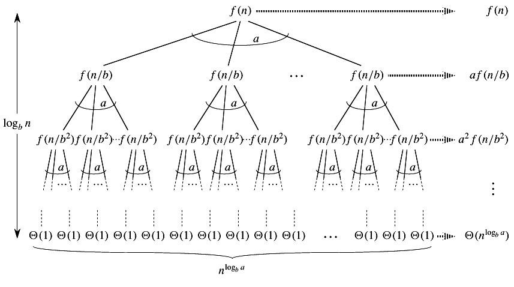

<h1 style="text-align: center"> 算法设计与分析证明集合 </h1>

 xyfJASON 

---

[TOC]

---

## $\textbf{Master Method}$ 的证明

$\textbf{Master Method}$：设常数 $a\geqslant 1,b>1$，$f(n)$ 是一个函数，$T(n)$ 是定义在非负整数上的递归式：
$$
T(n)=aT(n/b)+f(n)
$$
其中，$n/b$ 可以是 $\lfloor n/b\rfloor$ 或 $\lceil n/b\rceil$. 那么 $T(n)$ 有如下渐进界：

1. 若对某个常数 $\epsilon>0$ 有 $f(n)=O(n^{\log_ba-\epsilon})$，则 $T(n)=\Theta(n^{\log_ba})$；
2. 若 $f(n)=\Theta(n^{\log_ba})$，则 $T(n)=\Theta(n^{\log_ba}\lg n)$；
3. 若对某个常数 $\epsilon>0$ 有 $f(n)=\Omega(n^{\log_ba+\epsilon})$，且对某个常数 $c<1$ 和所有足够大的 $n$ 有 $af(n/b)\leqslant cf(n)$，则 $T(n)=\Theta(f(n))$. 

$\textbf{Proof}$：为了方便起见，我们首先对于 $n$ 为 $b$ 的幂的情况进行证明，随后再把证明扩展到所有正整数上。

设常数 $a\geqslant 1,b>1$，$f(n)$ 是定义在 $b$ 的幂上的非负函数，$T(n)$ 是定义在 $b$ 的幂上的递归式：
$$
T(n)=\begin{cases}\Theta(1)&n=1\\aT(n/b)+f(n)&n=b^i\end{cases}
$$
其中 $i$ 是正整数，那么作递归树有：

逐层求和可得：
$$
T(n)=\Theta(n^{\log_ba})+\sum_{j=0}^{\log_bn-1}a^jf(n/b^j)
$$
其中前一项是叶子结点的和，后面的和式是每一层的和。

记后面的和式为 $g(n)$：
$$
g(n)=\sum_{j=0}^{\log_bn-1}a^jf(n/b^j)
$$
分类讨论：

1. 若对某个常数 $\epsilon>0$ 有 $f(n)=O(n^{\log_ba-\epsilon})$，那么：
   $$
   \begin{align}
   g(n)&=O\left(\sum_{j=0}^{\log_bn-1}a^j\left(\frac{n}{b^j}\right)^{\log_b a-\epsilon}\right)\\
   &=O\left(n^{\log_ba-\epsilon}\sum_{j=0}^{\log_bn-1}\left(\frac{ab^\epsilon}{b^{\log_ba}}\right)^j\right)\\
   &=O\left(n^{\log_ba-\epsilon}\frac{1-{b^{\epsilon\log_bn}}}{1-b^\epsilon}\right)\\
   &=O\left(n^{\log_ba-\epsilon}\frac{n^{\epsilon}-1}{b^\epsilon-1}\right)\\
   &=O\left(n^{\log_ba}\right)
   \end{align}
   $$
   于是有：
   $$
   T(n)=\Theta(n^{\log_ba})+O(n^{\log_ba})=\Theta(n^{\log_ba})
   $$

2. 若 $f(n)=\Theta(n^{\log_ba})$，那么：
   $$
   \begin{align}
   g(n)&=\Theta\left(\sum_{j=0}^{\log_bn-1}a^j\left(\frac{n}{b^j}\right)^{\log_ba}\right)\\
   &=\Theta\left(n^{\log_ba}\sum_{j=0}^{\log_bn-1}1\right)\\
   &=\Theta\left(n^{\log_ba}\log_bn\right)\\
   &=\Theta\left(n^{\log_ba}\lg n\right)
   \end{align}
   $$
   于是有：
   $$
   T(n)=\Theta(n^{\log_ba})+\Theta(n^{\log_ba}\lg n)=\Theta(n^{\log_ba}\lg n)
   $$

3. 若对某个常数 $c<1$ 和所有足够大的 $n$ 有 $af(n/b)\leqslant cf(n)$，反复迭代 $j$ 次得：$f(n/b^j)\leqslant (c/a)^jf(n)$ 对充分大的 $n$ 成立，故：
   $$
   \begin{align}
   g(n)&\leqslant\sum_{j=0}^{\log_bn-1}c^jf(n)+O(1)\\
   &\leqslant f(n)\sum_{j=0}^\infty c^j+O(1)\\
   &=f(n)\frac{1}{1-c}+O(1)\\
   &=O(f(n))
   \end{align}
   $$
   另一方面，$g(n)=\sum\limits_{j=0}^{\log_bn-1}a^jf(n/b^j)\geqslant f(n)=\Omega(f(n))$，所以有：$g(n)=\Theta(f(n))$. 

   于是有：
   $$
   T(n)=\Theta(n^{\log_ba})+\Theta(f(n))
   $$
   加入条件：对某个常数 $\epsilon>0$ 有 $f(n)=\Omega(n^{\log_ba+\epsilon})$，那么：
   $$
   T(n)=\Theta(f(n))
   $$

综上，我们对 $n$ 为 $b$ 的幂的情况完成了证明。

为了把上述结论扩展到所有正整数，我们只需要对 $\lfloor n/b\rfloor$ 和 $\lceil n/b\rceil$ 形式的 $\textbf{Master Method}$ 进行证明。前者的上界和后者的下界可以通过放缩很容易地转化到 $b$ 的幂的情形，因此只需对前者的下界和后者的上界进行证明。这里只对后者的上界进行证明，前者的下界同理。

对递归树略作修改，可以得到一个高度为 $\lfloor \log_bn\rfloor$ 的递归树，记 $n_j=\lceil n/b^j\rceil$，同样地逐层求和，可以得到：
$$
T(n)=\Theta(n^{\log_ba})+\sum_{j=0}^{\lfloor \log_bn\rfloor-1}a^jf(n_j)
$$
对于情形1，我们已经知道了 $f(n)=O(n^{\log_ba-\epsilon})$，可以据此证明 $f(n_j)=O((n/b^j)^{\log_ba-\epsilon})$，那么直接采用之前的方法证明即可；

对于情形2，我们已经知道了 $f(n)=\Theta(n^{\log_ba})$，可以据此证明 $f(n_j)=O((n/b^j)^{\log_ba})$，那么直接采用之前的方法证明即可；

对于情形3，我们已经知道了 $af(\lceil n/b\rceil)\leqslant cf(n)$，于是 $f(n_j)\leqslant(c/a)^j f(n)$，直接采用之前的方法证明即可。

$\blacksquare$

## 排序相关

### 快排的平均复杂度

设 $T(n)$ 表示规模为 $n$ 的快速排序用时，则枚举分割点，可得递归方程：
$$
\begin{align}
T(n)&=\frac{1}{n}\sum_{s=1}^n[T(s)+T(n-s)+cn]\\
&=\frac{2}{n}\sum_{s=1}^{n-1}T(s)+\frac{1}{n}T(n)+cn
\end{align}
$$
解得：
$$
\begin{align}
&(n-1)T(n)=2\sum_{s=1}^{n-1}T(s)+cn^2\\
\implies&\frac{T(n)}{n}-\frac{T(n-1)}{n-1}=\frac{c(2n-1)}{n(n-1)}=c\left(\frac{1}{n-1}+\frac{1}{n}\right)\\
\implies&\frac{T(n)}{n}=T(1)+c\left(\frac{1}{n}+\frac{2}{n-1}+\frac{2}{n-2}+\cdots+\frac{2}
{2}+1\right)\\
\implies&\frac{T(n)}{n}=c\left(2H_n-\frac{1}{n}-1\right)\\
\implies&T(n)=O(n\lg n)
\end{align}
$$

### 随机化快排的期望复杂度

对于基于比较的排序，运行时间与比较次数相当。我们只需要求出随机化快排的期望比较次数。

设 $X$ 表示比较次数，设 $X_{ij}$ 为指示器随机变量，表示第 $i$ 大的数和第 $j$ 大的数是否进行了比较，于是 $X=\sum\limits_{i=1}^n\sum\limits_{j=i+1}^nX_{ij}$，由期望的线性性，有：
$$
\mathbb EX = \mathbb E\left[\sum_{i=1}^n\sum_{j=i+1}^nX_{ij}\right]=\sum_{i=1}^n\sum_{j=i+1}^n\mathbb EX_{ij}=\sum_{i=1}^n\sum_{j=i+1}^n\mathbb P(X_{ij}=1)
$$
因此，现在只需要求出 $\mathbb P(X_{ij}=1)$. 

第 $i$ 大的数和第 $j$ 大的数会进行比较当且仅当在其中某一个被拿出来作为基准时，第 $i+1\sim j-1$ 大的数没有被拿出来作为基准过，这个概率显然是 $\frac{2}{j-i+1}$，也即 $\mathbb P(X_{ij}=1)=\frac{2}{j-i+1}$. 于是乎，
$$
\mathbb EX=\sum_{i=1}^n\sum_{j=i+1}^n\frac{2}{j-i+1}=\sum_{l=1}^n\sum_{i=1}^{n-l+1}\frac{2}{l}\leqslant\sum_{l=1}^n\sum_{i=1}^n\frac{2}{l}=2nH_n=O(n\lg n)
$$
所以，随机化快排的期望复杂度为 $O(n\lg n)$. 

### 比较排序的下界

考虑决策树，其有 $n!$ 个叶子结点，故高度最小为
$$
\lceil\lg n!\rceil\geqslant\lg n!\sim\lg\sqrt {2\pi n}\left(\frac{n}{e}\right)^n=n\lg n-n+\frac{1}{2}\lg(2\pi n)
$$
于是比较排序的时间下界为：
$$
\Omega\left(n\lg n-n+\frac{1}{2}\lg(2\pi)+\frac{1}{2}\lg n\right)=\Omega(n\lg n)
$$

## 动态规划的证明

两个方面：

- 证明问题具有最优子结构：$\text{cut-and-paste}$
- 证明子问题重叠性：这个一般是平凡的

### 矩阵链乘法

- 最优子结构：设区间 $[l,r]$ 的最优分割点在 $k$ 处，则 $[l,r]$ 的最优解一定由 $[l,k]$ 和 $[k+1,r]$ 的最优解构成，否则，假若 $[l,k]$ 不是最优解，以最优解替换之，得到 $[l,r]$ 的更优解，矛盾。

- 转移方程：
  $$
  m[i,j]=\begin{cases}0&i=j\\\min\limits_{i\leqslant k<j}\{m[i,k]+m[k+1,j]+p_{i-1}p_kp_j\}&i<j\end{cases}
  $$

### 最长公共子序列

- 最优子结构：设 $\{x_1,\cdots,x_m\},\{y_1,\cdots,y_n\}$ 的 $\text{LCS}$ 为 $\{z_1,\cdots,z_k\}$，则：
  - 若 $x_m=y_n$，则 $z_k=x_m=y_n$，于是 $\{x_1,\cdots,x_{m-1}\}$ 和 $\{y_1,\cdots,y_{n-1}\}$ 的 $\text{LCS}$ 必为 $\{z_1,\cdots,z_{k-1}\}$，否则取更长的公共子序列代替之，得到 $\{x_1,\cdots,x_m\},\{y_1,\cdots,y_n\}$ 的更长的公共子序列，矛盾；
  - 若 $x_m\neq y_n$，且 $z_k\neq x_m$，则 $\{x_1,\cdots,x_{m-1}\}$ 和 $\{y_1,\cdots,y_{n}\}$ 的 $\text{LCS}$ 必为 $\{z_1,\cdots,z_{k}\}$，否则取更长的公共子序列代替之，矛盾；
  - 若 $x_m\neq y_n$，且 $z_k\neq y_n$，则 $\{x_1,\cdots,x_{m}\}$ 和 $\{y_1,\cdots,y_{n-1}\}$ 的 $\text{LCS}$ 必为 $\{z_1,\cdots,z_{k}\}$，否则取更长的公共子序列代替之，矛盾。

- 转移方程：
  $$
  c[i,j] = \begin{cases}0&i=0\text{ or }j=0\\c[i-1,j-1]+1&x_i=y_j\\\max\{c[i-1,j],c[i,j-1]\}&x_i\neq y_j\end{cases}
  $$

### $\text{0-1}$ 背包

- 最优子结构：若 $(x_1,x_2,\cdots,x_n)$ 是原问题最优解（$x_i$ 表示是否取第 $i$ 个物品），则 $(x_1,\cdots,x_{n-1})$ 一定是背包容量减去 $x_nw_n$ 后的背包问题的最优解，否则，取更优解，再加入 $x_n$，得到原背包问题的更优解，矛盾。

- 转移方程：
  $$
  m[i,j]=\begin{cases}m[i-1,j]&j<w_i\\\max\{m[i-1,j],m[i-1][j-w_i]+v_i\}&j\geqslant w_i\end{cases}
  $$

### 最优二叉搜索树

- 最优子结构：和“矩阵链乘法”问题类似。

- 转移方程：
  $$
  e[i,j]=\begin{cases}q_i&i=j+1\\\min\limits_{i\leqslant r\leqslant j}\{e[i,r-1]+e[r+1,j]+w(i,j)\}&i\leqslant j\end{cases}
  $$

## 贪心的证明

两个方面：

- 证明问题具有最优子结构：$\text{cut-and-paste}$
- 证明贪心选择性：$\text{cut-and-paste}$

### 任务安排问题

-  最优子结构：将所有区间按照右端点排序，记 $S_{ij}$ 表示左端点在 $a_i$ 右端点之后，右端点在 $a_j$ 左端点之前的所有区间集合，记 $A_{ij}$ 表示 $S_{ij}$ 的最优解，设 $a_k\in A_{ij}$，那么一定有：$A_{ij}=A_{ik}\cup \{a_k\}\cup A_{kj}$。
- 贪心选择性：$S_{ij}$ 中右端点最小的区间必然在 $A_{ij}$ 中。证明：设 $a_m$ 是 $S_{ij}$ 中右端点最小的区间，又设 $A_{ij}$ 中右端点最小的区间为 $a_k$，则：
  - 若 $a_m=a_k$，证毕；
  - 若 $a_m\neq a_k$，用 $a_m$ 替换 $a_k$，得到的一定是一个合法解，且不会更差，证毕。

### $\textbf{Huffman}$ 编码

- 最优子结构：设 $T$ 是字符集 $S$ 的最优编码树，设 $x,y$ 是两相邻叶节点，$z$ 为其父节点，$f(z)=f(x)+f(y)$，那么 $T'=T-\{x,y\}$ 是字符集 $S'=S-\{x,y\}+\{z\}$ 的最优编码树。

  证明：设 $B(T)$ 表示树 $T$ 的代价，则
  $$
  B(T)=B(T')-d(z)f(z)+d(x)f(x)+d(y)f(y)=B(T')+f(x)+f(y)
  $$
  倘若 $T'$ 不是 $S'$ 的最优编码树，则以最优编码树 $T''$ 代替之，得到：
  $$
  B(\text{new }T)=B(T'')+f(x)+f(y)<B(T')+f(x)+f(y)=B(T)
  $$
  矛盾。

- 贪心选择性：频率最小的两个字符 $x,y$ 必定是在最大深度的两个相邻叶节点。

  证明：假若不是这样的，设 $x$ 与 $z$ 相邻，深度为 $d_1$，$y$ 深度为 $d_2$，则交换 $y$ 和 $z$，代价变化为：
  $$
  \Delta B=f(y)d_1+f(z)d_2-f(y)d_2-f(z)d_1=(f(y)-f(z))(d_1-d_2)\leqslant 0
  $$
  故得到不会更差的编码树。证毕。

### 最小生成树

- 最优子结构：收缩图中最小边得到图 $G'$，设 $T$ 是包含该最小边的 $G$ 的最小生成树，则收缩后得到 $T'$ 是 $G'$ 的最小生成树。

  证：假若不是这样的，以比 $T'$ 更小的生成树 $\hat T'$ 代替之，随后扩张最小边，得到的 $\hat T$ 是 $G$ 的比 $T$ 更小的生成树，矛盾。

- $\textbf{Kruskal}$ 的贪心选择性：最小边 $(u,v)$ 一定在 $T$ 中。否则，设 $T'$ 是不包含 $(u,v)$ 的最小生成树，向其中加入 $(u,v)$，会形成一个环，删去环中除 $(u,v)$ 外的最小边 $(x,y)$，则代价变化为：
  $$
  \Delta=w(u,v)-w(x,y)<0
  $$
  得到了更小的生成树。

- $\textbf{Prim}$ 的贪心选择性：$u$ 连的边中最小边权者 $(u,v)$ 必定在最小生成树中。否则，设 $T'$ 是不包含 $(u,v)$ 的最小生成树，向其中加入 $(u,v)$，会形成一个环，这个环中与 $u$ 相连的另一条边设为 $(u,w)$，那么删去 $(u,w)$，代价变化为：
  $$
  \Delta =w(u,v)-w(u,w)<0
  $$
  得到了更小的生成树。

## $\textbf{A*}$ 的正确性证明

定理：采用 $\text{Best-first}$ 策略进行搜索，若 $\textbf{A*}$ 选择的节点是目标节点，则此时该节点表示的解就是最优解。

证明：设 $t$ 为选中的目标节点，则：

1. 由 $t$ 是目标节点知：$h^*(t)=h(t)=0,f^*(t)=f(t)=g(t)$；
2. 由 $t$ 被选中知：$f(t)\leqslant f(i),\forall i\neq t$；
3. $\exists s$ 使得 $f^*(s)$ 为最优解，即 $f^*(s)\leqslant f^*(i),\;\forall i\neq s$；
4. 根据 $\textbf{A*}$ 理论，$h(i)\leqslant h^*(i),f(i)\leqslant f^*(i),\;\forall i$. 

由此可得：
$$
f^*(s)\leqslant f^*(t)=f(t)\leqslant f(s)\leqslant f^*(s)
$$
所以，$f(t)=f^*(s)$，即我们此时找到了最优解。

## 图论

### $\textbf{Bellman-Ford}$ 的正确性证明

首先，最短路具有最优子结构：若 $u_1\to u_2\to\cdots\to u_k$ 是一条从 $u_1$ 到 $u_k$ 的最短路，则对于 $\forall 1\leqslant i<j\leqslant k$，$u_i\to u_{i+1}\to\cdots\to u_j$ 是一条从 $u_i$ 到 $u_j$ 的最短路。若不然，取从 $u_i$ 到 $u_j$ 的最短路代替之，得到从 $u_1$ 到 $u_k$ 的更短路，矛盾。

现考虑从 $s$ 到 $v_k$ 的最短路 $s\to v_1\to v_2\to\cdots\to v_k$：

- 第 $1$ 轮松弛后，必然得到 $v_1$ 的最短距离，因为 $(s,v_1)$ 会被松弛，而它又是最短路中的边，根据最优子结构，必是 $s_1$ 的最短距离；
- 第 $2$ 轮松弛后，必然得到 $v_2$ 的最短距离，理由同上；
- ……
- 第 $k$ 轮松弛后，必然得到 $v_k$ 的最短距离，理由同上。

由于最短路上最多 $|V|$ 个顶点，$|V|-1$ 条边，即 $k<|V|$，所以最多松弛 $|V|-1$ 轮就可以得到所有点的最短距离。

### $\textbf{Dijkstra}$ 的证明

$\textbf{Dijkstra}$ 是一个贪心算法，我们按照证明贪心的套路证明即可。

- 最优子结构：前一节已经证明。

- 贪心选择性：未加入集合的点中，距离最小者的距离必然已更新为最短距离，换句话说，距离最小者的最短路径必然已经由那些在集合中的点找到，可加入集合。

  证：设 $u$ 是未加入集合的距离最小者，而到它的最短路径中 $y$ 是第一个不在集合中的点。则由最优子结构可知 $d[y]=\delta(s,y)$，于是 $d[u]\geqslant \delta(s,u)=\delta(s,y)+\delta(y,u)=d[y]+\delta(y,u)\geqslant d[y]$，与 $u$ 是未加入集合的距离最小者相矛盾。证毕。

### $\textbf{Floyd}$ 的证明

$\textbf{Floyd}$ 是一个动态规划算法，由于我们已经证明了最优子结构，而子问题重叠性又是显然的，故正确。