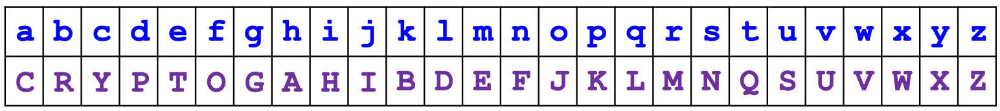
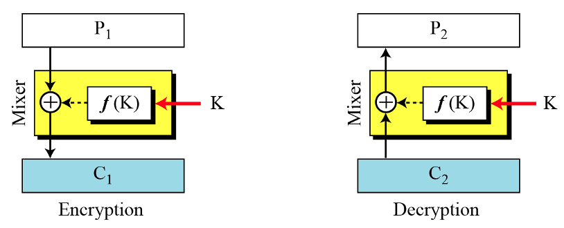
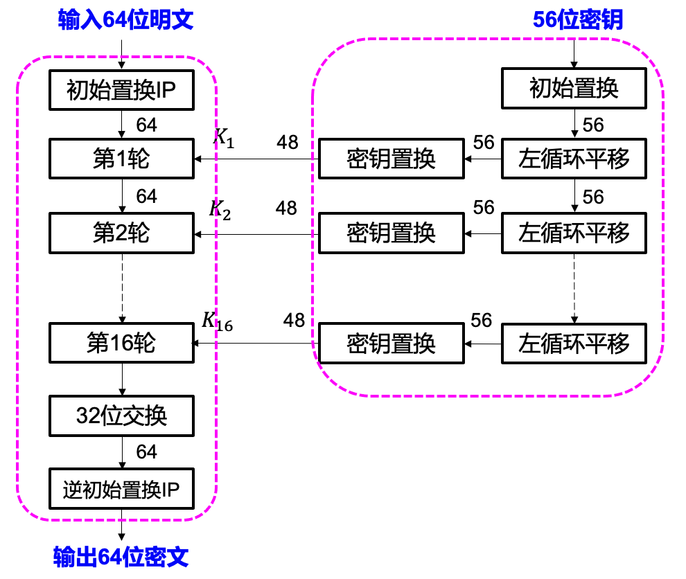
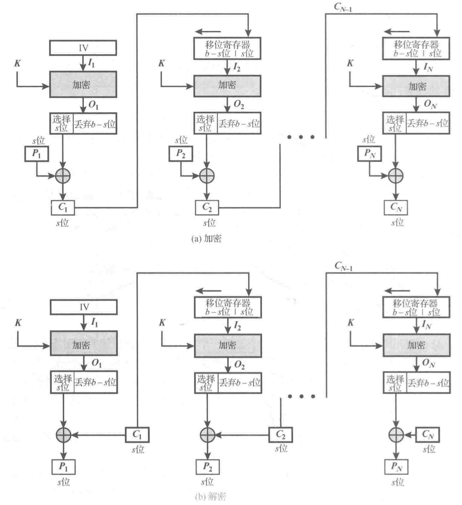

# 密码学基础

<p style="text-align: center">xyfJASON</p>

---

[TOC]


## 前言与简介

参考教材：**《密码编码学与网络安全——原理与实践（第八版）》(*Cryptography and Network Security*)**。

推荐书籍：

- 故事书：《密码的奥秘》《码书》《二战时期密码决战中的数学故事》
- 介绍性：《安全简史（从隐私保护到量子密码）》《安全通论（刷新网络空间安全观）》《图解密码技术》
- 数学基础：*An Introduction to Mathematical Cryptography*，《信息安全数学基础》

推荐会议与期刊：

- ACM Conference on Computer and Communications Security (CCS)
- International Cryptology Conference (Crypto)
- European Cryptology Conference (Eurocrypt)
- IEEE Symposium on Security and Privacy (S&P)
- Annual International Conference on the Theory and Application of Cryptology and Information Security (Asiacrypt)亚密
- International Workshop on Practice and Theory in Public Key Cryptography (PKC)
- Financial Cryptography and Data Security (FC)
- RSA Conference, Cryptographers' Track
- Journal of Cryptology
- IEEE Transactions on Information Forensics and Security (TIFS)
- IEEE Transactions on Dependable and Secure Computing (TDSC)


### 历史与发展


#### 起源

4000 年前的尼罗河畔，墓碑上刻着加以变形的象形文字，这一颇具神秘感的碑文，已具备了密码的基本特征——把一种符号（明文）用另一种符号（密文）代替；

公元前 5 世纪，古斯巴达人使用“天书”密码棒——置换密码出现了；

公元前 1 世纪，凯撒大帝发明凯撒密码——代换密码横空出世；

快进到 1926 年，德国人开始使用 ENIGMA，并在 1933 年将其作为德国国防军新式闪击部队的通信装置，幸于二战开始后不久，盟军将其破译。


#### 近代密码学（1949～1975）

计算机的发展使得基于复杂计算的密码成为可能。

1949，Shannon 发表 *The Communication Theory of Secret Systems*；

1967，David Kahn 发表 *The Codebreakers*；

1971-73，IBN Watson 实验室的 Horst Feistel 等人发表几篇技术报告：

- *A Cryptographic Device for Data Communication, 1971*
- *An Experimental Application of Cryptography to a remotely Accessed Data System, 1972*
- *Cryptography and Computer Privacy, 1973*

一个重要的思想被提出：**数据的安全基于<u>密钥</u>而不是算法的保密**。


#### 现代密码学（1976～）

1976，Diffie & Hellman 发表 *New Directions in Cryptography*，提出**非对称密码学（公钥密码学）**；

1977，Rivest & Shamir & Adleman 提出 **RSA 公钥加密算法**；

90 年代，逐步出现椭圆曲线等其他公钥算法。

公钥密码是的发送端和接收端**无密钥传输**的保密通信称为可能。


1977，DES 正式成为标准；

80 年代，出现过渡性的 "post DES" 算法；

90 年代，对称密钥密码进一步成熟，Rijndael, RC6, MARS, Twofish, Serpent 等出现；

2001 年 Rijndael/AES 替代 DES。


### 基本概念

**明文、密文**：略

**对称加密、密钥**：对称加密非常直观，好比 Alice 传输一个文件时上一个锁，Bob 用同样的锁打开文件读取内容


**非对称加密、公钥、私钥**：除了直接对文件上锁，我们还有什么办法呢？Alice 可以找 Bob 要一个开着门的保险柜，把文件放进保险柜并关上门，然后把保险柜传送给 Bob。由于这是 Bob 的保险柜，他自然能够用钥匙打开并取出文件。这里保险柜就扮演了「公钥」的角色，而 Bob 的钥匙就是他的「私钥」。


**总结**：


### 课程内容架构

**密码算法分类**：

- 无密钥：密码哈希函数、伪随机数生成器
- 单密钥：分组密码对称加密、序列密码对称加密、消息认证码
- 双密钥：非对称加密、数字签名、密钥交换、用户认证

**整体架构**：


## 古典密码学


### 密码攻击的几种类型

密码学包括**密码编码学**和**密码分析学**，前者设计密码，后者攻击密码。虽然这门课学习的主体是前者，但是所谓「知己知彼，百战不殆」，我们有必要知道密码攻击都有哪些种类。

|   攻击类型   |                      密码分析者已知信息                      |
| :----------: | :----------------------------------------------------------: |
|  唯密文攻击  |                      加密算法<br/>密文                       |
| 已知明文攻击 |   加密算法<br/>密文<br/>用同一密钥加密的一个或多个明密文对   |
| 选择明文攻击 |     加密算法<br/>密文<br/>分析者选择的明文，及对应的密文     |
| 选择密文攻击 |   加密算法<br/>密文<br/>分析者选择的一些密文，及对应的明文   |
| 选择文本攻击 | 加密算法<br/>密文<br/>分析者选择的明文，及对应的密文<br/>分析者选择的一些密文，及对应的明文 |


### 代换密码

>  明文中每一个字符代换（替换）为密文中另一个字符。

代换密码分类：

- 单字母单表
  - 加法密码：凯撒密码 Caesar cipher
  - 加乘密码：仿射密码 Affine cipher
  - 混合密码：混合字母表密码 Mixed alphabetic cipher
- 单字母多表密码
  - 周期多表代换：维吉尼亚密码 Vigenère cipher
  - 周期多表代换：转轮密码机 Rotor machine
  - 无限多表代换：一次一密 One-time pad
- 多字母密码
  - 2 字母代换：普莱菲尔密码 Playfair
  - Hill 密码


#### 单字母单表

**凯撒密码（移位密码、加法密码）**：
$$
\begin{align}
&c=Enc(m, k)=(m+k)\bmod 26\\
&m=Dec(c, k)=(c-k)\bmod 26
\end{align}
$$

密钥是 $k$，密钥空间为 $\mathcal K=\{k\in\mathbb Z_{26}\}$，大小 $|\mathcal K|=26$.

密文的统计特性与密钥取值之间的关系简单，甚至可以暴力破解。

**仿射密码（加乘密码）**：
$$
\begin{align}
&c=Enc(m, a, b)=(am+b)\bmod 26\\
&m=Dec(c, a, b)=a^{-1}(c-b)\bmod 26
\end{align}
$$

密钥是 $(a, b)$，密钥空间为 $\mathcal K=\{(a, b)\in\mathbb Z_{26}\times\mathbb Z_{26}:\gcd(a, 26)=1\}$，大小 $|\mathcal K|=\varphi(26)\times 26$.

> 注：实现时涉及到**扩展欧几里得算法**求逆元。

**混合字母表密码**：

1. 随机混合字母表

   密钥是整个字母表，密钥空间大小 $|\mathcal K|=26!$

   密钥的存储分发不方便

2. 关键词混合字母表

   密钥是关键词，关键词去重后依次填到字母表中，填完后其他字母按顺序填写剩余空间

   

**统计攻击**：分析密文字符频率


除了单字符的出现频率，还可以统计双字母组合的频率等。为了使明文结构在密文中的残留度减少，可以**多个字母一起加密**，或者**多表代替**。


#### 单字母多表

**维吉尼亚密码**：
$$
\begin{align}
&c_i=Enc(m_i,k_{i\bmod l})=(m_i+k_{i\bmod l})\bmod {26}\\
&m_i=Dec(c_i,k_{i\bmod l})=(c_i-k_{i\bmod l})\bmod 26
\end{align}
$$

$l$ 为关键词长度，注意与凯撒密码对比。

维吉尼亚密码的「多表」体现在一共有 $l$ 张表——每 $l$ 个字符循环使用这些表。为了方便，我们可以把可能的 26 张表合并成一个大表：


那么对于明文 $m_i$、密钥 $k_i$，只需找到第 $m_i$ 列、第 $k_i$ 行交叉处的字母即是密文 $c_i$.

**轮转密码机（1870-1943）**：Enigma 机由快、中、慢三个转轮组成，快转轮转一圈之后中转轮转一格，中转轮转一圈之后慢转轮转一格。每个转轮相当于 $26$ 张表格，总的密钥空间为 $26^3$。


**一次一密（One time pad）**：使用与明文一样长且无重复的随机密钥来加密消息；密钥不可重复使用。一次一密是**唯一**具有**完全保密**的密码体制，它是真正**不可攻破**的——因为密钥的随机性，密文与明文没有任何统计关系，密文不包含明文的任何信息。

一次一密更多谈的是一种思想，可以采用类似于维吉尼亚密码的方式加密，即：
$$
\begin{align}
&c_i=Enc(m_i, k_i)=(m_i+k_i)\bmod 26\\
&m_i=Dec(c_i, k_i)=(c_i-k_i)\bmod 26
\end{align}
$$
也可以按二进制比特异或：
$$
\begin{align}
&c=Enc(m, k)=m\oplus k\\
&m=Dec(c, k)=c\oplus k
\end{align}
$$
从另一个角度更能形象地说明一次一密为什么不可攻破。由于密钥的完全随机，给定任何一个与密文长度一样的明文，都能求出一个把这个密文加密成这个明文的密钥。换句话说，如果用穷举的方式搜索密钥，那会得到大量可读且意义清晰的明文，根本不知道哪个才是对的，所以这种密码是不可攻破的。（妙啊～

为什么密钥不可重复使用呢？假设使用密钥 $k$ 加密两段明文：
$$
c_1=m_1\oplus k,\quad c_2=m_2\oplus k
$$
截获密文后，于是我们可以知道：
$$
c_1\oplus c_2=m_1\oplus m_2
$$
虽然知道的不是 $m_1,\,m_2$ 本身，但是在密码学中，**你永远不知道敌人知道多少信息**。这个异或结果终归是给了敌人有关明文的信息，这是需要避免的。

> Michael Rabin: "You should never re-use a one-time pad. It’s like toilet paper; if you re-use it, things get messy."

虽然一次一密提供了完全的安全性，但是它密钥不可重复，要求能够产生大规模随机数据，而且密钥庞大，使用极其不便，因而实际应用非常少。


#### 多字母多表

**普莱菲尔密码 Playfair（2 字母）**：

1. 挑选一个单词作为密钥；
2. 填充 $5\times5$ 矩阵：密钥词去重后从左至右从上至下填入矩阵单元，再将剩余字母按字母表顺序从左至右从上至下填入矩阵剩下的单元
3. 将明文分成两个字符一组（但若一组字母相同则中间插入一个 "x"）
4. 加密规则：
   1. 若两字符在同一行，则各以右边字符取代；
   2. 若两字符在同一列，则各以下方字符取代；
   3. 其他情況，则换成此二字符对角的两字符。
5. 解密规则：
   1. 若两字符在同一行，则各以左边字符取代；
   2. 若两字符在同一列，则各以上方字符取代；
   3. 其他情況，则换成此二字符对角的两字符。

虽然相对简单的单表密码是一个巨大的进步，但是依然是相对容易攻破的，因为它的密文仍然完好地保留了明文语言的大部分结构特征。


**Hill 密码**：用 $n$ 个线性方程将 $n$ 个连续的明文字母替换成 $n$ 个密文字母：
$$
\begin{bmatrix}c_1\\c_2\\\vdots\\c_n\end{bmatrix}=
\begin{bmatrix}k_{11}&k_{12}&\cdots&k_{1n}\\k_{21}&k_{22}&\cdots&k_{2n}\\\vdots&\vdots&\ddots&\vdots\\k_{n1}&k_{n2}&\cdots&k_{nn}\end{bmatrix}
\begin{bmatrix}m_1\\m_2\\\vdots\\m_n\end{bmatrix}
$$
上述运算都是在模 $26$ 意义下进行。

解密时求逆矩阵即可：
$$
\mathbf m=K^{-1}\mathbf c
$$
Hill 密码可以抵抗**唯密文攻击**，但是不能抵抗**已知明文攻击**。只要我们获取 $n$ 对 $(c,m)$ pair，pair 中密文和明文长度都是 $n$，就可以解出上述线性方程组的密钥矩阵 $K$。


#### 安全性


**统计攻击**除了统计单字母频率以外，还可以统计：

1. 双字母频率：TH, HE, AN, IN, ER, ON, RE, ED, ND, HA, AT, EN
2. 三字母频率：THE, AND, THA, ENT, ION, TIO, FOR, NDE, HAS, NCE, TIS, OFT, MEN
3. 连续相同字母频率：SS, EE, TT, FF, LL, MM, OO


### 置换密码

重排明文字母的顺序得到密文。

举例：

1. 无密钥置换：栅栏密码 Rail fence cipher
2. 有密钥置换：列移位密码 Column transposition cipher

**栅栏密码**：例如按对角线写明文，按行读密文：

```
m e m a t r h t g p r y
 e t e f e t e o a a t
```

**列移位密码**：把明文一行一行写成矩阵，再按列**打乱顺序**读出来，**列的顺序就是密钥**。单次置换容易被攻破，但是多次置换会相对安全很多。


## 分组密码与DES


### 对称加密分类

- 分组密码/块密码：一次加密一个分组，典型的分组是 64 位或者 128 位。
- 序列密码/流密码：一次加密一个比特或一个字节，例如一次一密的按位异或版本。


### 分组密码设计准则

- **混淆 Confusion**

  **密文**和**密钥**之间的统计关系尽可能复杂，以使得攻击者无法得到密钥；

  即使攻击者得到密文的一些统计信息，由于密文和密钥之间的复杂关系，他也无法得到密钥；

  使用复杂的**代换**算法可以得到预期的混淆效果，简单的线性代换函数几乎增加不了混淆。

- **扩散 Diffusion**

  将**明文**的统计特性散布到**密文**中去，尽可能使明文和密文间的统计特性变得复杂；

  可以通过让每个明文数字尽可能地影响多个密文数字获得，等效于每个密文数字被许多明文数字影响。


### 分组密码设计方法


#### 乘积与迭代

- 乘积密码

  Shannon 提出了乘积密码的思想：顺序执行两个或多个**代换和置换**，最后结果的密码强度高于每个基本密码系统产生的结果。

  例如：Feistel Network、SPN (Substitution Permutation Net)

  - Feistel Network：三个基本构件——self-invertible, invertible, noninvertible.
  - SPN：只有 invertible，加密过程的构件在解密过程中有对应求逆的构件。

- 迭代：执行多轮


#### Feistel Network

让我们一点一点构建起一个 Feistel Network。

首先，为了达到**混淆**的目的，我们可以首先对密钥做变换 $F$，然后与明文异或得到密文——变换 $F$ 让密文的一位依赖于密钥的多位，因而有混淆的效果：



一个值得注意的地方是，**$F$ 函数不必要求可逆**。

**扩散**效果可以通过置换获得，我们把明文对半分成两部分——左边 $L$ 和右边 $R$。加密时，右边部分和密钥通过 $F$ 函数后给到左边，这样明文右边的信息就扩散到了左边：


现在问题也很明显，右边部分一直没变过，不过这很好解决，交换一下左右即可：


最后，迭代多轮，就得到了 Feistel Network：


$$
\begin{align}
&L_{i+1}=R_i\\
&R_{i+1}=L_i\oplus F(R_i, K_i)\\
\end{align}
$$
从上面的分析可以看出，Feistel 密码的强度来自三个方面：迭代轮数、函数 $F$ 和密钥扩展算法。

- 显然，迭代轮数越多，密码分析就越困难。一般来说，迭代轮数的选择标准是：使密码分析的难度大于简单穷举攻击的难度。
- 函数 $F$ 是 Feistel 密码的核心，为其带来了混淆。首先，它一定是非线性的，且非线形成分越多，分析就越困难；其次，我们希望算法有较好的**雪崩效应**，即输入一位的改变引起输出多位的改变；最后，有文献建议引入**位无关准则**，即输入任意一位发生变化时，输出任意两位的变化彼此无关。
- 由于我们要迭代多轮但我们只有一个初始密钥，因此每一轮的密钥其实都是迭代产生的子密钥，此称为密钥扩展算法。


### DES


#### 简化版 DES

作为教学使用，我们先看一个简化版的 DES，输入明文只有 **8** 位，密钥只有 **10** 位，并且只迭代 **2** 轮。

整体流程：


可以看见，简化版 DES 由两部分构成——**密钥生成**和**加密**。

- 密钥生成

  

- 加密：$f_K$ 函数完成置换和代换，细节如下：

  

整个过程涉及到的**置换**有：密钥生成中的置换、压缩与置换，加密过程中的初始置换 $\text{IP}$ 及其逆置换 $\text{IP}^{-1}$、拓展与置换 $E$、$S$ 盒后面的置换 $P$。

涉及到的**代换**有：加密过程中的 $S$ 盒。

$S$ 盒是什么呢？是一个 $2^i$ 行 $2^j$ 列的矩阵，输入一个 $i+j$ 位的二进制比特流，其中 $i$ 位构成行号，$j$ 位构成列号，即得到变换结果。


#### DES

了解了简化版的 DES，真实应用中的 DES 只是改变了参数——输入明文 64 位，密钥 56 位，迭代 16 轮。**加密流程完全一致。**



我们把单轮结构细致地画出来：


可以看见，先对上一轮的右半部分 $R_{i-1}$ 做扩展置换 $E$，然后与轮密钥异或，然后 6 位一组放进 $S$ 盒，每个 $S$ 盒吐出来 4 位，拼在一起做一个置换 $P$，再与上一轮的左半部分 $L_{i-1}$ 异或，得到当前轮的左半部分。


#### DES 安全性分析

DES 密钥有 56 位，穷举攻击需要穷举 $2^{56}\approx 7.2\times 10^{16}$ 个密钥，在当下超算时代一个小时就可以破解。幸运的是存在大量 DES 的替代算法，如 3DES 和 AES 等。


## 数学基础


### 中国剩余定理

我们常见的 CRT 是以这样的形式出现的：设正整数 $m_1,m_2,\cdots,m_k$ **两两互质**，则一元线性同余方程组
$$
\begin{cases}x\equiv a_1\pmod {m_1}\\x\equiv a_2\pmod {m_2}\\\cdots\\x\equiv a_k\pmod {m_k}\end{cases}
$$
有整数解，并且解在模 $M=\prod\limits_{i=1}^k m_i$ 下唯一，为
$$
x=\left(\sum\limits_{i=1}^k a_iM_i{M_i}^{-1}\right)\bmod M
$$
其中 $M_i=\frac{M}{m_i}$，${M_i}^{-1}$ 是 $M_i$ 在模 $m_i$ 意义下的逆元。

*Proof*：首先证明上述解的正确性：将 $x$ 代入原方程可知，和式的第 $i$ 项正好满足方程，而其余项均为 $0$；其次证明上述解的唯一性：假设 $x,y$ 均是其解，则 $\forall i\in\{1,2,\cdots,k\},\;m_i\mid x-y$，又 $m_i$ 两两互质，故 $M\mid x-y$，在模 $M$ 意义下只能 $x=y$。证毕。

但是呢，*Cryptography and Network Security* 书中提供了另一个角度，私以为非常有意思——CRT 说明了这样一件事，$Z_M$ 中的任一整数（$0,1,\ldots,M-1$）都可以由一组余数来**重构**，这组余数就是它对 $m_1,m_2,\ldots,m_k$ 取模得到的。也就是说，CRT 表明双射关系

$$
Z_M\leftrightarrow Z_{m_1}\times Z_{m_2}\times\cdots\times Z_{m_k}
$$
成立。

> $Z_{10}$ 中的整数可以由对 $2,5$ 取模的两个余数来重构。例如 $8\leftrightarrow(0, 3)$。

仅仅一个双射关系没什么意思，重要的是，**$Z_M$ 中元素上的运算等价于对应的 $k$ 元组上的运算**，这一点并不难证明，但它的有用之处在于**能让我们把对模 $M$ 的大数运算转化到相对小的数的运算**。

> 例如，在模 $1813=37\times 49$ 下，$973\leftrightarrow(11, 42)$，$678\leftrightarrow(12, 41)$，那么
> $$
> \begin{align}
> &(973+678)\bmod 1813\\
> \leftrightarrow&((11+12)\bmod 37,(42+41)\bmod 49)\\
> \leftrightarrow&(23, 34)
> \end{align}
> $$
> 可以用 CRT 验证上述结果是正确的：首先计算 $M_1^{-1}=49^{-1}\bmod 37=34$，$M_2^{-1}=37^{-1}\bmod 49=4$，于是：$(23\times 49\times 34+34\times37\times4)\bmod1813=43350\bmod1813=1651$，确实等于 $(973+678)\bmod 1813=1651$。


### 群、环、域


#### 群

**群** $G$，有时记为 $\{G,\cdot\}$，是一个定义了二元运算 $\cdot$ 的集合，满足：

- (A1) 封闭性：$a,b\in G \to a\cdot b\in G$
- (A2) 结合律：$\forall a,b,c\in G,\,a\cdot(b\cdot c)=(a\cdot b)\cdot c$
- (A3) 单位元：$\exists e\in G,\,\forall a\in G,\,e\cdot a=a\cdot e=a$
- (A4) 逆元：$\forall a\in G,\,\exists a'\in G,\,a\cdot a'=a'\cdot a=e$

**交换群**，在群的基础上还满足：

- (A5) 交换律：$\forall a,b\in G,\,a\cdot b=b\cdot a$

**循环群**，有一个生成元 $a$，此时群可以写作 $\langle a\rangle$。循环群一定是交换群。


#### 环

**环** $R$，有时记为 $\{R,+,\times\}$，是一个定义了两个二元运算 $(+,\times)$ 的集合，满足：

- (A1)~(A5)：$R$ 关于 $+$ 构成一个交换群
- (M1) 乘法封闭性：$a,b\in R\to ab\in R$
- (M2) 乘法结合律：$\forall a,b,c\in R,\,a(bc)=(ab)c$
- (M3) 分配律：$\forall a,b,c\in R,\,a(b+c)=ab+ac,\,(a+b)c=ac+bc$

> 简单理解环：一个集合，做加、减、乘不脱离该集合。

**交换环**，在环的基础上还满足：

- (M4) 乘法交换律：$\forall a,b\in R,\,ab=ba$

**整环**，在交换环的基础上还满足：

- (M5) 乘法单位元：$\exists 1\in R,\,\forall a\in R,\,a1=1a=a$
- (M6) 无零因子：$a,b\in R,\,ab=0\to a=0 \vee b=0$


#### 域

**域** $F$，有时记为 $\{F,+,\times\}$，在整环的基础上，还满足：

- (M7) 乘法逆元：$\forall a\neq 0,\,\exists a^{-1}\in F,\,a(a^{-1})=(a^{-1})a=1$

> 简单理解域：一个集合，做加、减、乘、除不脱离该集合。


#### 小结

群、环、域的性质总结如下：


在密码学中，我们常常考虑集合 $Z_n$，它里面的元素是 $\{0,1,\cdots,n-1\}$，运算定义为模 $n$ 下的加法和乘法。检查 $\{Z_n,+,\times\}$ 的性质，容易知道它形成了一个**交换环**，但并不是整环（也就更不是域），因为不满足 (M6) 无零因子条件。

> $Z_8$ 中，$2\times 4=0$，因而不满足无零因子条件。

如果我们想要元素有乘法逆元，那么元素必须与模数互质。定义 $Z_n^\ast$ 为小于等于 $n$ 且与 $n$ 互质的正整数集合，容易验证 $\{Z_n^\ast,\times\}$ 是一个**交换群**，且阶为 $\varphi(n)$.

更特别的，在密码学中，我们常常用 $Z_p$ 和 $Z_p^\ast$，其中 $p$ 为质数。可以验证 $\{Z_p,+,\times\}$ 形成了一个**有限域**。

有限域也称作伽罗瓦域，**它的阶一定是质数的幂次 $p^n$**，记作 $GF(p^n)$。

特别的，在 $GF(2)$ 中，加法运算等价于异或，而乘法运算等价于与，这非常有利于计算机做运算。


### 多项式运算


#### 普通多项式运算

多项式大家都知道：
$$
f(x)=a_0+a_1x+\cdots+a_nx^n=\sum_{i=0}^na_ix^i
$$
多项式运算指的就是多项式的加法、减法、乘法和除法。

**注意我们研究多项式只是关注于其形式，并不关心带入某个具体的 $x$ 值。**

普通多项式的加法、减法、乘法如下：
$$
\begin{align}
&f(x)\pm g(x)=\sum_{i=0}^n(a_i\pm b_i)x^i\\
&f(x)\times g(x)=\sum_{i=0}^{n+m}\left(\sum_{j=0}^{i}a_jb_{i-j}\right)x^i
\end{align}
$$
（上式中没有的系数自动视为零）

两个多项式相除（长除法），得到一个商多项式和余数多项式。


#### 系数在 $Z_p$ 中的多项式运算

运算规则和普通多项式运算相同，只不过全部在 $Z_p$ 中进行即可。

>  以除法为例：在 $GF(7)$ 上求 $(5x^2+4x+6)/(2x+1)$。
>
>  进行长除法，则第一步的商是 $5\cdot 2^{-1}x=6x$，余下 $(4-6)x+6=5x+6$；第二步商 $5\cdot 2^{-1}=6$，余下 $0$。因此 $(5x^2+4x+6)/(2x+1)=6x+6$. 

类比实数的加减乘除，我们也可以对应定义余式、因式、整除、不可约（既约）、素多项式、最大公因式等概念，并且诸如辗转相除法等算法也能正常执行。

只有系数在域上时才能定义多项式除法（普通多项式除法的系数也是在实数域上的），否则系数不能落回原代数系统。当然，即便系数在域上，除法也不一定整除，有可能会有余式。


### 有限域 $GF(2^n)$


#### 构造方法

所有的加密算法都涉及整数集上的运算，而当运算涉及除法时，这个整数集需要是一个有限域；另一方面，我们希望能充分利用 $n$ 位二进制比特，也就是希望这个整数集大小为 $2^n$。综上，我们希望构造出一个 $GF(2^n)$。

一个直接的想法是用模 $2^n$ 意义下的 $\{Z_{2^n},+,\times\}$，可惜 $n>1$ 时它并不是一个有限域。不过，我们可以非常巧妙地利用多项式运算构造出一个 $GF(2^n)$。

设多项式的系数都取自 $Z_2=\{0,1\}$，那么一个 $n$ 位二进制数与一个多项式有着双射关系：

|  $0$  |  $1$  |  $x$  | $x + 1$ | $x^2$ | $x^2 + 1$ | $x^2 + x$ | $x^2 + x + 1$ |
| :---: | :---: | :---: | :-----: | :---: | :-------: | :-------: | :-----------: |
| `000` | `001` | `010` |  `011`  | `100` |   `101`   |   `110`   |     `111`     |
|   0   |   1   |   2   |    3    |   4   |     5     |     6     |       7       |

当 $n=3$ 时，可以证明，**在模 $m(x)=x^3+x+1$ 意义下，次数小于 3 的、系数在 $Z_2$ 中的所有多项式构成了一个有限域**。这不就达到我们的目的了吗？

在下一节要讲的 AES 加密算法中，我们用到的是 $GF(2^8)$，这时候取 $m(x)=x^8+x^4+x^3+x+1$ 即可。


#### 计算上的考虑

事实上，上述构造的 $GF(2^n)$ 还具有优秀的计算特点——其加法和乘法都可以用**位运算**表达出来。

- 加法：在有限域 $GF(2^n)$ 中，**两个多项式的加法等同于按位异或**。

- 乘法：以 $GF(2^8)$ 为例。首先注意到：
  $$
  x^8\bmod m(x)=(-x^4-x^3-x-1)\bmod m(x)=x^4+x^3+x+1
  $$
  于是，设 $f(x)=b_7x^7+b_6x^6+\cdots+b_1x+b_0=(b_7b_6b_5b_4b_3b_2b_1b_0)$，则：
  $$
  xf(x)\bmod m(x)=(b_7x^8+b_6x^7+\cdots+b_1x^2+b_0x)\bmod m(x)
  $$
  若 $b_7=0$，则该结果已是最简结果，视为位运算，则相当于**左移一位**；

  若 $b_7=1$，则：
  $$
  xf(x)\bmod m(x)=[(b_6x^7+\cdots+b_1x^2+b_0)+(x^4+x^3+x+1)]\bmod m(x)
  $$
  视为位运算，则相当于**左移一位后与 $00011011$ 异或**。

  综上：
  $$
  xf(x)\bmod m(x)=\begin{cases}(b_6b_5b_4b_3b_2b_1b_00),&b_7=0\\(b_6b_5b_4b_3b_2b_1b_00)\oplus(00011011),&b_7=1\end{cases}
  $$
  乘以更高次幂只需反复使用该结论。


## AES

AES 是应用最广泛的对称密码，但是与非对称密码相比，它的结构**相当复杂**，无法简单地解释。

我也懒得写了，写了也是抄书，有兴趣就去看《密码编码学与网络安全》第 6 章和附录 D 吧～


## 分组密码工作模式


### 电码本模式 ECB

你以为有了分组加密算法，我们就可以直接把密文分组挨个儿加密完事儿了吗？Naïve！当你用同一个密钥对各个明文分组加密的时候，相同的分组就会产生相同的密文，所以……虽然组内的信息被你混淆扩散得一塌糊涂，但是组间的信息可能被你泄漏得一干二净……

比如你要加密一只企鹅：


这加密了个寂寞……

又比如说，你知道公司下发的工资密文里第二个分组是工资数额，于是你截获你同事（比你工资高）的工资密文，把第二个分组换成你的工资密文的第二个分组，然后他就成功「被」降薪了哈哈～

这种最简单的模式被称为电码本（ECB）模式，因为我们可以想象一个很厚的电码本，对于任意分组长度的明文，都可以查到相应的密文。

显然，经由我们上面的讨论可以知道，**ECB 模式只适用于加密比分组长度短的消息，比如一个密钥**。


### 密文分组链接模式 CBC

为了解决 ECB 的问题，我们需要将相同的明文分组加密为不同的密文，一个简单的思路就是利用上一组的加密结果，先与这一组的明文异或之后，再进行加密：


$$
\begin{align}
&C_i=Enc(K, P_i\oplus C_{i-1})\\
&P_i=Dec(K, C_i)\oplus C_{i-1}
\end{align}
$$
这里设 $C_0=IV$.

$IV$ 的选取对 CBC 模式至关重要，它必须由收发双方共享，但是第三方不可预测。可以**用 ECB 模式加密 $IV$** 实现这一要求。

- 优点：能隐蔽明文的数据模式，在某种程度上能防止数据纂改，诸如重放、嵌入和删除等
- 缺点：会出现传播错误，对同步差错敏感（增加或丢失一个或多个比特）
  - 如果比特数不变，假设在传输过程中某密文组 $C_k$ 出错，那么解密时只会影响到 $P_{k}$ 和 $P_{k+1}$，再后面的组不会受到影响（看公式就明白了）


### 密码反馈模式 CFB

CFB、OFB 和 CTR 模式都能将分组密码转换为流密码，使用它们时无需对明文进行填充来对齐分组（ECB 和 CBC 要填充）。


$$
\begin{align}
&C_i=P_i\oplus \text{SelectLeft}_r\{Enc(K, [\text{ShiftLeft}_r(S_{i-1})|C_{i-1}])\}\\
&P_i=C_i\oplus \text{SelectLeft}_r\{Enc(K, [\text{ShiftLeft}_r(S_{i-1})|C_{i-1}])\}
\end{align}
$$

- 优点
  - 适于用户数据格式的需要
  - 能隐蔽明文数据图样，也能检测出对手对于密文的篡改
- 缺点
  - 对信道错误较敏感，且会造成错误传播
  - CFB也需要一个初始矢量，并要和密钥同时进行更换


### 输出反馈模式 OFB


- 优点
  - 克服了CBC和CFB的错误传播所带来的问题
- 缺点
  - 对于密文被篡改难以进行检测
  - 不具有自同步能力，要求系统要保持严格的同步


### 计数器模式 CTR


- 优点：硬件效率、软件效率、预处理、随机访问、可证明的安全性、简单性、无填充

<br/>

我们看到，上述若干模式的名称中带有「反馈」（feedback）字样，那么反馈究竟体现在哪里呢？反馈指的是在硬件电路层面，我们可以将输出寄存器的结果返回到输入寄存器做下一轮的加密。CBC、CFB、OFB、CTR 都具有反馈机制：


## 序列密码


### 序列密码

我们前面已经学过，序列密码（流密码）是**对称密码**的一种。它实现简单、便于硬件实施、效率高，所以获得了广泛使用。

**序列密码可以视为「一次一密」的伪随机版本。**为什么这么说呢？因为一次一密使用一个长度等于明文消息长度的随机密钥，而序列密码使用**短密钥**和**伪随机位流**，计算上和伪随机数流等价。由于一次一密在理论上是不可破译的，所以用序列密码来**仿效**一次一密是人们所希望的。

密钥越长越安全，但是存储、分配也越困难，所以人们用一个短的密钥种子通过某种算法来获取长的密钥序列，这就是**密钥流生成器**：
$$
z_i=f(k, \sigma_i)
$$
其中 $\sigma_i$ 是一个记忆元件（寄存器）的状态，也就是说，$z_i$ 由当前状态和短密钥 $k$ 决定。状态 $\sigma_i$ 可能会受到初始状态、密钥和明文的影响。


如果密钥序列的产生独立于明文和密文，那么称为**同步序列密码**。此时，加密器可以分成密钥流生成器和加密/解密变换器两部分。密钥流生成器可以看作一个有限状态自动机，由状态转移函数 $\phi$ 和输出函数 $\psi$ 构成：


实际应用中，状态转移可以采用多个线性反馈移位寄存器（LFSR）实现，而输出函数必须是一个非线性函数。

如果密钥序列的产生与<u>固定大小的前序密文</u>有关，称作**自同步序列密码**，即：
$$
\sigma_i=(c_{i-t},\ldots,c_{i-1})
$$
<br/>

密钥序列生成器 KG 应该满足如下要求：

- 种子密钥 $k$ 的变化量足够大，一般应在 $2^{128}$ 以上
- KG 产生的密钥序列 $k$ 具有极大周期，一般应不小于 $255$
- 密钥序列 $k$ 具有均匀的 $n$ 元分布，即在一个周期环上，某特定形式的 $n$ 长比特串与其求反，两者出现的频数大抵相当（如均匀的游程分布）
- 密钥序列 $k$ 不可由一个低级（如小于 $10^6$ 级）的 LFSR 产生，也不可与一个低级的 LFSR 产生的序列有比率很小的相异项
- 利用统计方法由密钥序列 $k$ 提取关于 KG 的结构或种子密钥 $k$ 信息在计算上不可行
- 混乱性，即密钥序列 $k$ 的每一比特均与种子密钥 $k$ 的大多数比特有关
- 扩散性，即密钥序列 $k$ 任一比特的改变要引起种子密钥 $k$ 在全貌上的变化


### 线性反馈移位寄存器

一般结构：


改变反馈线的连接状态可以改变序列的周期，而我们希望找到最大的周期，长度为 $n$ 的 LFSR 最大周期是 $2^n-1$，即除了 $00\cdots0$ 以外的其他状态都能遍历到。

研究 LFSR，可以考虑其**特征多项式**：
$$
f(x)=c_0+c_1x+\cdots+c_nx^n
$$

> 做代数上的研究经常用形式上的多项式，此时对变量 $x$ 的具体取值并不关心。

LFSR 达到最大周期的**充要条件**是：其特征多项式是**本原多项式**。


这样的伪随机序列具有优越的性质：

- 均衡性：0 和 1 出现等概率
- 短游程特性：游程指相同符号连续出现的序列片段
- 自相关特性：序列与延时序列的相似度


## 公钥加密体制及RSA


### 公钥密码体制


#### 概述

公钥密码（非对称密码）是密码学发展史上最伟大的一次革命，与对称密码学不同，它基于数学而非代换和置换。

我们必须要清楚几个容易产生的误解。首先，不能说公钥密码比对称密码更安全，任何加密方法的安全性都依赖于密钥长度和计算量，不能说谁比谁更安全；其次，公钥密码出现之后，对称密码也没有过时，相反，由于公钥密码的大计算量，它仅限于在密钥管理和签名这类应用中，不可能淘汰对称密码；最后，公钥密码也需要某种协议来完成公钥管理，并不比对称密码的密钥分发简单。

公钥密码的思想非常简单：Alice 用 Bob 的公钥加密消息，发送给 Bob 后，Bob 用他的私钥解密消息。如果反过来，用私钥加密消息，公钥解密消息，那我们还完成了**数字签名**工作，能认证源和数据的完整性。


#### 设计准则

1. 产生一对公钥和私钥是容易的
2. 用公钥对消息加密是容易的
3. 用私钥对消息解密是容易的
4. 从公钥推断出私钥在计算上是不可行的
5. 已知公钥和密文时，恢复出明文在计算上是不可行的
6. [Optional] 用私钥加密、公钥解密是可行的


为保证上述要求，公钥密码需要寻找一个**单向陷门函数**：

- 已知 $k$ 和 $X$，计算 $Y=f_k(X)$ 容易
- 已知 $k$ 和 $Y$，计算 $X=f_k^{-1}(Y)$ 容易
- 已知 $Y$，未知 $k$，计算 $X=f_k^{-1}(Y)$ 在不可行


### RSA 算法组成


#### 概述

Rivest, Shamir & Adleman, 1978.

既可以用于加密，又可以用于数字签名。

安全性基于**大整数分解**的困难性。


#### 步骤

**生成密钥**：

1. 选择两个大素数 $p, q$
2. 计算 $n=pq,\,\varphi(n)=(p-1)(q-1)$
3. 产生公钥：随机选择 $e\in(1, \varphi(n))$ 且 $\gcd(e, \varphi(n))=1$，则 $(e, n)$ 作为公钥
4. 产生私钥：求 $d$ 满足 $ed\equiv 1\pmod {\varphi(n)}$，则 $(d, n)$ 作为公钥

**加密**：对明文 $M$，计算密文 $C=M^e\bmod n$

**解密**：对密文 $C$，计算明文 $M=C^d\bmod n$


#### 正确性

根据欧拉定理：当 $(a, m)=1$ 时，
$$
a^{\varphi(m)}\equiv 1\pmod m
$$
不难得到如下推论：
$$
a^b\equiv a^{b\ \bmod\ \varphi(m)}\pmod m
$$
因此，解密时：
$$
M'\equiv C^d\equiv M^{ed}\equiv M^{ed\ \bmod\ \varphi(n)}\equiv M \pmod n
$$


#### 计算问题

**生成密钥**

怎么才能生成大素数呢？其实目前还没有直接产生任意大素数的好方法，但我们可以随机一个数，然后用 Miller-Rabin 素性测试等方法检测它是否是素数。

根据素数定理，$n$ 以内的素数大约有 $n/\ln n$ 个，因此期望每随机 $\ln n$ 次就能找到一个素数。

**快速幂**

加密和解密都是在模意义下计算大幂次，如果线性计算无疑非常耗时。一个广为人知的算法就是快速幂，此不赘述。

**扩展欧几里得算法**

私钥 $d$ 是 $e$ 在模 $\varphi(n)$ 下的逆元，求解逆元可以用扩展欧几里得算法。


### RSA 算法安全性


#### 基于大整数分解的困难性

在使用 RSA 算法时，一旦计算出 $n$ 和 $\varphi(n)$ 后，$p, q$ 即被立刻销毁，此时，再从 $n$ 或 $\varphi(n)$ 恢复出 $p,q$ 是一件计算上不可行的。

当然，随着算力提高，一些曾经以为足够大的数已经被成功分解了，现在要求模数应该在 $1024\sim 2048\text{ bit}$ 之间。


#### 共模攻击

如果在实现 RSA 时，给每一用户相同的模数 $n$，那虽然加解密的密钥不同，但依旧可以破解。

设两个用户的公钥分别为 $e_1,e_2$，且 $(e_1, e_2)=1$，明文是 $M$，密文分别是
$$
C_1=M^{e_1}\bmod n\quad\quad\quad C_2=M^{e_2}\bmod n
$$
则敌手截获 $C_1,C_2$ 后，利用扩展欧几里得算法求解 $C_1^{-1}$ 以及：
$$
re_1+se_2=1
$$
$r,s$ 一正一负，不妨设 $r<0$，则计算 $(C_1^{-1})^{-r}C_2^s$：
$$
(C_1^{-1})^{-r}C_2^s\equiv C_1^rC_2^s\equiv M^{re_1+se_2}\equiv M\pmod n
$$
于是获得了明文 $M$。


#### 低指数攻击

RSA 同时用于多个用户，但每个用户的加密指数 $e$ 都很小，不妨设为 $3$。设 3 个用户的模数分别是 $n_1,n_2,n_3$，且两两互质，则对于明文 $M$：
$$
\begin{cases}
M^3\equiv C_1\pmod {n_1}\\
M^3\equiv C_2\pmod {n_2}\\
M^3\equiv C_3\pmod {n_3}
\end{cases}
$$
利用中国剩余定理可以解出 $M^3\bmod {n_1n_2n_3}$，又因为 $M^3<n_1n_2n_3$，所以直接开 $3$ 次方根得到 $M$。


## 其他公钥加密算法


### Rabin


#### 概述

- 由M. Rabin设计，是RSA加密算法的改进。
- RSA 基于指数同余，而 Rabin 基于**二次同余**。
- 它不是以一一对应的单向陷门函数为基础，**对同一密文，可能有两个以上对应的明文**。
- **破译该体制等价于对大整数的分解**。
- RSA 中选取的公钥 $e$ 满足 $1<e<\varphi(n)$，且 $\gcd(e, \varphi(n))=1$；而 Rabin 密码体制相当于取 $e=2$。


#### 步骤

**产生密钥**：

1. 随机选择两个大素数 $p, q$，满足：
   $$
   p\equiv q\equiv 3\pmod 4
   $$

2. 计算 $n=pq$，**取 $n$ 为公钥，$p,q$ 为私钥**。

**加密**：对明文 $M$，计算密文 $C=M^2\bmod n$

**解密**：有四个可能的解
$$
\begin{cases}
x\equiv m_1\pmod p\\
x\equiv m_2\pmod q
\end{cases}\quad\text{or}\quad
\begin{cases}
x\equiv m_1\pmod p\\
x\equiv -m_2\pmod q
\end{cases}\quad\text{or}\quad
\begin{cases}
x\equiv -m_1\pmod p\\
x\equiv m_2\pmod q
\end{cases}\quad\text{or}\quad
\begin{cases}
x\equiv -m_1\pmod p\\
x\equiv -m_2\pmod q
\end{cases}
$$
其中，$m_1=C^{\frac{p+1}{4}}\bmod p$，$m_2=C^{\frac{q+1}{4}}\bmod q$.


#### 正确性

对密文 $C$，解密过程就是求解：
$$
x^2\equiv C\pmod n
$$
等价于解：
$$
\begin{cases}
x^2\equiv C\pmod p\\
x^2\equiv C\pmod q
\end{cases}
$$

> 为什么等价？
>
> 首先，如果 $x^2\equiv C\pmod n$，则 $x^2=kn+C=kpq+C$，因此显然有 $x^2\equiv C\pmod p$ 并且 $x^2\equiv C\pmod q$.
>
> 其次，如果 $x^2\equiv C\pmod p$ 并且 $x^2\equiv C\pmod q$，那么 $x^2=k_1p+C=k_2q+C$，于是 $k_1p=k_2q$。由于 $(p, q)=1$，所以 $q\mid k_1$ 且 $p\mid k_2$，设 $k_1=k_3q$，于是 $x^2=k_1p+C=k_3pq+C=k_3n+C$，所以 $x^2\equiv C\pmod n$.
>
> 因此等价。

在限制了 $p\equiv 3\pmod 4$ 的条件下，方程 $x^2\equiv C\pmod p$ 的**两个**根可以直接被构造出来：$x=\pm C^{\frac{p+1}{4}}\bmod p$（注意 $\frac{p+1}{4}$ 是整数）。证明很简单：
$$
{\left(\pm C^{\frac{p+1}{4}}\right)}^2\equiv C^{\frac{p+1}{2}}\equiv x^{p+1}\equiv x^2\equiv C\pmod p
$$
这里用到了费马小定理 $x^{p-1}\equiv 1\pmod p$. 


### ElGamal


#### 概述

- 由 Taher ElGamal 于 1985 年提出
- 安全性基于有限域上的**离散对数**的难解性
- 加密算法是概率算法
- 不能抵御选择密文攻击


#### 步骤

**产生密钥**：选择一素数 $p$ 和小于 $p$ 的随机数 $x$，设 $g$ 是 $p$ 的原根，计算 $y=g^x\bmod p$，取 $y$ 为公钥，$x$ 为私钥。

**加密**：对明文 $M$，随机选整数 $k<p-1$，计算 $C_1=g^k\bmod p,\,C_2=y^kM\bmod p$，则密文为 $(C_1, C_2)$。

**解密**：计算
$$
M=\frac{C_2}{C_1^x}\bmod p=C_2(C_1^{-1})^x\bmod p
$$


#### 正确性

$$
M'\equiv\frac{C_2}{C_1^x}\equiv \frac{y^kM}{g^{kx}}\equiv y^kM(g^x)^{-k}\equiv My^ky^{-k}\equiv M \pmod p
$$


### 椭圆曲线加密 ECC


#### 实数域上的椭圆曲线

椭圆曲线是一个三次方程：
$$
y^2+axy+by=x^3+cx^2+dx+e
$$
再加上一个无穷远点（或称为零点）的元素 $O$.

但对密码学而言下述形式已经足够：
$$
y^2=x^3+ax+b
$$
记满足该方程的所有点加上 $O$ 构成集合 $E(a, b)$. 


在椭圆曲线上做**加法**，有直观的**几何描述**。如果上述参数 $a,b$ 满足
$$
4a^3+27b^2\neq 0
$$
那么可以基于集合 $E(a, b)$ 定义一个**交换群**，这个群上的运算称为加法，并且：

1. 单位元是 $O$

2. 设 $P=(x, y)$，则定义 $-P=(x, -y)$，即关于 $x$ 轴对称

3. 计算 $P+Q$，则作 $\overline{PQ}$ 割线，与椭圆曲线交于另一个点 $R$，定义 $P+Q=-R$；

   如果 $P=Q$，那么 $\overline{PQ}$ 割线就成为 $P$ 点处的切线

4. 上述几何解释也适用于 $P+(-P)$，连接 $P, -P$ 得到的线可以认为在无穷远处与曲线相交，故 $P+(-P)=O$，符合单位元的定位


**代数描述**

设 $P=(x_P, y_P), Q=(x_Q, y_Q), R=(x_R,y_R)=P+Q$，则：
$$
x_R=\Delta^2-x_P-x_Q\quad y_R=\Delta (x_P-x_R)-y_P
$$
其中 $\Delta$ 是 $\overline{PQ}$ 的斜率：
$$
\Delta=
\begin{cases}
\frac{y_Q-y_P}{x_Q-x_P}&&P\neq Q\\
\frac{3x_P^2+a}{2y_P}&&P=Q,\,y_P\neq 0
\end{cases}
$$


#### $Z_p$ 上的椭圆曲线

密码学中使用两类椭圆曲线——定义在 $Z_p$ 上的素数曲线和定义在 $GF(2^m)$ 上的二元曲线，该节和下一节分别讨论这两种情形。

$Z_p$ 上的椭圆曲线，变量和系数都在 $Z_p$ 上取值，即：
$$
y^2\bmod p=(x^3+ax+b)\bmod p
$$
那么集合 $E_p(a, b)$ 就是包含所有满足上式的点 $(x, y)$ 以及无穷远点 $O$ 的集合。

定义在有限域上的椭圆曲线并没有显而易见的几何解释，但是可以使用实数域上的代数解释。如果硬要画出来，大概长这样：


类似于实数域上的椭圆曲线，当
$$
(4a^3+27b^2)\bmod p\neq 0
$$
时，我们可以在 $E_p(a, b)$ 上定义一个有限交换群：

1. 单位元是 $O$

2. 设 $P=(x, y)$，则定义 $-P=(x, -y\bmod p)=(x, p-y)$

3. 设 $P=(x_P, y_P), Q=(x_Q, y_Q), R=(x_R,y_R)=P+Q$，则
   $$
   x_R=(\lambda^2-x_P-x_Q)\bmod p\quad y_R=(-y_P+\lambda(x_P-x_R))\bmod p
   $$
   其中，
   $$
   \lambda=
   \begin{cases}
   \left(\frac{y_Q-y_P}{x_Q-x_P}\right)\bmod p&P\neq Q\\
   \left(\frac{3x_P^2+a}{2y_P}\right)\bmod p&P=Q
   \end{cases}
   $$


#### $GF(2^m)$ 上的椭圆曲线

$GF(2^m)$ 上适用于椭圆曲线密码应用的形式为：
$$
y^2+xy=x^3+ax^2+b
$$
其中，$a,b,x,y$ 均是 $GF(2^m)$ 上的元素，所有计算在 $GF(2^m)$ 上进行。满足上式的所有点 $(x,y)$ 和无穷远点 $O$ 构成了集合 $E_{2^m}(a, b)$. 

同样的，我们可以在 $E_{2^m}(a, b)$ 上定义一个有限交换群：

1. 单位元是 $O$

2. 设 $P=(x, y)$，则定义 $-P=(x, x+y)$

3. 设 $P=(x_P, y_P), Q=(x_Q, y_Q), R=(x_R,y_R)=P+Q$，且 $P\neq Q$，则
   $$
   X_R=\lambda^2+\lambda+x_P+x_Q+a\quad y_R=\lambda(x_P+x_R)+x_R+y_P
   $$
   其中，
   $$
   \lambda=\frac{y_Q+y_P}{x_Q+x_P}
   $$

4. 设 $P=(x_P,y_P)$，$R=2P=(x_R,y_R)$，则
   $$
   x_R=\lambda^2+\lambda+a\quad y_R=x_P^2+(\lambda+1)x_R
   $$
   其中，
   $$
   \lambda=x_P+\frac{y_P}{x_P}
   $$


#### 利用椭圆曲线加/解密

**生成密钥**：选取参数点 $G$ 和椭圆曲线群 $E(a, b)$，私钥为 $n$，计算公钥 $E=n\times G$.

**加密**：将明文编码为一个点 $P$，随机选择一个正整数 $k$，则密文由一对点组成：$\{kG, P+kE\}$

**解密**：$P'=(P+kE)-n\times(kG)$


## DH 密钥交换协议

在使用**对称密码**的时候，收发双方必须拥有相同的密钥，但是这个密钥是谁确定的？又是怎么传给双方的？难道双方为了传信息，还要线下见个面把密钥确定下来？这显然不现实啊。

DH 密钥交换协议可以完成这个工作，我们可以用颜色来形象地说明它的工作过程：


那实际上，DH 密钥交换是这样的：

- 设公共已知参数是 $(q,g)$，其中 $q$ 是一个素数，$g$ 是其原根
- 双方各自的私钥分别为 $x,y\in Z_q$
- Alice 给 Bob 的是 $h_S=g^x\bmod q$，Bob 给 Alice 的是 $h_R=g^y\bmod q$。现在，Alice 手上有 $q,g,x,g^y$，Bob 手上有 $q,g,y,g^x$
- Alice 计算 $(g^y)^x\bmod q=g^{xy}\bmod q$，Bob 计算 $(g^x)^y\bmod q=g^{xy}\bmod q$，这样双方就有了一个共同的值作为密钥啦

DH 密钥交换的正确性是显然的，那它为什么是安全的呢？假设有一个坏蛋想要偷 Alice 和 Bob 的密钥或者私钥，他能知道的信息有：$q,g,g^x,g^y$，但是由于**离散对数**的困难性，他无法求出 $x,y$，也没办法求出 $g^{xy}$.

这种攻击的方式称作消极攻击，攻击者只是截获信息去分析。但是，DH 密钥交换协议不能抵抗**中间人攻击**。

1. 设 Darth 自己生成两个私钥 $u,v$，计算相应公钥 $h_1=g^u\bmod q,\,h_2=g^v\bmod q$
2. 当 Alice 给 Bob 发送 $h_S$ 时，Darth 截获下来，并给 Bob 发送 $h_1$；同时 Darth 计算 $h_S^v\bmod q=g^{vx}\bmod q$
3. 当 Bob 给 Alice 发送 $h_R$ 时，Darth 截获下来，并给 Alice 发送 $h_2$；同时 Darth 计算 $h_R^u\bmod q=g^{uy}\bmod q$

这样，Alice 以为她与 Bob 共享的密钥是 $h_2^{x}\bmod q=g^{vx}\bmod q$，Bob 以为他与 Alice 共享的密钥是 $h_1^y\bmod q=g^{uy}\bmod q$，但事实是，Alice 与 Darth、Bob 与 Darth 分别共享了两个密钥。于是，Darth 神不知鬼不觉地在 Alice 和 Bob 之间插了一手，但他俩还以为自己的消息很安全呢！


## 消息认证


### 消息认证码


#### 概念

消息认证码（MAC, Message Authentication Code）指消息被一**密钥**控制的公开函数作用后产生的、用作认证符的、**固定长度**的数值，或称为密码校验和。简单来说，就是**带密钥的 Hash 函数**。

通信双方共享一密钥 $K$，发送明文消息 $M$ 时，附加上消息认证码：$M||C_K(M)$。

如果仅收发双方知道 $K$，且接收方计算得到的 MAC 与接收到的 MAC 一致，则这一就实现了以下功能：

1. 接收方相信发送方发来的消息未被篡改
2. 接收方相信发送方不是冒充的

MAC 函数与加密算法类似，但是**不必可逆**。


#### 使用方式


#### 要求

假设攻击者知道函数 $C$，但不知道密钥 $K$，那么 MAC 应该满足以下要求：

1. 如果敌手得到 $M$ 和 $C_K(M)$，则构造一满足 $C_K(M')=C_K(M)$ 的新消息 $M'$ 在计算上是不可行的；
2. $C_K(M)$ 在以下意义下是均匀分布的： 随机选取两个消息 $M,M'$，$\mathbb P[C_K(M)=C_K(M')]=2^{-n}$，其中 $n$ 为 MAC 的长；
3. 若 $M'$ 是 $M$ 的某个变换，即 $M'=f(M)$，例如 $f$ 为插入一个或多个比特，那么 $\mathbb P[C_K(M)=C_K(M')]=2^{-n}$。


#### 数据认证算法

数据认证算法是最为广泛使用的消息认证码之一，但较为陈旧，目前已被废止：


### 杂凑函数


#### 概念

杂凑函数，也即 Hash 函数，将**任意长**的消息 $M$ 映射为较短的、**固定长度**的值 $H(M)$ 作为认证符。

杂凑码是消息中所有比特的函数，因此提供了一种错误检测能力，即改变消息中任何一个比特或几个比特都会使杂凑码发生改变。


#### 使用方式

杂凑函数的使用方式有：


#### 要求

杂凑函数应满足以下条件：

1. 函数的输入可以是任意长；
2. 函数的输出是固定长；
3. 已知 $x$，求 $H(x)$ 较为容易，可用硬件或软件实现；
4. **抗原象**：已知 $h$，求使得 $H(x)=h$ 的 $x$ 在计算上是不可行的，这一性质称为函数的单向性，称H(x)为单向杂凑函数。
5. **抗第二原象**：已知 $x$，找出 $y(y\neq x)$ 使得 $H(y)=H(x)$ 在计算上是不可行的，称为弱单向杂凑函数。
6. **抗碰撞**：找出任意两个不同的输入 $x,y$，使得 $H(y)=H(x)$ 在计算上是不可行的，称为强单向杂凑函数。


#### 生日攻击

生日悖论是一个广为人知的问题，设有 $k$ 个整数，每个数在 $1\sim n$ 之间等可能取值，则 $k$ 个数互不相同的取法有：
$$
n\times (n-1)\times \cdots\times (n-k+1)=\frac{n!}{(n-k)!}
$$
种。因此这 $k$ 个数中**存在相同数字的概率**是：
$$
P(n, k)=1-\frac{n!}{(n-k)!n^k}
$$
若要该概率大于 $0.5$：
$$
P(n,k)>0.5\Rightarrow\frac{n!}{(n-k)!n^k}<\frac{1}{2}\Rightarrow k > 1.18\sqrt n
$$

> 最后一步怎么推的？我也不知道……留个坑……

因此，如果某一个杂凑函数的输出长 $m$ 比特，即有 $2^m$ 种可能的输出，那么想要 $k$ 个随机输入里产生碰撞的概率大于 $0.5$，只需取
$$
k\approx\sqrt{2^m}=2^{m/2}
$$
这被称作**第二类生日攻击**，即寻找函数 $H$ 的具有相同输出的任意两个输入。更具体地，第二类生日攻击操作如下：

1. 设 A 用自己的私钥对消息的杂凑值加密，加密结果作为对消息的签字，连同明文消息一起发往接收者；
2. 敌手对 A 发送的消息 $M$ 产生出 $2^{m/2}$ 个变形的消息，同时敌手还准备一个假冒的消息 $M'$，并对假冒的消息产生出 $2^{m/2}$ 个变形的消息；
3. 敌手在产生的两个消息集合中，找出杂凑值相同的一对消息 $\tilde M, \tilde{\tilde M}$，由生日悖论可知敌手成功的概率大于 $0.5$。如果不成功，则重新产生一个假冒的消息，并产生 $2^{m/2}$ 个变形，直到找到杂凑值相同的一对消息为止；
3. 敌手将 $\tilde M$ 提交给 A 请求签字，然后将 A 对 $\tilde M$ 的签字当作对 $\tilde{\tilde M}$ 的签字，连同 $\tilde{\tilde M}$ 一起发给意欲的接收者。


#### 迭代型杂凑函数


$Y_0||Y_1||\cdots||Y_{L-1}$ 是填充对齐后的消息，$IV$ 是初始向量。


## 数字签名与公钥基础设施


### 数字签名


#### 概念

在消息认证中，我们通过对消息 Hash 后进行对称加密，可以让接收方确认发送方的身份和消息的完整性。但是，假设 Alice 发了一些不好的消息（咳咳，自行脑补），Bob 想要揭发，于是他说：“大家来看啊，Alice 居然给我发了这个，噫～～～”，难道 Alice 就甘愿社死吗？不，Alice 可以这样抵赖：“明明是你编的这条消息，然后拿我们的密钥加密，用来污蔑我！” 这下，两人谁也没法说服吃瓜群众了。

也就是说，消息认证不具有**不可否认性**，而这篇文章涉及的数字签名，就具有这样的性质。

数字签名的特性：

1. 签名是可信的：任何人可验证签名的有效性
2. 签名是不可伪造的：除合法签名者外，其他人伪造签名是困难的
3. 签名是不可复制的：一消息的签名不能复制为另一消息的签名
4. 签名的消息是不可改变的：经签名的消息不能被篡改
5. 签名是不可抵赖的：签名者事后不能否认自己的签名

因此，数字签名实现了对身份的认证、对数据完整性的确认以及不可否认性。

**一般描述**：设明文消息为 $m$，发送方私钥为 $x$，公钥为 $y$，则发送方用**自己的私钥**对消息签名 $s=Sig_x(m)$，接收方用**发送方的公钥**验证签名 $Ver_y(s, m)=0/1$.

**正确性**：$Ver_y(Sig_x(m),m)=1$

**安全性**：从 $m,s$ 难以求得 $x$，或伪造一个消息 $m'$ 使得 $Ver_y(s,m')=1$. 


但上述过程也不是十全十美，攻击者可以随机一个签名 $s$，然后用 Alice 的公钥反过来求一个消息 $m$，这样的 $(s,m)$ 一定可以通过验证的，所以攻击者就伪造了一条 Alice 的消息，虽然这条消息的内容多半是乱码。

解决方式很简单，**在加密前做一次 Hash**，由于 Hash 的不可逆，攻击者就无法从签名伪造出消息了。


#### RSA 签名

学习 RSA 的时候就知道，在 RSA 加密算法流程中将公私钥互换，结果也是正确的，所以我们自然可以用 RSA 做数字签名。

**密钥生成**：

1. 随机选择两个大素数 $p,q$，计算 $n=pq,\,\varphi(n)=(p-1)(q-1)$
2. 选择一个整数 $e\in(1, \varphi(n))$ 且 $\gcd(e, \varphi(n))=1$，以 $(e, n)$ 为公钥
3. 计算 $d$：$de\equiv 1\pmod {\varphi(n)}$，以 $(d,n)$ 为私钥

**签名**：设消息为 $m$，签字为 $s={H(m)}^d\bmod n$

**验证**：收到消息 $m$ 和签字 $s$，检查 $H(m)=s^e\bmod n$ 是否成立


#### ElGamal 签名

**密钥生成**：

1. 选择一个大素数 $p$，设 $g$ 是 $Z_p^\ast$ 的一个生成元。
2. 随机一个 $x\in Z_p^\ast$ 为私钥，计算 $y=g^x\bmod p$ 为公钥

**签名**：设消息为 $m$，随机选择 $k\in Z_{p-1}^\ast$，计算 $r=g^k\bmod p$，$s=k^{-1}(H(m)-xr)\bmod (p-1)$，以二元组 $(r,s)$ 作为签名

**验证**：收到消息 $m$ 和签字 $(r,s)$，检查 $y^rr^s\equiv g^{H(m)}\pmod p$ 是否成立。


#### Schnorr 签名

留坑


#### 数字签名标准 DSS

留坑


### 公钥基础设施

虽然非对称密码不需要对称密码的密钥分发机制，但是也有一个问题——我们要从哪里拿到接收方的公钥呢？直观的想法是大家把自己的公钥丢到一个池子里，各取所需，毕竟公钥就是拿来公开的嘛。可是这样的话，不怀好意者可以随意篡改别人的公钥，所以，这个池子也必须有人管理和维护。这就是公钥基础设施。


管理者叫做 CA，管理流程如下：

1. 假设 Bob 生成了一个公钥，他会把公钥发给 CA
2. CA 用自己的私钥对 Bob 的公钥（以及一些额外信息）加密，这叫做**证书**。证书发给 Bob 一份，数据库里存一份
3. Alice 需要 Bob 的公钥的时候，把 Bob 的证书拿下来，用 CA 的公钥验证这份证书的有效性，如果验证通过，那么 Alice 就可以相信这个公钥没问题
