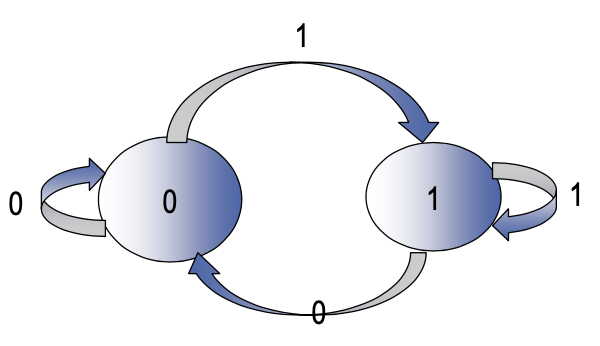
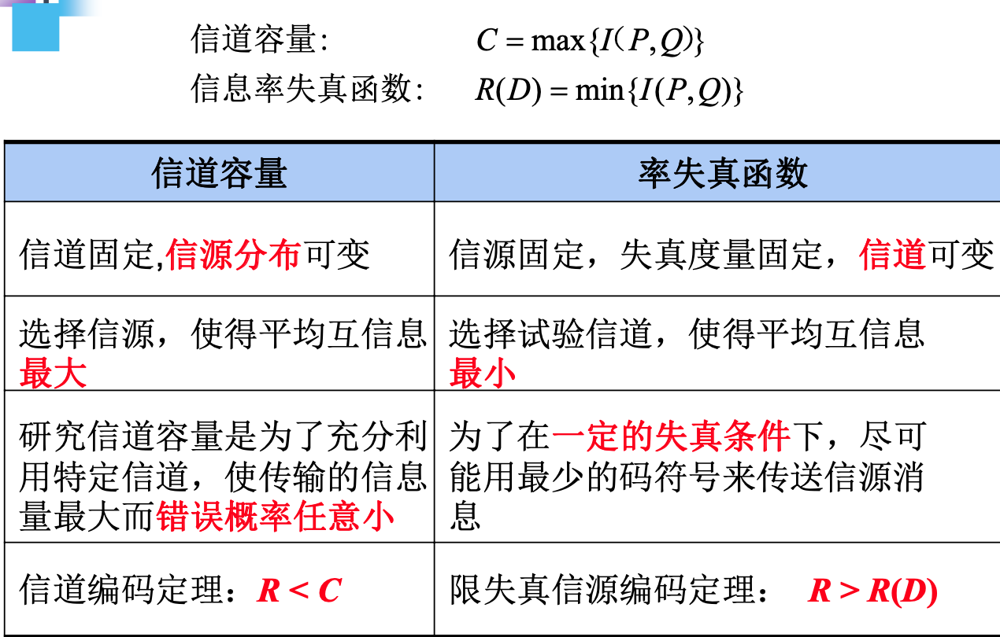

# 信息论

xyfJASON

---

[TOC]

$$
\newcommand{\bfX}{\mathbf X}
\newcommand{\bfY}{\mathbf Y}
$$

## 信息的统计度量

### 自信息量和条件自信息量

**Def（自信息量）**：设 $x$ 为一个随机事件，
$$
I(x)=-\log p(x)
$$
自信息量衡量随机事件的不确定性。

**Def（联合自信息量）**：设 $x,y$ 为随机事件，
$$
I(x,y)=-\log p(x,y)
$$
**单位**：若 $\log$ 底数为 $2$，为 bit；若底数为 $e$，为 nat；若底数为 $10$，为 hart；若底数为 $3$，为 trit.

**Properties**:

1. 单调递减

2. 当 $p(x)=1$ 时，$I(x)=0$

3. 当 $p(x)=0$ 时，$I(x)=\infty$

4. 两独立事件的联合信息量等于各自信息量之和：$I(x,y)=I(x)+I(y)\quad x,y\text{ 独立}$

**Def（条件自信息量）**：设 $x,y$ 为随机事件，
$$
I(x\mid y)=-\log p(x\mid y)
$$

### 互信息量和条件互信息量

**Def（互信息量）**：设 $x,y$ 为随机事件，
$$
I(x;y)=\log\frac{p(x\mid y)}{p(x)}=I(x)-I(x\mid y)
$$
互信息量是一种消除的不确定性的度量，即先验不确定性减去尚存在的不确定性。

**Property（互易性）**：
$$
I(x;y)=\log\frac{p(x\mid y)}{p(x)}=\log\frac{p(x,y)}{p(x)p(y)}=\log\frac{p(y\mid x)}{p(y)}=I(y;x)
$$
**Property**：当 $x,y$ 独立时，互信息量为 $0$.

**Property**：互信息量可正可负，无论符号如何，绝对值越大，$x$ 和 $y$ 关系越密切。

**Thm**:
$$
I(x;y)\leq I(x),\qquad I(x;y)\leq I(y)
$$
proof:
$$
I(x;y)=\log\frac{p(x\mid y)}{p(x)}<\log\frac{1}{p(x)}=I(x)
$$
Q.E.D.

**Def（条件互信息量）**：设 $x,y,z$ 是随机事件，
$$
I(x;y\mid z)=\log\frac{p(x\mid y,z)}{p(x\mid z)}
$$

**Def（多个事件之间的互信息）**：
$$
\begin{align}
I(x;y,z)=\log\frac{p(x\mid y,z)}{p(x)}=\log\frac{p(x\mid y,z)}{p(x\mid z)}\frac{p(x\mid z)}{p(x)}=I(x;z)+I(x;y\mid z)
\end{align}
$$

### 熵，条件熵和联合熵

**Def（熵）**：设有离散随机变量 $X$，
$$
H(X)=\mathbb E[I(X)]=\mathbb E[-\log p(X)]=-\sum_{x}p(x)\log p(x)
$$
注意，定义 $0\log0=\lim_{x\to 0}x\log x=0$.

**Def（条件熵）**：设 $X,Y$ 为两随机变量，
$$
H(X\mid Y)=\sum_{x,y}p(x,y)I(x\mid y)=-\sum_{x,y}p(x,y)\log p(x\mid y)
$$
又由于
$$
H(X\mid y)=-\sum_xp(x\mid y)\log p(x\mid y)
$$
故
$$
\begin{align}
H(X\mid Y)&=-\sum_y\sum_x p(x,y)\log p(x\mid y)\\
&=-\sum_yp(y)\sum_xp(x\mid y)\log p(x\mid y)\\
&=\sum_y p(y)H(X\mid y)
\end{align}
$$

注意区分 $H(X\mid Y)$ 和 $H(X\mid y)$.

**Def（联合熵）**：设 $X,Y$ 为两随机变量，
$$
H(X,Y)=\sum_{x,y}p(x,y)I(x,y)=-\sum_{x,y}p(x,y)\log p(x,y)
$$

**Property（对称性）**：
$$
H(p_1,p_2,\ldots,p_n)=H(p_2,p_1,\ldots,p_n)=\cdots
$$
**Property（非负性）**：
$$
H(X)\geq 0
$$
当且仅当 $X$ 为必然事件/确定性随机变量时 $H(X)=0$.

**Property（扩展性）**：
$$
H(p_1,p_2,\ldots,p_n)=H(p_1,p_2,\ldots,p_n-\epsilon,\epsilon)
$$
其中 $\epsilon$ 是一个无穷小量。

**Property（可加性）**：
$$
H(X,Y)=H(X)+H(Y\mid X)=H(Y)+H(X\mid Y)
$$
特别地，当 $X,Y$ 独立时，$H(X,Y)=H(X)+H(Y)$.

proof:
$$
\begin{align}
H(X,Y)&=\sum_{xy}p(x,y)\log\frac{1}{p(x,y)}\\
&=\sum_{xy}p(x,y)\log\frac{1}{p(x)p(y\mid x)}\\
&=\sum_{xy}p(x,y)\log\frac{1}{p(x)}+\sum_{xy}p(x,y)\log\frac{1}{p(y\mid x)}\\
&=\sum_x\log\frac{1}{p(x)}\sum_yp(x,y)+H(Y\mid X)\\
&=\sum_xp(x)\log\frac{1}{p(x)}+H(Y\mid X)\\
&=H(X)+H(Y\mid X)
\end{align}
$$
Q.E.D.

**Property（极值性）**：
$$
H(p_1,p_2,\ldots,p_n)\leq H(1/n,1/n,\ldots,1/n)=\log n
$$
**Property（确定性）**：必然事件熵为 $0$.

**Property（上凸性）**：$H(p_1,p_2,\ldots,p_n)$ 是严格上凸函数。

**Thm**：
$$
H(X\mid Y)\leq H(X)
$$
proof:
$$
\begin{align}
H(X\mid Y)&=\sum_{xy}p(x,y)\log \frac{1}{p(x\mid y)}\\
&=\sum_{xy}p(x,y)\log\frac{p(x)p(y)}{p(x,y)p(x)}\\
&=\sum_{xy}p(x,y)\log\frac{1}{p(x)}+\sum_{xy}p(x,y)\log\frac{p(x)p(y)}{p(x,y)}\\
&=H(X)+\log\left(\sum_{xy}p(x,y)\frac{p(x)p(y)}{p(x,y)}\right)\\
&=H(X)
\end{align}
$$
Q.E.D.

**Thm**：
$$
H(X,Y)\leq H(X)+H(Y)
$$
利用可加性与上一条定理易得。

**Def（加权熵）**：
$$
H_W(X)=-\sum_{i=1}^nw_ip_i\log p_i
$$

### 平均互信息量

**Def（平均互信息量）**：设 $X,Y$ 是两随机变量，
$$
\begin{align}
I(X;Y)&=\sum_{x,y}p(x,y)I(x;y)\\
&=\sum_{x,y}p(x)p(y\mid x)\log\frac{p(y\mid x)}{p(y)}\\
&=\sum_{x,y}p(x)p(y\mid x)\log\frac{p(y\mid x)}{\sum_{x'}p(y\mid x')p(x')}
\end{align}
$$
写成这种形式是为了只用 $p(x)$ 和 $p(y\mid x)$ 表达平均互信息量，其中 $p(x)$ 是先验概率，$p(y\mid x)$ 是前向转移概率。

**Property（非负性）**：
$$
I(X;Y)\geq 0
$$
当 $X,Y$ 独立时为零。

**Property（对称性）**：
$$
I(X;Y)=I(Y;X)
$$
**平均互信息量和各类熵的关系**：
$$
I(X;Y)=H(X)-H(X\mid Y)=H(Y)-H(Y\mid X)=H(X)+H(Y)-H(X,Y)
$$
源自互信息量和自信息量的关系，如下图所示。

**Property（极值性）**：
$$
I(X;Y)\leq H(X)\quad I(X;Y)\leq H(Y)
$$
**Property（凸函数性）**：平均互信息量是先验概率 $p(x)$ 的上凸函数；平均互信息量是前向转移概率 $p(y\mid x)$ 的下凸函数。

## 离散信源

### 信源的数学模型及其分类

信源可以输出多个符号，每个符号以一定概率随机出现，因此可用如下表述形式建模：
$$
\begin{bmatrix}X\\P\end{bmatrix}=\begin{bmatrix}x_1&x_2&\cdots&x_q\\p(x_1)&p(x_2)&\cdots& p(x_q)\end{bmatrix}
$$
**连续信源 v.s. 离散信源**：

- 连续信源——时空连续、幅度连续（如自然图像）
- 离散信源——时空离散、幅度离散（如数字图像）
- 采样（时空离散化）与量化（幅度取值离散化）

**有记忆信源 v.s. 无记忆信源**：

- 有记忆信源
  - 有限记忆信源——记忆长度
  - 无限记忆信源
- 无记忆信源：$p(x_1\cdots x_M)=\prod_{i=1}^Mp(x_i)$

### 离散无记忆信源

**Def**：设信源 $X$ 的符号集为 $\{x_1,\ldots,x_q\}$，符号 $x_i$ 发出的概率为 $p(x_i)$，它们**互不相关**，称 $X$ 为离散无记忆信源。

**自信息量**：信源发出符号 $x_i$ 的信息量
$$
I(x_i)=-\log p(x_i)
$$
**信源熵**：信源的平均自信息量
$$
H(X)=\mathbb E[I(x_i)]=\sum_{i=1}^q p(x_i)I(x_i)=-\sum_{i=1}^qp(x_i)\log p(x_i)
$$

### 离散无记忆信源的扩展信源

**$N$ 次扩展信源**：集合中的每一个元素是一个 $N$ 维随机矢量，例如：

- 二进制信源：$X=\{00,01,10,11\}$，$N=2$
- 英语：$X=\{\text{the}, \text{car}, \text{ear}, \text{she}, \text{you}, \ldots\}$，$N=3$
- 汉语：$X=\{\text{我们在上课}，\text{张三睡着了}，\ldots\}$，$N=5$

**Def**：设 $X$ 是一个离散无记忆信源
$$
\begin{bmatrix}X\\P\end{bmatrix}=\begin{bmatrix}x_1&x_2&\cdots&x_q\\p(x_1)&p(x_2)&\cdots& p(x_q)\end{bmatrix}
$$
则 $X$ 的 $N$ 次扩展信源为：
$$
\begin{bmatrix}X^N\\P\end{bmatrix}=\begin{bmatrix}\alpha_1&\alpha_2&\cdots&\alpha_{q^N}\\p(\alpha_1)&p(\alpha_2)&\cdots& p(\alpha_{q^N})\end{bmatrix}
$$

其中，若 $\alpha_i=x_{i_1}\cdots x_{i_N}$，则 $p(\alpha_i)=\prod_{k=1}^Np(x_{i_k})$.

**离散无记忆 $N$ 次扩展信源的熵**：离散无记忆信源 $X$ 的 $N$ 次扩展信源 $X^N$ 的熵等于信源熵的 $N$ 倍，即：
$$
H(X^N)=NH(X)
$$

### 离散平稳信源

#### 离散平稳信源

**Def**：设信源产生随机序列：$X_1,X_2,\ldots$，满足：

1. $X_i\in\{a_1,\ldots,a_q\}$

2. 序列是平稳的：
   $$
   P(X_{i_1}=x_1,\ldots,X_{i_N}=x_N)=P(X_{i_1+h}=x_1,\ldots,X_{i_N+h}=x_N)
   $$

称此信源为离散平稳信源。离散平稳信源所发符号序列的概率分布**与时间起点无关**，概率是平稳的。

**Def**：

- 一维平稳信源：
  $$
  P(X_i=x)=P(X_j=x)=p(x)
  $$

- 二维平稳信源：
  $$
  P(X_i=x_1,X_{i+1}=x_2)=P(X_j=x_1,X_{j+1}=x_2)=p(x_1x_2)
  $$

- 完全平稳信源：
  $$
  P(X_i=x_1,\ldots,X_{i+N}=x_N)=P(X_j=x_1,\ldots,X_{j+N}=x_N)=p(x_1,\ldots ,x_N)
  $$

**Thm**：从定义容易推得，离散平稳信源的条件概率也与时间起点无关：
$$
P(x_{i+N}\mid x_i\cdots x_{i+N-1})=P(x_{j+N}\mid x_j\cdots x_{j+N-1})
$$
**注意，离散平稳信源不一定无记忆。**

#### 二维平稳信源的熵

二维平稳信源 $X$：
$$
\begin{bmatrix}X\\P\end{bmatrix}=\begin{bmatrix}X_1X_2\\P\end{bmatrix}=\begin{bmatrix}a_1a_1&a_1a_2&\cdots &a_qa_q\\p(a_1a_1)&p(a_1a_2)&\cdots&p(a_qa_q)\end{bmatrix}
$$
联合熵：
$$
H(X)=H(X_1X_2)=-\sum_{i=1}^q\sum_{j=1}^qp(a_ia_j)\log p(a_ia_j)
$$
条件熵：
$$
H(X_2\mid X_1)=-\sum_{i=1}^q\sum_{j=1}^qp(a_ia_j)\log p(a_j\mid a_i)
$$

#### 极限熵

**Def**：信源输出长度为 $N$ 的符号序列，平均每个符号的熵为：
$$
H_N(X)=\frac{1}{N}H(X^N)=\frac{1}{N}H(X_1,X_2,\ldots,X_N)
$$
其中，$X^N$ 是 $X_1,X_2,\ldots,X_N$ 的简写。

**Def（极限熵）**：
$$
H_\infty(X)=\lim_{N\to\infty}H_N(X)
$$
含义：信源输出的符号序列中，平均每个符号带有的信息量，即实际的熵。

**Thm**：对任意离散平稳信源，若 $H_1(X)<\infty$，则：
$$
\lim_{N\to\infty}H_N(X)=\lim_{N\to\infty}H(X_N\mid X^{N-1})
$$
特别地，当信源记忆长度有限时（设为 $m$），则：
$$
H_\infty(X)=\lim_{N\to\infty}H(X_N\mid X_1,X_2,\ldots,X_{N-1})=H(X_{m+1}\mid X_1,\ldots,X_m)
$$

### 马尔可夫信源

#### 有限状态马尔可夫链

**Def**：设有随机序列 $\{X_n\}$，状态空间 $S=\{S_1,\ldots,S_q\}$，若：
$$
P(X_n=S_{i_n}\mid X_{n-1}=S_{i_{n-1}},\ldots,X_1=S_{i_1})=P(X_n=S_{i_n}\mid X_{n-1}=S_{i_{n-1}})
$$
则称 $\{X_n\}$ 具有马尔可夫性质，是马尔可夫链。

**Def（转移概率）**：已知 $m$ 时刻系统处于状态 $S_i$ 的条件下，在 $n$ 时刻系统处于状态 $S_j$ 的概率
$$
p_{ij}(m,n)=P(X_n=S_j\mid X_m=S_i)
$$

- 一步转移概率：$p_{ij}(m,m+1)$，简记为 $p_{ij}(m)$.
- $k$ 步转移概率：$p_{ij}(m, m+k)$，也记作 $p_{ij}^{(k)}(m)$；所有 $p_{ij}^{(k)}(m)$ 构成转移矩阵 $P^{(k)}(m)$.

**Def（时齐马尔可夫链，齐次马尔可夫链，具有平稳转移概率的马尔可夫链）**：
$$
p_{ij}(m)=P(X_{m+1}=j\mid X_m=i)=p_{ij}
$$
即 $p_{ij}(m)$ 与时刻 $m$ 无关。

易知时齐马尔可夫链满足 C-K 方程：
$$
P^{(m+r)}=P^{(m)}P^{(r)}
$$
**Def（遍历性）**：若齐次马尔可夫链对一切 $i, j$ 存在不依赖于 $i$ 的极限：
$$
\lim_{n\to\infty}p_{ij}^{(n)}=w_j
$$
且满足：
$$
w_j\geq 0,\quad w_j=\sum_{i}w_ip_{ij},\quad\sum_{j}w_j=1
$$
则称其具有遍历性，$w_j$ 为稳态分布。

注意，遍历性是指经过一个过程后达到平稳，而不是一直平稳。

**稳态分布**：设某马尔可夫链的状态转移矩阵为 $P$，其稳态分布为 $\vec w$（列向量），则：

1. $\sum_{j}w_j =1$
2. $\vec w^TP = \vec w^T$；进而，若初始分布 $\vec w^{(0)} =\vec w$，则对所有 $n$，$\vec w^{(n)}=\vec w$
3. $\vec w$ 是该链的唯一稳态分布。

**Thm**：设 $P$ 为某一马尔可夫链的状态转移矩阵，则该链稳态分布存在的充要条件是存在一个正整数 $N$，使得矩阵 $P^N$ 中所有的元素均大于零。

#### 马尔可夫信源

马尔可夫信源的状态<u>由若干个符号组成</u>：

- 一阶马尔可夫信源：每个状态包含一个符号，将要输出的符号仅与前一个符号（即上一个状态）相关
- 二阶马尔可夫信源：每个状态包含两个符号，将要输出的符号与前两个符号（即上一个状态）相关
- ……

    

马尔可夫信源是有限记忆信源，若状态由 $m$ 个符号组成，则记忆长度为 $m$.

**遍历的马尔可夫信源的极限熵**：时间足够长后，遍历的 $m$ 阶马尔可夫信源可视作平稳信源：
$$
H_\infty=\lim_{N\to\infty}H(X_N\mid X_1,X_2,\ldots,X_{N−1})=H(X_{m+1}|X_1,X_2,\ldots,X_m)
$$
即 $m$ 阶遍历马尔可夫信源的极限熵 = $m$ 阶条件熵。

下面继续进行计算：
$$
\begin{align}
H_\infty&=H(X_{m+1}\mid X_1,X_2,\ldots,X_m)\\
&=\sum_{a_{k_{m+1}}}\sum_{a_{k_m},\ldots,a_{k_1}}p(a_{k_{m+1}}a_{k_m}\cdots a_{k_1})\log\frac{1}{p(a_{k_{m+1}}\mid a_{k_m},\ldots,a_{k_1})}\\
&=\sum_{a_{k_{m+1}}}\sum_{S_j}p(a_{k_{m+1}}S_j)\log\frac{1}{p(a_{k_{m+1}}\mid S_j)}\\
&=\sum_{S_j}p(S_j)\sum_{a_{k_{m+1}}}p(a_{k_{m+1}}\mid S_j)\log\frac{1}{p(a_{k_{m+1}}\mid S_j)}\\
&=\sum_{S_j}p(S_j)H(X\mid S_j)
\end{align}
$$
**因此，欲计算某遍历的马尔可夫信源的极限熵（信源熵），只需计算其稳态分布 $p(S_j)$，和在每一个状态 $S_j$ 下发出的符号的熵 $H(X\mid S_j)$.**

### 相关性和剩余度

对于平稳信源，有：
$$
H(X_N\mid X_1,\ldots,X_{N-1})\leq H(X_N\mid X_2,\ldots,X_{N-1})=H(X_{N-1}\mid X_1,\ldots,X_{N-2})
$$
以此类推：
$$
H(X_N\mid X_1,\ldots,X_{N-1})\leq H(X_{N-1}\mid X_1,\ldots,X_{N-2})\leq\cdots\leq H(X_1)\leq H_0=\log q
$$
含义：由于信源符号间存在依赖关系，信源输出的符号越多，越容易判断将要输出的符号是什么，即信源熵（不确定性）越小。

**Def（熵的相对率）**：
$$
\eta=\frac{H(X)}{H_\max(X)}=\frac{H(X)}{H_0(X)}
$$
**Def（信源剩余度）**：
$$
R=1-\frac{H_\infty}{H_0}=1-\frac{H_\infty}{\log q}
$$
其中，$H_0$ 表示每个符号可能携带的最大的平均信息量，$H_\infty$ 表示每个符号携带的实际的平均信息量。

**Def（内熵）**：
$$
R_{ie}=\log q-H_\infty(X)
$$
含义：信源剩余度越大，表明信源符号之间的相关性越强，信源的输出效率越低；信源剩余度越小，表明信源符号之间的相关性越弱，信源输出效率越高。

## 离散信道及其容量

### 信道的数学模型及其分类

由于干扰的存在，信道的输出 $Y$ 与输入 $X$ 不一定完全相同，用条件概率 $p(y|x)$ 描述。

**信道的分类**：

- 根据输入输出是否连续：
  - 连续信道：I、O 均是连续事件集
  - 离散信道；I、O 均是离散事件集
- 根据输入输出个数：
  - 两端信道；I、O 均只有一个用户的单向通信信道，又称为两用户信道、单路信道
  - 多端信道：I 或 O 至少有一端有两个以上的用户，又称为多用户信道、网络信道
- 根据编码器、译码器的数量：
  - 多元接入信道：多个编码器、一个译码器的信道
  - 广播信道：一个编码器、多个译码器的信道
- 根据统计特性是否随时间变化
  - 恒参信道：信道的统计特性不随时间发生变化
  - 随参信道：信道的统计特性随时间发生变化
- 根据信道的记忆特性：
  - 无记忆信道：信道的输出仅与当前的输入有关，与以前的输入无关
  - 有记忆信道：信道的输出不仅与当前的输入有关，与以前的输入也有关系

**一些特殊信道**：

- 无损信道：输出可以决定输入，$H(X\mid Y)=0$
- 确定信道：输出完全由输入决定，$H(Y\mid X)=0$
- 无噪信道：即使无损信道，又是确定信道
- 无用信道：输入输出相互独立

### 离散无记忆信道

#### 离散信道的数学模型

信道输入序列 $x=\{x_1,\ldots,x_N\}$，输出序列 $y=\{y_1,\ldots,y_N\}$，信道：$p(y\mid x)=p(y_1\cdots y_N\mid x_1\cdots x_N)$. 其数学模型为：

简记为：
$$
\{X,p(y\mid x), Y\}
$$
**Def**：若离散信道对任意 $N$ 长的输入、输出序列有
$$
p(y\mid x)=p(y_1y_2\cdots y_N \mid x_1x_2\cdots x_N)=\prod_{n=1}^Np(y_n\mid x_n)
$$
则称它为**离散无记忆信道**，简称 DMC. 其数学模型为：

简记为：
$$
\{X,p(y\mid x), Y\}=\{X,p(y_n\mid x_n), Y\}
$$

> 注：对于一般的离散信道，
> $$
> p(y\mid x)=p(y_1\mid x_1\cdots x_N)p(y_2\mid x_1\cdots x_Ny_1)\cdots p(y_N\mid x_1\cdots x_Ny_1\cdots y_{N-1})
> $$

**Def**：对任意 $n$ 和 $m$，若离散无记忆信道还满足 $P(y_n = j \mid x_n = i) = P( y_m = j \mid x_m = i)$， 则称此信道为**平稳**的或者**恒参**的。

后面如无特殊声明，所讨论的离散无记忆信道都是平稳的。

#### DMC 的信道矩阵

平稳 DMC 的概率不变且只需研究单个符号的传输，因此可以组成一个**信道矩阵**：
$$
P=[p_{ij}]\in \R^{r\times s}
$$

> 注意 $P$ 不是一个方阵。

分析离散信道常用的概率列举如下：

- 先验概率：
  $$
  p(a_i)=p(X=a_i)
  $$

- 联合概率：
  $$
  p(a_ib_j)=p(a_i)p(b_j\mid a_i)=p(b_j)p(a_i\mid b_j)
  $$

- 前向转移概率（信道传递概率）：
  $$
  p(b_j\mid a_i)=p_{ij}
  $$

- 后向转移概率（后验概率）：
  $$
  p(a_i\mid b_j)=\frac{p(a_i)p(b_j\mid a_i)}{\sum_k p(a_k)p(b_j\mid a_k)}
  $$

- 输出符号概率：
  $$
  p(b_j)=\sum_i p(a_i)p(b_j\mid a_i)
  $$

**Def（对称信道）**：信道转移矩阵 $p(b_j\mid a_i)$ 的行是彼此的置换，列也是彼此的置换

**Def（弱对称信道）**：信道转移矩阵 $p(b_j\mid a_i)$ 的行是彼此的置换，列和相等

例如：$p(y\mid x)=\begin{bmatrix}1/3&1/6&1/2\\1/3&1/2&1/6\end{bmatrix}$ 是弱对称信道。

**二元删除信道 & 二元对称消失信道**：

#### 信道疑义度

**Def（先验熵）**：
$$
H(X)=-\sum_{i=1}^rp(a_i)\log p(a_i)
$$
**Def（后验熵）**：
$$
H(X\mid b_j)=-\sum_{i=1}^r p(a_i\mid b_j)\log p(a_i\mid b_j)
$$
**Def（信道疑义度）**：即输入空间 $X$ 对输出空间 $Y$ 的条件熵，是后验熵的期望。
$$
H(X\mid Y)=-\sum_{i}\sum_{j}p(a_ib_j)\log p(a_i\mid b_j)=\mathbb E[H(X\mid b_j)]
$$
什么情况下信道疑义度为零？无噪信道或无损信道：$H(X\mid Y)=0$.

$H(X\mid Y)\leq H(X)$：收到输出符号 $Y$ 以后，总能消除一些对 $X$ 的不确定性，获得一些信息。

#### 平均互信息

**Def**：原始信源熵与信道疑义度之差
$$
I(X;Y)=H(X)-H(X\mid Y)
$$
含义：通过信道传送过去的信息量。

**凸函数性**：

- 固定信道：信道传递概率 $p(y\mid x)$ 不变，平均互信息 $I(X;Y)$ 是信源概率分布 $p(x)$ 的上凸函数。
- 固定信源：信源概率分布 $p(x)$ 不变，平均互信息 $I(X;Y)$ 是信道传递概率 $p(y\mid x)$ 的下凸函数。

#### 熵、信道疑义度及平均互信息的相互关系

同第二节课。

- $H(X,Y) \leq H(X)+H(Y)$
- $H(X,Y) =H(X) + H(Y\mid X) =H(Y)+H(X\mid Y)$
- $I(X;Y) =H(X)-H(X\mid Y)$
- $I(X;Y) =I(Y;X) \geq 0$
- $I(X;Y) =H(X)+H(Y)-H(XY)$
- $I(X;X) =H(X)$

### 离散无记忆扩展信道

#### $N$ 次扩展信道

$N$ 次扩展信道与单符号信道之间的关系，类似于 $N$ 次扩展信源与单符号信源之间的关系。

$N$ 次扩展信道中，输入变量和输出变量均为 $N$ 维：$\bfX=\{X_1,\ldots,X_N\}$，$\bfY=\{Y_1,\ldots,Y_N\}$，输入序列共有 $r^N$ 个，输出序列共有 $s^N$ 个，输入和输出序列分别记为 $\alpha_k$ 和$\beta_h$.

其数学模型为：

其中
$$
p(\beta_h\mid \alpha_k)=p(b_{h_1}\cdots b_{h_N}\mid a_{k_1}\cdots a_{k_N})=\prod_{i=1}^Np(b_{h_i}\mid a_{k_i})
$$

#### 定理

**Def**：$N$ 次扩展信道的平均互信息为：
$$
I(\bfX;\bfY)=I(X^N;Y^N)=\sum p(\alpha_k\beta_h)\log \frac{p(\alpha_k\mid\beta_h)}{p(\alpha_k)}
$$
**Thm**：设信道的输入、输出分别是长度为 $N$ 的序列 $X,Y$，则：

- 若信道无记忆
  $$
  I(\bfX;\bfY)\leq \sum_{n=1}^N I(X_n;Y_n)
  $$

- 若信源无记忆
  $$
  I(\bfX;\bfY)\geq\sum_{n=1}^N I(X_n;Y_n)
  $$

- 若信源、信道都无记忆
  $$
  I(\bfX;\bfY)=\sum_{n=1}^N I(X_n;Y_n)
  $$

### 信道容量

#### 信道容量

**Def**：信道容量定义为改变信源分布 $p(x)$，所得到的平均互信息的最大值：
$$
 C=\max_{p(x)}{I(X;Y)}
$$

> 因为 $I(X;Y)$ 是信源分布 $p(x)$ 的上凸函数，所以这个最大值能找到且唯一。
>
> 信道容量与信源 $p(x)$ 无关，只与信道特性 $p(x\mid y)$ 有关，因为取了最大值。

**Def（信息传输率）**：平均每个输出符号携带的关于输入的信息量（比特/符号）。
$$
R=I(X;Y)
$$
核心问题：求信道容量 $C$，以及达到 $C$ 的信源分布 $p(x)$.

#### 特殊信道的信道容量

- **无损信道**

  确定了输出，就能确定输入，因此信道矩阵的每一列只有一个非零元素。

  信道疑义度：$H(X\mid Y)=0$

  于是：$I(X;Y)=H(X)-H(X\mid Y)=H(X)$

  信道容量：
  $$
  C=\max_{p(x)}I(X;Y)=\max_{p(x)}H(X)=\log r
  $$
  最佳输入分布为等概分布。

- **确定信道**

  确定了输入，就能确定输出，因此信道矩阵的每一行只有一个非零元素。又因为每一行的和为 $1$，因此每一行有且仅有一个 $1$，其余都是 $0$.

  $H(Y\mid X)=0$

  于是：$I(X;Y)=H(Y)-H(Y\mid X)=H(Y)$

  信道容量：
  $$
  C=\max_{p(x)}I(X;Y)=\max_{p(x)}H(Y)=\log s
  $$
  最佳输入分布为使得输出是等概分布的分布。

- **无噪信道**

  输出与输入一一对应，信道矩阵是单位矩阵。

  $H(X\mid Y)=H(Y\mid X)=0$

  于是：$I(X;Y)=H(X)=H(Y)$

  信道容量：
  $$
  C=\log r=\log s
  $$
  最佳输入分布为等概分布。

#### 离散对称信道

**Def（输入对称信道）**：信道矩阵的每一行都是其他行的不同排列。

于是 $H(Y\mid X=x_1)=\cdots=H(Y\mid X=x_r)$，故
$$
H(Y\mid X)=\mathbb E_X[H(Y\mid X)]=H(Y\mid X=x_k)=H(p_1',\ldots,p_s')
$$
其中，$p_1',\ldots p_s'$为信道矩阵中的任一行。因此 $I(X;Y)=H(Y)-H(Y\mid X)=H(Y)-H(p_1',\ldots,p_s')$.

信道容量：
$$
C=\max_{p(x)}I(X;Y)=\max_{p(x)}(H(Y)-H(p_1',\ldots,p_s'))=\log s-H(p_1',\ldots,p_s')
$$
最佳输入分布为使得输出是等概分布的分布。

**Def（输出对称信道）**：信道矩阵的每一列都是其他列的不同排列，易知每一列和为 $r/s$.

当输入等概率分布时，输出也是等概率分布：
$$
p(y_j)=\sum_{k=1}^rp(y_j\mid x_k)p(x_k)=\frac{1}{r}\sum_{k=1}^r p(y_j\mid x_k)=\frac{1}{r}\frac{r}{s}=\frac{1}{s}
$$
**Def（对称信道）**：信道矩阵的每一行（列）都是其他行（列）的不同排列。

**Def（准对称信道）**：若一个离散无记忆信道的信道矩阵中，按照信道的输出集 $Y$ 可以将信道矩阵划分成 $n$ 个子集，每个子矩阵中的每一行（列）都是其他行（列）的不同排列，则称这类信道为准对称信道。当划分的子集只有一个时，信道关于输入和输出对称，称此类信道为对称信道。

**Thm**：一个离散对称信道当输入为等概分布时，达到信道容量 $C$，且
$$
 C=\log s-H(p_1'\cdots p_s')
$$
其中，$p_1',\ldots p_s'$为信道矩阵中的任一行。

Proof：利用输入、输出对称信道的性质易证。

**Def（强对称信道）**：

信道容量：
$$
C=\log r-p\log(r-1)-H(p)
$$
最佳输入分布为等概率分布。

#### 离散无记忆 $N$ 次扩展信道的信道容量

$$
C^N=\max I(\bfX;\bfY)
$$

1. 由于信道无记忆时 $I(\mathbf X;\mathbf Y)\leq\sum_{i=1}^NI(X_n;Y_n)$，同时如果信源也无记忆，$I(\mathbf X;\mathbf Y)=\sum_{i=1}^N I(X_n;Y_n)$，因此 $C^N$ 的最大值在信源无记忆时取到。

2. 当信源无记忆时，$I(\mathbf X;\mathbf Y)=NI(X;Y)$，因此
   $$
   C^N=\max NI(X;Y)=NC
   $$

3. 当信源无记忆且达到最佳分布时，DMC 的 $N$ 次扩展信道达到信道容量。

#### 信源与信道的匹配

通常情况下，信息传输率 $R=I(X;Y)< C$，信道有剩余度：$C-I(X;Y)$

信道的相对剩余度：
$$
\frac{C-I(X;Y)}{C}=1-\frac{I(X;Y)}{C}
$$
信源与信道匹配：信源处于最佳输入分布，使得信息传输率 $R = C$.

信源编码的目的：通过编码，改变原始信源的统计特性，使得信源与信道尽量匹配，使得信道剩余度尽可能小。

## 无失真信源编码

编码：把信息由一种表示形式变换成另外一种表示形式。

### 编码器

设信源符号集为 $S=\{s_1,s_2,\ldots,s_q\}$，码符号集为 $X=\{x_1,\ldots,x_r\}$. 编码器将信源符号 $s_i$ 编码为其对应码字 $W_i$：
$$
\begin{align}
\text{信源符号 } s_i &\xrightarrow{\text{encoder}} \text{码字 } W_i=(x_{i1}x_{i2}\cdots x_{il})\\
\text{源字 }S_i=(s_{i_1}\ldots s_{i_N}) &\xrightarrow{\text{encoder}}\text{码 }C=(W_1\ldots W_N)
\end{align}
$$
所有码字构成的集合称为代码组 $\mathbf C=\{W_1,W_2,\ldots,W_q\}$.

例如：

对于无失真编码，映射应为一一映射，且可逆。

$N$ 次扩展码：设信源符号集 $S=\{s_i\}$ 编码后得到代码组 $\mathbf C=\{W_i\}$，则对 $N$ 次扩展信源 $S^N$ 进行编码，得到代码组 $\mathbf C^N$，且 $\alpha=(s_{j1},s_{j2},\ldots,s_{jN})\in S^N$ 编码为 $W=(W_{j1},W_{j2},\ldots,W_{jN})\in\mathbf C^N$. 例如：

### 分组码

**Def（分组码）**：将信源符号集中的每个信源符号 $s_i$ 映射成一个固定的码字 $w_i$，这样的码称为分组码。

**Def（非分组码）**：编码器的输出不仅与当前输入的源字母决定，还可能与以前的源字母或码字母有关，例如：$y_i=x_i\oplus y_{i-1}$.

**Def（奇异性）**：若一种分组码中的所有码字都互不相同，则称为非奇异码（non-singular），否则称为奇异码。

非奇异是分组码能够正确译码的必要条件：即正确译码 $\Rightarrow$ 非奇异码，但是非奇异码 $\not\Rightarrow$ 正确译码，因为即便单个符号是非奇异的，其 $N$ 次扩展码可能是奇异的，导致不能正确译码。

**Def（唯一可译性）**：一个分组码若对于任意有限的整数 $N$，其 $N$ 次扩展码均为非奇异的，则称之为唯一可译码（uniquely decodable code）.

**Def（即时性）**：无需考虑后续的码符号即可从码符号序列中译出码字，这样的唯一可译码称为即时码（instantaneous code 瞬时码、非延长码）。

**Thm**：一个唯一可译码成为即时码的<u>充要条件</u>是其中任何一个码字都不是其他码字的前缀。

**树图法**构造即时码：

**小结**：

### 定长码

#### 两个不等式

**Thm**：

- 若信源有 $q$ 个符号，对其进行 $r$ 元等长编码，码长为 $l$，则信源存在唯一可译定长码的条件：$r^l\geq q$，即 
  $$
  l\geq \log_r q\quad\text{或}\quad l\log r\geq \log q
  $$

- 若对该信源的 $N$ 次扩展信源进行 $r$ 元等长编码，码长为 $l$，则信源存在唯一可译定长码的条件：$r^l\geq q^N$，即
  $$
  \frac{l}{N}\geq \log_r q\quad\text{或}\quad l\log r\geq N\log q
  $$

> 理解：$l\log r$ 是编码后的最大信息量，$N\log q$ 是编码前的最大信息量，要使得唯一可译码存在，那么编码后能表示的最大信息量至少要有编码前的最大信息量。

#### 定长编码定理

**Thm（定长编码定理）**：设离散无记忆信源 $\begin{bmatrix}S\\P\end{bmatrix}=\begin{bmatrix}s_1&\cdots&s_q\\p(s_1)&\cdots&p(s_q)\end{bmatrix}$ 的熵为 $H(S)$，其 $N$ 次扩展信源为 $\begin{bmatrix}S^N\\P\end{bmatrix}=\begin{bmatrix}\alpha_1&\cdots&\alpha_{q^N}\\p(\alpha_1)&\cdots&p(\alpha_{q^N})\end{bmatrix}$，现用码符号集 $X=\{x_1,\ldots,x_r\}$ 对 $N$ 次扩展信源进行长度为 $l$ 的定长编码。对于 $\forall \epsilon>0$，

- 若满足：
  $$
  \frac{l}{N}\log r\geq H(S)+\epsilon
  $$
  则 $\forall\delta>0$，当 $N$ 足够大时，译码错误概率小于 $\delta$；

- 若满足：
  $$
  \frac{l}{N}\log r\leq H(S)-2\epsilon
  $$
  则当 $N$ 足够大时，译码错误概率趋于 $1$.

> 理解：$l\log r$ 与 $N H(S)$ 的比较——前者是长度为 $l$ 的码能携带的最大信息量，后者是长度为 $N$ 的信源符号序列平均携带的信息量。
>
> Intuitive proof idea：高概率的序列数量少（典型序列）、数量多的序列概率低（非典型序列）。

**Def（编码信息率/编码速率/码率）**：
$$
R=\frac{l}{N}\log r
$$

> 含义：用于表示每个信源符号的最大信息量。

**Def（编码效率）**：
$$
\eta=\frac{H(S)}{R}=\frac{H(S)}{l/N\cdot\log r}
$$
最佳编码效率：
$$
\eta_\max=\frac{H(S)}{H(S)+\epsilon},\,\epsilon>0
$$
**推论**：对任意 $\delta>0$，当
$$
N\geq \frac{\sigma^2}{H^2(S)}\frac{\eta_\max^2}{(1-\eta_\max)^2\delta}
$$
时，错误率可以小于 $\delta$. 其中 $\sigma^2$ 是 $I(s_i)$ 的方差。

### 变长码

#### 两个不等式

**Kraft inequality**：即时码**存在**的充要条件是：
$$
\sum_{i=1}^qr^{-l_i}\leq 1
$$
**McMillan inequality**：唯一可译码**存在**的充要条件是：
$$
\sum_{i=1}^qr^{-l_i}\leq 1
$$
其中 $q$ 是信源符号的个数，$r$ 是码符号的个数，$l_1,\ldots,l_q$ 是各个码字的码长。

> 没错，这两个不等式一模一样。
>
> 注意：
>
> 

#### 唯一可译码判别准则

由原始码集合 $S_0$，构造 $S_1,S_2,\ldots$ 如下：

1. $S_1$ 的构造：设 $W_i,W_j\in S_0$，若 $W_i=W_jA$，则将后缀 $A$ 加入 $S_1$；
2. $S_n(n>1)$ 的构造：将 $S_0$ 与 $S_{n-1}$ 比较，若 $W\in S_0,U\in S_{n-1}$ 且 $U=WA$ 

一种码是唯一可译码的充要条件是 $S_1,S_2,\ldots$ 均与 $S_0$ 交集为空。

例子：

#### 变长编码定理

**Def（平均长度）**：设信源 $\begin{bmatrix}S\\P\end{bmatrix}=\begin{bmatrix}s_1&\cdots&s_q\\p(s_1)&\cdots&p(s_q)\end{bmatrix}$ 编码后的码字分别为 $W_1,\ldots,W_q$，各码字长度分别为 $l_1,\ldots,l_q$. 对唯一可译码，这个码的平均长度为：
$$
\bar L=\sum_{i=1}^q p(s_i)l_i
$$
**Def（紧致码/最佳码）**：若一种唯一可译码的平均码长小于等于其他的唯一可译码，则称为紧致码/最佳码。

**Thm（变长编码定理）**：对熵为 $H(S)$ 的离散无记忆信源 $\begin{bmatrix}S\\P\end{bmatrix}=\begin{bmatrix}s_1&\cdots&s_q\\p(s_1)&\cdots&p(s_q)\end{bmatrix}$，

- 若用具有 $r$ 个码符号的集合 $X=\{x_1,\ldots,x_r\}$ 对该信源进行编码，则一定存在一种唯一可译码，其平均码长 $\bar L$ 满足：
  $$
  \frac{H(S)}{\log r}\leq\bar L<1+\frac{H(S)}{\log r}
  $$

- 若用具有 $r$ 个码符号的集合 $X=\{x_1,\ldots,x_r\}$ 对该信源的 $N$ 次扩展信源 $S^N$ 进行编码，则一定存在一种唯一可译码，其每个信源符号所需的码字平均长度满足：
  $$
  \frac{H(S)}{\log r}\leq \frac{\bar L_N}{N}<\frac{H(S)}{\log r}+\frac{1}{N}
  $$

> 可记 $H(S)/\log r$ 为 $H_r(S)$.

**Def（编码信息率/编码速率/码率）**：
$$
R=\frac{\bar L_N}{N}\log r
$$

**Def（编码效率）**：
$$
\eta=\frac{H(S)}{R}=\frac{H(S)}{\bar L_N/N\cdot\log r}=\frac{H_r(S)}{\bar L}
$$

从信道的角度看，对于无噪信道，编码后的信息传输率为：
$$
R=H(X)=\frac{H(S)}{\bar L}\quad(\text{bit/码符号})
$$

#### Shannon 编码

设信源的概率分布为 $P=\{p_1,p_2,\ldots,p_n\}$，且 $p_1>p_2>\cdots>p_n$，

1. 求 $q_k=\sum_{i=1}^{k-1}p_i$
2. 将 $q_k$ 按二进制小数展开
3. 令 $l_k=\left\lceil\log\frac{1}{p_k}\right\rceil$，截取 $l_k$ 位作为 $p_k$ 的编码

#### Huffman 编码

**二元 Huffman 码**：每次把概率最小的 $2$ 个符号合并成一个新的符号。

当有多个符号概率相同时，他们的排列次序是任意的。 但是无论最终的编码结果如何，针对同一个信源，平均码长一定是相等的。这时，码长的方差越小，我们认为越好。

**$r$ 元 Huffman 码**：每次把概率最小的 $r$ 个符号合并成一个新的符号，并分别用码元 $0,1,\ldots,(r-1)$ 来表示。为了使短码得到充分利用，使平均码长最短，**必须使最后一步的缩减信源有 $r$ 个信源符号**。因此对于 $r$ 元编码，信源 $S$ 符号个数 $q$ 必须满足（每合并一次减少 $r-1$ 个）：
$$
q=(r-1)k+r
$$
即要求方程 $q=(r-1) k+r$ 有整数解，其中 $k$ 为未知数。**如果此方程没有解，可以通过人为增加一些概率为 $0$ 的符号来解决。**

#### 算术编码

**初始化**：

**确定符号的编码范围**：

- 编码时输入第 1 个符号是 $10$，找到它的编码范围是 $[0.5, 0.7]$
- 消息中第 2 个符号 $00$ 的编码范围是 $[0, 0.1)$，它的间隔就取 $[0.5, 0.7)$ 的第一个十分之一作为新间隔$[0.5, 0.52)$
- 编码第 3 个符号 $11$ 时，取新间隔为 $[0.514, 0.52)$
- 编码第 4 个符号 $00$ 时，取新间隔为 $[0.514, 0.5146)$
- 依此类推......
- 消息的编码输出可以是最后一个间隔中的任意数

**解码**：

**缺点**：

- 用区间中的一个数表示一个编码序列的输出，如果序列无限长，则这个小数也会无限长，有可能溢出机器 的表示能力
- 不到最后，不能输出这个区间，因此也无法输出任何编码的结果，但大部分情况都要求输入序列后就能获 得输出，例如，实时的应用场景，你不能等所有的序列输入完后才给出输出的结果
- 需要事先知道符号的概率分布

定长码和变长码的小结：

|                                       |                     定长码                     |            变长码            |
| :-----------------------------------: | :--------------------------------------------: | :--------------------------: |
|          唯一可译码存在条件           |  $r^l\geq q$ 或 $l\log r\geq \log q$   | $\sum_{i=1}^qr^{-l_i}\leq 1$ |
| $N$ 次扩展信源 唯一可译码存在条件 | $r^l\geq q^N$ 或 $l\log r\geq N\log q$ |              /               |
|              编码信息率               |              $R=l/N\cdot{\log r}$              |  $R=\bar L_N/N\cdot\log r$   |
|               编码效率                |                 $\eta=H(S)/R$                  |        $\eta=H(S)/R$         |

## 有噪信道编码

### 噪声信道的编码问题

在普通信道的输入和输出端连接编码器和译码器，形成的新信道称作编码信道。

#### 概述

为什么需要信道编码？错误检测和校正：

- 奇偶校验：错误检测
- 汉明码（Hamming code）：错误检测和校正

对比：

- **信源**编码的作用：提高信息传输的有效性。
- **信道**编码的作用：提高信息传输时的抗干扰能力，以增加信息传输的可靠性。

分类：

- 按照功能：
  - 检错码（Error Checking Code）
  - 纠错码（Error Correcting Code）
- 按照对信息序列处理的方法；
  - 分组码（Block Code）：将信道编码器的源符号序列与码符号序列都分成组，映射在分组的基础上独立进行的。
  - 非分组码（Non-block Code）：编码器的输出不仅与当前输入的源符号有关，还可能与与以前的源符号或码符号有关，又称为卷积码。
- 按照校验位与信息位关系：
  - 线性码（Linear Code）：校验位与信息位之间的关系是线性关系（满足线性叠加原理）。
  - 非线性码（Nonlinear Code）：不满足上述关系。
- 按照适用的差错类型：
  - 纠随机差错码：设计的目标是纠随机差错。
  - 纠突发差错码：设计的目标是纠突发错误。

#### 译码规则

**Def**：设信道输入符号集为 $X=\{x_i,i=1,\ldots,r\}$，输出符号集为 $Y=\{y_j,j=1,\ldots,s\}$，如果对于每一个符号，都有一个确定的函数 $F$，使 $y_j$ 对应于唯一的一个输入符号 $x_i$，称这样的函数为**译码规则**，记为
$$
F(y_j)=x_i
$$
因为每个 $y_j$ 都有 $r$ 种译码选择，所以译码规则一共有 $r^s$ 种。给定一个译码规则 $F(y_j)=x_i$，<u>假若我们承认它是“正确”的</u>，那么可以定义：

- **条件正确概率**
  $$
  p(F(y_j)\mid y_j)=p(x_i\mid y_j)
  $$

- **条件错误概率**
  $$
  p(e\mid y_j)=1-p(x_i\mid y_j)
  $$

- **平均错误概率**
  $$
  p_E=\sum_{j=1}^sp(y_j)p(e\mid y_j)=\sum_{j=1}^sp(y_j)(1-p(x_i\mid y_j))
  $$

那么究竟哪个译码规则最好呢，我们认为**使得平均错误概率最小**的译码规则是最好的。基于这一原理，有如下译码准则：

- **最大后验概率准则**：选择译码函数 $F(y_j)=x^\ast$ ，使得：
  $$
  p(x^\ast\mid y_j)\geq p(x_i\mid y_j)\quad\forall i
  $$

- **极大似然译码准则**：选择译码函数 $F(y_j)=x^\ast$，使得：
  $$
  p(y_j\mid x^\ast)\geq p(y_j\mid x_i)\quad \forall i
  $$

当输入等概率分布时，两个准则是等价的。

在确定选择某个译码准则 $F(y_j)=x^\ast$ 后，平均错误概率可以进一步写作：
$$
\begin{align}
p_E&=\sum_{y_j}p(y_j)p(e\mid y_j)\\
&=\sum_{y_j}p(y_j)(1-p(x^\ast\mid y_j))\\
&=1-\sum_{y_j}p(x^\ast y_j)\\
&=\sum_{y_j}\sum_{x_i\neq x^\ast}p(x_iy_j)\\
&=\sum_{y_j}\sum_{x_i\neq x^\ast}p(x_i)p(y_j\mid x_i)\\
\end{align}
$$
特别地，若输入等概率分布，则：
$$
p_E=\frac{1}{r}\sum_{y_j}\sum_{x_i\neq x^\ast}p(y_j\mid x_i)\\
$$
**Fano 不等式**：错误概率与信道疑义度 $H(X\mid Y)$ 满足如下关系：
$$
H(X\mid Y)\leq H(p_E)+p_E\log (r-1)
$$
含义：当信源、信道给定，信道疑义度 $H(X\mid Y)$ 给定了译码错误概率的下界。

### 错误概率与编码方法

即使选择最佳译码规则也只能有限地减小平均错误概率 $p_E$（因为说到底，$p_E$ 还是由信道矩阵决定的），信道编码方法可以进一步减小 $p_E$ ，甚至是任意小。

#### 重复编码

发送端发 0/1 时，连续发多个 0/1.

例子：三次重复编码：

重复次数越多，错误概率越小，但信息传输率也下降：
$$
R=\frac{H(S)}{\bar L}=\frac{\log M}{n}
$$

#### 消息符号数 $M$

在一个二进制信道的 $n$ 次无记忆扩展信道中，输入端有 $2^n$ 个符号序列可能作为消息，通常只选择其中的 $M$ 个作为消息传递。

例子：设 $n=3$，

可以得出结论：随着 $M$ 增大，$R$ 增大，但 $p_E$ 也随之增大；反之亦然。

#### (5,2)线性码

取 $M=4,n=5$，即在 5 次扩展信道中，有 32 种可能的输入序列，选择其中的 4 个作为消息传递。具体而言，这 4 个码字满足下列条件：设码字为 $\alpha_1\alpha_2\alpha_3\alpha_4\alpha_5$，则：
$$
\begin{cases}\alpha_1=\alpha_4\\\alpha_3=\alpha_5=\alpha_1\oplus\alpha_2\end{cases}
$$
其信息传输率为 $R=\log M/n=2/5$.

#### Hamming 距离

**Def**：设 $X=(x_1\ldots x_n),Y=(y_1\ldots,y_n)$ 为两个长为 $n$ 的二元码字，则码字 $X$ 与 $Y$ 之间的 Hamming 距离定义为：
$$
D(X,Y)=\sum_{i=1}^n x_i\oplus y_i
$$
Hamming 距离满足距离的三个性质：非负、对称、三角不等式。

给定码的集合 $\mathbf C$，定义其最小距离为其中任意两个码字的 Hamming 距离的最小值：
$$
D=\min D(C_i,C_j)\quad C_i\neq C_j,\,C_i,C_j\in \mathbf C
$$
在选择编码规则时，应使码字之间的距离越大越好。

### 有噪信道编码定理

**有噪信道编码定理**：设 $C$ 为离散无记忆信道容量，$\forall \varepsilon>0$，当信息传输率 $R<C$ 时，只要码长 $N$ 足够长，总可以在输入符号集中找到 $M=2^{NR}$ 个码字组成的一组码和相应的译码规则，使译码的错误率 $p_E<\varepsilon$.

> Intuitive idea：$R<C\implies 2^{NR}<2^{NC}\implies 2^{N(\log M/N)}<2^{NC}\implies M<2^{NC}$.

**有噪信道编码逆定理**：设有一离散无记忆平稳信源，其信道容量为 $C$，对于任意 $\varepsilon>0$，若选用码字总数 $M=2^{N(C+\varepsilon)}$，则无论 $N$ 取多大，也找不到一种编码，使译码错误概率 $p_E$ 任意的小。

## 限失真信源编码

### 失真测度

**Def**：设 $A=\{a_1,\ldots,a_r\}$ 和 $B=\{b_1,b_2,\ldots,b_s\}$ 分别为源符号集和码符号集，单个符号的**失真函数/失真度量/失真度**是一个非负函数 $d(x,y)$，其中 $x\in A,y\in B$.

常见失真函数：

- 汉明失真
  $$
  d(x,y)=\begin{cases}0&\text{if } x=y\\1&\text{if }x\neq y\end{cases}
  $$

- 平方误差失真
  $$
  d(x,y)=(y-x)^2
  $$

**失真矩阵**：
$$
\begin{bmatrix}d\end{bmatrix}=\begin{bmatrix}
d(a_1,b_1)&\cdots &d(a_1,b_s)\\
\vdots&\ddots&\vdots\\
d(a_r,b_1)&\cdots &d(a_r,b_s)\\
\end{bmatrix}
$$
**矢量失真函数/字失真度**：

设 $\vec x=(x_1,\ldots,x_N)$ 和 $\vec y=(y_1,\ldots,y_N)$ 分别为长度为 $N$ 的源字和码字，$\vec x$ 与 $\vec y$ 之间的矢量失真函数为：
$$
d(\vec x,\vec y)=\frac{1}{N}\sum_{i=1}^N d(x_i,y_i)
$$
**平均失真度**：
$$
\bar D=\mathbb E[d]=\sum_i\sum_j p(x_iy_j)d(x_i,y_j)=\sum_i\sum_j p(x_i)p(y_j\mid x_i)d(x_i,y_j)
$$
**矢量平均失真度**：
$$
\bar D_N=\mathbb E[d_N]=\frac{1}{N}\sum_{i=1}^N \mathbb E[d(x_i,y_j)]=\frac{1}{N}\sum_{i=1}^N\bar D_i
$$

### 信息率失真函数

#### D允许信道

**保真度准则**：如果预先规定的平均失真度为 $D$，则称信源压缩后的平均失真度 $\bar D$ 不大于 $D$ 的准则为保真度准则。

> 保真度准则对应「限失真信源编码」中的「限」。

$$
\bar D=\sum_i\sum_j p(x_i)p(y_j\mid x_i)d_{ij}\leq D
$$

**D允许信道**：满足保真度准则 $\bar D\leq D$ 的所有信道称为 D 允许信道，记为 $B_D$，即 $B_D=\{p(y\mid x):\bar D<D\}$.

> 理解：<u>把编码过程看成一个信道</u>，那么：
>
> - 限失真信源压缩问题就是，对给定的信源，在满足保真度准则的前提下，使得信息传输率 R（每个符号携带的关于信源的信息量）尽可能小。
> - 从接收端的角度，在满足保真度的条件下，希望 $I(X;Y)$ 最小。
> - 如果在 D 允许失真信道中，找到 $p(y\mid x)$，使得 $I(X;Y)$ 达到最小，就说明找到了最好的编解码方法。

#### 信息率失真函数

**Def**：当信源 $p(x)$ 一定时，平均互信息量 $I(X;Y)$ 是信道转移概率函数 $p(y\mid x)$ 的 U 型凸函数，这意味着可以关于 $p(y\mid x)$ 对平均互信息量 $I(X;Y)$ 求得极小值，定义这个极小值为信息率失真函数 $R(D)$：
$$
R(D)=\min_{p(y\mid x)\in B_D}I(X;Y)
$$
对于离散无记忆信源：
$$
R(D)=\min_{p(y_j\mid x_i)\in B_D}\sum_{i=1}^r\sum_{j=1}^s p(x_i)p(y_j\mid x_i)\log \frac{p(y_j\mid x_i)}{p(x_i)}
$$
$R(0)$ 表示无失真信源的信息传输率。

**对比**：信息率失真函数 v.s. 信道容量

#### 率失真函数的性质

**Property 1**：$R(D)$ 的定义域为 $0\leq D_\min\leq D\leq D_\max$，当 $D>D_\max$ 时 $R(D)=0$；值域为 $0\sim H(X)$.

1. 一般而言，$p(x_i)$ 和 $d(x,y)$ 是已知条件，因此：
   $$
   D_\min=\sum_i\left[p(x_i)\min_{p(y_j\mid x_i)}\sum_j p(y_j\mid x_i)d(x_i,y_j)\right]
   $$
   即：对每个 $x_i$，设 $y^\ast=\arg\min_{y_j}d(x_i,y_j)$，那么取 $p(y^\ast\mid x_i)=1$ 而其他为 $0$，即达到平均失真度的最小值。**简单来说，就是在失真矩阵中圈出每一行的最小值，从而得到对应信道。**

2. 当 $D>D_\max$ 时，$R(D)=0$，即存在一个信道使得 $I(X;Y)=0$，即 $X,Y$ 独立。于是：
   $$
   \begin{align}
   D_\max&=\min_{p(y\mid x)}\sum_i\sum_j p(x_i)p(y_j\mid x_i)d(x_i,y_j)\\
   &=\min_{p(y)}\sum_i\sum_jp(x_i)p(y_j)d(x_i,y_j) \\
   &=\min_{p(y)}\sum_j p(y_j)\sum_ip(x_i)d(x_i,y_j)
   \end{align}
   $$
   取 $p(y_j\mid x_i)=p(y_j)=\begin{cases}1&\sum_i p(x_i)d(x_i,y_j)\text{取最小值}\\0&\sum_i p(x_i)d(x_i,y_j)\text{不取最小值}\end{cases}$，则：
   $$
   D_\max=\min_{p(y)}\sum_i p(x_i)d(x_i,y_j)
   $$
   **简单来说，就是在失真矩阵中选出一列，这一列的加权和最小，从而得到对应信道。**（当然，如果某多列加权和一样，那么取这些列做线性组合也行）

**Property 2**：$R(D)$ 是关于 $D$ 的下凸函数

**Property 3**：$R(D)$ 在 $(0,D_\max)$ 上严格单调递减

### 限失真信源编码定理

**限失真信源编码定理**：设离散 $n$ 长无记忆信源为 $\begin{bmatrix}X\\P\end{bmatrix}=\begin{bmatrix}x_1&x_2&\cdots &x_n\\p(x_1)&p(x_2)&\cdots&p(x_n)\end{bmatrix}$，单字符失真函数为 $d(x_{ik},y_{jk})$，给定单字符失真度下的信息率失真函数为 $R(D)$，则对于任意的 $\varepsilon>0,\delta>0,D\geq 0$，可以找到满足保真度准则 $(D+\delta)$ 的允许码 $(M,n)$，当 $n$ 足够大时，其信息传输率 $R=R(D)+\varepsilon$，码字数目 $M=2^{n[R(D)+\varepsilon]}$.

**限失真信源编码逆定理**：设离散 $n$ 长无记忆信源为 $\begin{bmatrix}X\\P\end{bmatrix}=\begin{bmatrix}x_1&x_2&\cdots &x_n\\p(x_1)&p(x_2)&\cdots&p(x_n)\end{bmatrix}$，单字符失真函数为 $d(x_{ik},y_{jk})$，给定单字符失真度下的信息率失真函数为 $R(D)$，则所有满足保真度准则 $D$ 的信源码的速率都不小于 $R(D)$，即
$$
\frac{\log M(n,D)}{n}\geq R(D)
$$
理解：

1. 不存在平均失真度为 $D$，平均信息传输率 $R<R(D)$ 的任何信源码。
2. 任意长度为 $n$ 的信源码 $C$，若码字个数 $M<2^{nR(D)}$，一定有平均失真度 $d(C)>D$.

**两大问题**：

1. 符合实际信源的*R*(*D*)函数的计算相当困难。
2. 该定理说明在一定条件下满足保真度准则的编码方法是存在的，但并未给出编码方案。

## 保密系统的基本信息理论

### 基本概念

**古典密码**举例：

- 凯撒密码
  $$
  c=[(m_i+k)\bmod26]
  $$

- 单字母替换

- Vigenere 多字母移位加密
  $$
  c_i=m_i+k_{i\bmod t}
  $$

- Enigma 密码（二战）

**对称加密**（双方使用同一个密钥）：

**非对称加密**（公钥加密、私钥解密）：

**Kerckhoff principle**：保密性不应依赖于算法或系统本身的保密性，而依赖于密钥的保密性。

### 保密系统的数学模型

说明：**假设信道是无干扰的**。对于有干扰信道，可根据香农第二定理，在信道输入输出端分别加入信道编解码，构成广义的无干扰信道。

两种安全性标准：

- 理论保密性：密码分析者在具有无限的时间和计算资源条件下，密码系统的抗破译能力。
- 实际保密性：密码分析者在一定的计算资源及其他限制的条件下，密码系统的抗破译能力。

几类密码分析：

- 唯密文攻击(ciphertext only attack, COA)：仅能对截获的密文进行分析；
- 已知明文攻击(known plaintext attack, KPA)：除密文外，还知道一 些密文-明文对(使用相同密钥)；
- 选择明文攻击(chosen plaintext attack, CPA)：可以选择一些明文-密文对；
- 选择密文攻击(chosen ciphertext attack, CCA)：可以选择一些密文-明文对；

攻击场景分类：

- COA，KPA：被动攻击(Passive attack)
- CPA，CCA：主动攻击(Active attack)

### 完全保密性

记 $S^L$ 为明文空间，$C^n$ 为密文空间，$K^r$ 为密钥空间。

**Def（完全保密系统）**：如果保密系统 $(S^L,K^r,C^n,E_k,D_k)$ 满足 $I(S^L;C^n)=0$，称此系统为完全保密系统。

对于任一保密系统：

- 从密文中获取的关于明文的信息有：$I(S^L;C^n)=H(S^L)-H(S^L\mid C^n)$
- 从密文中获取的关于密钥的信息有：$I(K^r;C^n)=H(K^r)-H(K^r\mid C^n)$
- 已知密文和密钥后，明文没有不确定性：$H(S^L\mid C^nK^r)=0$ 或 $I(S^L;C^nK^r)=H(S^L)$

**Def（完全保密系统的另一个等价定义）**：
$$
p(m\mid c)=p(m)\quad\text{或}\quad p(c\mid m)=p(c)\quad\forall m\in S^L,c\in C^n
$$

**Thm1**：明文空间上的加密方案 $\Pi$ 是完全保密的，当且仅当对于任意明文空间上的概率分布，任意 $m_0,m_1\in S^L,c\in C^n$，都有：
$$
p(c\mid m_0)=p(c\mid m_1)
$$
**Thm2**：对任意保密系统，
$$
I(S^L;C^n)\geq H(S^L)-H(K^r)
$$
**Thm3**：完全保密系统存在的必要条件是：
$$
H(K^r)\geq H(S^L)
$$

> 理解：若信源有剩余，$0\leq H(S^L)\leq L\log q$；若信源有记忆，$H(S^L)$ 大大减少。因此明文的剩余度将会为密码分析者带来一定的便利，可以通过无失真信源编码减少新信源的剩余度，来增大破译难度。

**Thm4**：一次一密是完全保密的。

**Thm5**：设加密方案 $\Pi$ 是明文空间 $S^L$ 上的一个完全保密加密方案，密钥空间 $K^r$ 由 Gen 算法产生，则 $|K^r|\geq|S^L|$.

**Thm6（香农定理）**：设加密方案 $\Pi=(\text{Gen},\text{Enc},\text{Dec})$ 的明文空间为 $\mathcal M$，密钥空间为 $\mathcal K$，密文空间为 $\mathcal C$，且 $|\mathcal M|=|\mathcal K|=|\mathcal C|$，则当且仅当下列条件成立时，此方案是完全保密的：

1. 由 Gen 产生的任何密钥 $k\in\mathcal K$ 的概率都是 $\frac{1}{|\mathcal K|}$；
2. 对任意明文 $m\in\mathcal M$ 和任意密文 $c\in\mathcal C$，只存在唯一的密钥 $k\in\mathcal K$ 使得 $\text{Enc}_k(m)=c$.

### 理论保密性

**Def（唯一解距离）**：一个密码系统在唯密文攻击下的唯一解距离为：
$$
n_0=\min\{n\in N:H(K^r\mid C^n)\approx0\},\quad N\in \mathbb N_+
$$

> 理解：唯一解距离是破译者唯一确定加密密钥所需的最小密文量。
> $$
> \begin{align}
> H(K^r\mid C^n)&=H(K^r\mid C_1\cdots C_n)\\
> &\leq H(K^r\mid C_1\cdots C_{n-1})\\
> &\leq\cdots\\
> &\leq H(K^r\mid C_1)\\
> &\leq H(K^r)
> \end{align}
> $$
> 即密文越多，密钥的疑义度越小，从而确定密钥空间 $K^r$. 

**Def（理论保密性）**：若一个密码系统满足：$\lim_{n\to\infty}H(K^r\mid C^n)\neq 0$，该系统就具有理论保密性。

**Thm**：若加密方案 $\Pi:(S^L,K^r,C^n,\text{Enc}_k,\text{Dec}_k)$ 采用随机密码方法（密钥与明文独立），将 $L$ 长的明文加密成 $n$ 长的密文（$L=n$），则：
$$
H(K^r\mid C^n)=H(K^r)+H(S^L)-H(C^n)
$$
**Def（$L$ 长明文的剩余度）**：
$$
D_L=L\log q-H(S^L)
$$
**Def（$L$ 长明文的平均剩余度）**：
$$
\delta_L=\frac{D_L}{L}=\log q-\frac{1}{L}H(S^L)
$$
在以上定义下，由于 $H(C^n)\approx n\log q$，可推出：
$$
n_0\approx \frac{H(K^r)}{\delta_L}
$$

实际情况下，通常 $\delta_L\neq0$，因此对明文加密之前进行压缩编码来减少剩余度，对于提高系统的安全性有重要作用。

### 实际保密性

保密系统在破译者的能力、时间、人力等受限条件下的安全性称为实际保密性。

实际条件限制下，一个理论上不保密的系统可能提供实际保密性，<u>但也可能是脆弱的</u>。例如：英文单表代换密码在 $\delta_L=0$ 时在理论上是安全的（唯密文攻击），但如果破译者获得一些明文-密文对，则能较容易地破译。

举例：RSA算法——安全性等价于有限域上的大素数分解难题。
