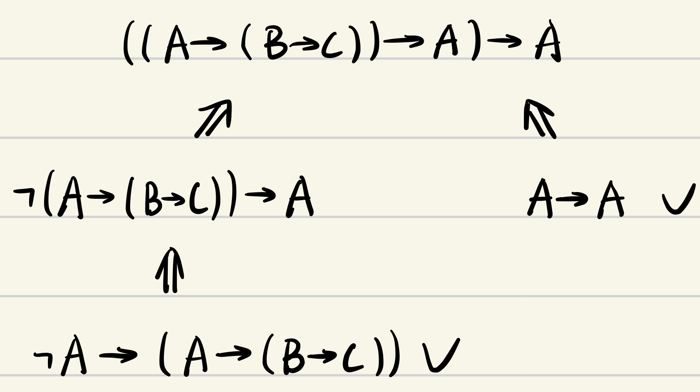

<h1 style="text-align: center"> 数理逻辑题型一览 </h1>

 xyfJASON 

---

[TOC]

## 求(主)析取/合取范式

**方法 1**. 直接转化：
$$
\begin{align}
&p\to q\iff \neg p\or q\\
&p\leftrightarrow q\iff (p\and q)\or (\neg p\and\neg q)
\end{align}
$$

**方法 2**. 画真值表：如果是求主析取/合取范式推荐这种做法，方便且不容易出错。

**例一（2019深圳）**：求出公式 $(p \to q) \and (p \to r)$ 的主合取范式和主析取范式。

解：

| $p$  | $q$  | $r$  | $p\to q$ | $p\to r$ | $(p\to q)\and(p\to r)$ |
| :--: | :--: | :--: | :------: | :------: | :--------------------: |
|  0   |  0   |  0   |    1     |    1     |           1            |
|  0   |  0   |  1   |    1     |    1     |           1            |
|  0   |  1   |  0   |    1     |    1     |           1            |
|  0   |  1   |  1   |    1     |    1     |           1            |
|  1   |  0   |  0   |    0     |    0     |           0            |
|  1   |  0   |  1   |    0     |    1     |           0            |
|  1   |  1   |  0   |    1     |    0     |           0            |
|  1   |  1   |  1   |    1     |    1     |           1            |

主合取范式为：$(\neg p\or q\or r)\and(\neg p\or q\or\neg r)\and(\neg p\or\neg q\or r)$

主析取范式为：$(\neg p\and\neg q\and\neg r)\or(\neg p\and\neg q\and r)\or(\neg p\and q\and\neg r)\or(\neg p\and q\and r)\or(p\and q\and r)$

## 用完备联结词组表示公式

完备联结词组有：$\{\and,\or,\neg\},\{\Delta_1,\to\},\{\neg,\to\},\{\downarrow\},\{\uparrow\}$ 等。
$$
\begin{align}
&\neg p\iff p\downarrow p\iff p\uparrow p\\
&p\or q\iff \neg p\to q\iff\neg p\uparrow \neg q\iff (p\downarrow q)\downarrow(p\downarrow q)\\
&p\and q\iff \neg(p\to\neg q)\iff\neg p\downarrow\neg q\iff(p\uparrow q)\uparrow(p\uparrow q)
\end{align}
$$

**例一（2019深圳）**：分别用公式 $\uparrow$ 和 $\downarrow$ 表示公式 $p\or q \to q\and r$。

解：
$$
\begin{align}
p\or q\to q\and r&\iff\neg(\neg p\and\neg q)\to\neg\neg(q\and r)\\
&\iff(\neg p\uparrow\neg q)\to\neg(q\uparrow r)\\
&\iff \neg((\neg p\uparrow \neg q)\and(q\uparrow r))\\
&\iff (\neg p\uparrow\neg q)\uparrow(q\uparrow r)\\
&\iff ((p\uparrow p)\uparrow(q\uparrow q))\uparrow(q\uparrow r)\\\\
p\or q\to q\and r&\iff\neg\neg(p\or q)\to \neg(\neg q\or\neg r)\\
&\iff\neg (p\downarrow q)\to(\neg q\downarrow \neg r)\\
&\iff(p\downarrow q)\or(\neg q\downarrow \neg r)\\
&\iff\neg((p\downarrow q)\downarrow(\neg q\downarrow \neg r))\\
&\iff ((p\downarrow q)\downarrow((q\downarrow q)\downarrow(r\downarrow r)))\downarrow ((p\downarrow q)\downarrow((q\downarrow q)\downarrow(r\downarrow r)))
\end{align}
$$

**例二（2017本部）**：用 $\downarrow$ 等价表示公式 $(p\to q)\to\neg r$。

解：
$$
\begin{align}
(p\to q)\to \neg r&\iff\neg(p\to q)\or\neg r\\
&\iff\neg(\neg(p\to q)\downarrow\neg r)\\
&\iff\neg(\neg(\neg p\or q)\downarrow\neg r)\\
&\iff\neg((\neg p\downarrow q)\downarrow\neg r)\\
&\iff(((p\downarrow p)\downarrow q)\downarrow(r\downarrow r))\downarrow (((p\downarrow p)\downarrow q)\downarrow(r\downarrow r))
\end{align}
$$

## 判断逻辑蕴含/逻辑等价的正确性

使用指派的计算：
$$
\begin{align}
&(\neg A)^v=1-A^v\\
&(A\and B)^v=A^v\cdot B^v\\
&(A\or B)^v=A^v+B^v-A^v\cdot B^v\\
&(A\to B)^v=1-A^v+A^v\cdot B^v\\
&(A\leftrightarrow B)^v=A^v\cdot B^v+(1-A^v)\cdot(1-B^v)
\end{align}
$$
然后用逻辑蕴含/逻辑等价的定义判断。

如果是错误的，给出一个反例即可。

**例一（2019深圳）**：判定下列逻辑蕴含式 $\{A\or B \to C,B\or C\to D,C\or D\to E,\neg A\}\implies E\or B$ 是否成立，给出理由。

解：取指派 $v$ 使得 $A^v=B^v=C^v=D^v=E^v=0$，则所有条件被弄真但结论被弄假，故不成立。

**例二（2017本部）**：判定下列逻辑等价式 $\neg((A\to \neg B)\to\neg C)\iff C\to(B\to\neg A)$ 是否成立。

解：
$$
\begin{align}
(\neg((A\to\neg B)\to\neg C))^v&=1-((A\to\neg B)\to\neg C)^v\\
&=(A\to\neg B)^v-(A\to\neg B)^v\cdot(\neg C)^v\\
&=(1-A^v+A^v\cdot(\neg B)^v)\cdot C^v\\
&=(1-A^v\cdot B^v)\cdot C^v\\\\
(C\to(B\to\neg A))^v&=1-C^v+C^v\cdot(B\to \neg A)^v\\
&=1-C^v+C^v\cdot(1-B^v+B^v\cdot(\neg A)^v)\\
&=1-B^v\cdot C^v+(1-A^v)\cdot B^v\cdot C^v\\
&=1-A^v\cdot B^v\cdot C^v
\end{align}
$$
因而，当 $A^v=B^v=1,\,C^v=0$ 时，前者为 $0$ 而后者为 $1$，故不成立。

**例三（2016本部）**：判定下列逻辑蕴含和逻辑等价是否成立。

1. $\neg(C\and D)\to(A\to B),A,\neg D\implies B$

   解：设指派 $v$ 弄真所有条件，则 $A^v=1,D^v=0,(\neg(C\and D)\to(A\to B))^v=1$，于是：
   $$
   \begin{align}
   (\neg(C\and D)\to(A\to B))^v&=1-(\neg(C\and D))^v+(\neg(C\and D))^v(A\to B)^v\\
   &=C^vD^v+(1-C^vD^v)(1-A^v+A^vB^v)\\
   &=B^v=1
   \end{align}
   $$
   所以结论被弄真，故成立。

2. $(A\to C)\and(B\to C)\iff\neg(A\to \neg B)\to C$

   解：
   $$
   \begin{align}
   ((A\to C)\and(B\to C))^v&=(A\to C)^v(B\to C)^v\\
   &=(1-A^v+A^vC^v)(1-B^v+B^vC^v)\\
   &=1-A^v-B^v+B^vC^v+A^v B^v+A^vC^v-A^vB^vC^v\\\\
   (\neg(A\to\neg B)\to C)^v&=1-(1-(A\to\neg B)^v)+(1-(A\to\neg B)^v)\cdot C^v\\
   &=(A\to\neg B)^v\cdot (1-C^v)+C^v\\
   &=(1-A^v+A^v(1-B^v))(1-C^v)+C^v\\
   &=1-A^vB^v+A^vB^vC^v
   \end{align}
   $$
   因而，当 $C^v=A^v=0,B^v=1$ 时，前者为 $0$ 而后者为 $1$，故不成立。

## 在 PC 中证明公式

思维过程是证明序列的逆序，即「要证……只需证……」。拿到一道题，只要把思维过程理顺了，证明时倒着写就行了。有时候倒着想卡在某一步了，可以再正向推一下，两面夹击解决问题。

### 常用公理&定理

**公理 1**

$$
A1:\quad A\to(B\to A)
$$

公理 1 的作用是“砍头”，即「要证 $B\to A$，只需证 $A$」，直接把前件砍掉了。在前件与后件没有关系，或者发现后件本身就是永真式时使用。

**公理 2**

$$
A2:\quad (A\to(B\to C))\to((A\to B)\to (A\to C))
$$

公理 2 有一个鲜明的特点是“共享前件”，即要证的式子中 $A\to B$ 和 $A\to C$ 都有共同的前件 $A$，这时候我们可以把 $A$ 提出来，变成只需证 $A\to(B\to C)$。如果要证的式子“共享后件”，我们可以对每个部分取逆否得到共享前件的式子，然后运用公理 2。

**反身**

$$
\text{Thm }1:\quad\vdash A\to A
$$

**前件互换系列**

$$
\begin{align}
&\text{Thm }2:&& \text{if }\vdash A\to(B\to C)，\text{then }\vdash B\to(A\to C)\\
&\text{Thm }3:&& \vdash (A\to(B\to C))\to(B\to(A\to C)) 
\end{align}
$$

前件互换能调动公式两部分的位置，常常有助于继续推导。见到形如 $A\to(B\to C)$ 时都可以尝试前件互换。

**加前后件系列**

$$
\begin{align}
&\text{Thm }4:&& \vdash (B\to C)\to((A\to B)\to(A\to C))\\
&\text{Thm }5:&& \vdash (A\to B)\to((B\to C)\to(A\to C))
\end{align}
$$

观察要证的式子，发现它们的特点也是“共享前件”和“共享后件”，并且与公理 2 不同的是，共享的前件或后件将被砍掉。因此，我们可以总结：当我们遇见一个式子共享前件或共享后件，**首先考虑使用加前后件**，看一看砍掉前后件之后得到的式子是不是永真式，如果是，那么皆大欢喜；如果不是，那么使用公理 2。

**自相矛盾系列**

$$
\begin{align}
&\text{Thm }6:&& \vdash \neg A\to(A\to B)\\
&\text{Thm }7:&& \vdash A\to(\neg A\to B)
\end{align}
$$

如果 $A$ 和 $\neg A$ 都成立，这是自相矛盾的，所以能推出任何式子都成立。

**反证法系列**

$$
\begin{align}
&\text{Thm }9:&& \vdash (\neg A\to A)\to A\\
&\text{Thm }11:&& \vdash (A\to \neg A)\to \neg A\\
&\text{Thm }16:&& \vdash (\neg A\to B)\to((\neg A\to \neg B)\to A)\\
&\text{Thm }17:&& \vdash (A\to B)\to((A\to \neg B)\to \neg A)\
\end{align}
$$

如果 $A$ 不成立，那么 $A$ 成立，这说明假设不正确，故 $A$ 成立；

如果 $A$ 成立，那么 $A$ 不成立，这说明假设不正确，故 $\neg A$ 成立；

如果 $A$ 不成立，立即可知 $B$ 成立；推了一会儿又知道 $B$ 不成立，说明假设不正确，故 $A$ 成立；

如果 $A$ 成立，立即可知 $B$ 成立；推了一会儿又知道 $B$ 不成立，说明假设不正确，故 $\neg A$ 成立。

**逆否命题系列**

$$
\begin{align}
&A3:&& \vdash (\neg A\to \neg B)\to(B\to A)\\
&\text{Thm }13:&&\vdash(A\to B)\to(\neg B\to \neg A)\\
&\text{Thm }14:&&\vdash(\neg A\to B)\to(\neg B\to A)\\
&\text{Thm }15:&&\vdash(A\to \neg B)\to(B\to \neg A)
\end{align}
$$

逆否命题很有用，有时遇到很多否定自然使用逆否命题把否定去掉，有时用一下逆否命题就能产生和其他项重复的项，方便我们的证明。

**双重否定系列**

$$
\begin{align}
&\text{Thm }10:&&\vdash\neg\neg A\to A\\
&\text{Thm }12:&&\vdash A\to\neg\neg A
\end{align}
$$

**三段论**

$$
\text{Thm }8:\quad \text{if }\vdash A\to B,\,\vdash B\to C,\text{ then }\vdash A\to C
$$

非常常用的定理。

**解题神器**

$$
\text{Thm 18}:\quad\vdash\neg A\to C\ \and\ \vdash B\to C\ \text{ iff }\ \vdash (A\to B)\to C
$$

要证 $(A\to B)\to C$，只需要拆开分别证 $\neg A\to C$ 和 $B\to C$ 即可。

### 例题

**例一（2019深圳）**

求证：$\vdash_{PC}((A\to B)\to A)\to(B\to A)$

思维过程：

**例二（2019深圳）**

求证：$\vdash_{PC}((A\to B)\to(A\to C))\to (A\to (B\to C))$

思维过程：

**例三（2019深圳）**

求证：$\vdash_{PC}(A\to C)\to((B\to C)\to(((A\to B)\to B)\to C))$

思维过程：

**例四（2019深圳）**

求证：$\vdash_{PC}((A\to B)\to C)\to ((A\to C)\to C)$

思维过程：

**例五（2017本部）**

求证：$\vdash_{PC}((A\to B)\to(A\to C))\to(A\to(B\to C))$

同 2019 深圳，此处不赘述。

**例六（2017本部）**

求证：$\vdash_{PC}B\to((B\to C)\to(\neg A\to C))$

思维过程：

**例七（2017本部）**

求证：$\vdash_{PC}(A\to B)\to(\neg B\to(A\to\neg A))$

思维过程：

**例八（2017本部）**

求证：$\neg((A\to B)\to\neg(B\to A)),A\vdash_{PC} B$

思维过程：

**例九（2016本部）**

求证：$\vdash_{PC}\neg(A\to B)\to(A\to(B\to C))$

思维过程：

**例十（2016本部）**

求证：$\vdash_{PC}((A\to \neg B)\to\neg(A\to \neg C))\to(\neg B\to C)$

思维过程：

**例十一（2016本部）**

求证：$\vdash_{PC}(C\to\neg(A\to B))\to((C\to\neg A)\to \neg C)$

思维过程：

**例十二（2016本部）**

求证：$\vdash_{PC}((\neg A\to A)\to\neg B)\to((\neg A\to \neg B)\to\neg B)$

思维过程：

**例十三（2015本部）**

求证：$\vdash_{PC}\neg C\to(\neg B\to\neg(\neg B\to C))$

思维过程：

**例十四（2015本部）**

求证：$\vdash_{PC}((A\to(B\to C))\to A)\to A$

思维过程：

**例十五（2015本部）**

求证：$\vdash_{PC}(A\to(B\to\neg C))\to(C\to(A\to\neg B))$

思维过程：

**例十六（2015本部）**

求证：$((\neg A\to B)\to C)\to D,\neg D\to \neg B,\neg A\vdash_{PC} D$

思维过程：

## 在 ND 中证明公式

相比 PC 系统，ND 系统的推理规则比较符合人的思维，可能相对好做一点。

### 推理规则

$$
\begin{align}
&r_1:&&\cfrac{\Gamma\vdash B}{\Gamma\cup\{A\}\vdash B}&&(+)\\
&r_2:&&\cfrac{\Gamma;A\vdash B,\,\Gamma;\neg A\vdash B}{\Gamma\vdash B}&&(-)\\
&r_3:&&\cfrac{\Gamma\vdash A}{\Gamma\vdash A\or B},\,\cfrac{\Gamma \vdash B}{\Gamma \vdash A\or B}&&(\or+)\\
&r_4:&&\cfrac{\Gamma;A\vdash C,\,\Gamma;B\vdash C,\,\Gamma\vdash A\or B}{\Gamma\vdash C}&&(\or-)\\
&r_5:&&\cfrac{\Gamma\vdash A,\Gamma\vdash B}{\Gamma\vdash A\and B}&&(\and+)\\
&r_6:&&\cfrac{\Gamma\vdash A\and B}{\Gamma\vdash A},\,\cfrac{\Gamma \vdash A\and B}{\Gamma \vdash B}&&(\and-)\\
&r_7:&&\cfrac{\Gamma;A\vdash B}{\Gamma\vdash A\to B}&&(\to+)\\
&r_8:&&\cfrac{\Gamma \vdash A, \Gamma\vdash A\to B}{\Gamma \vdash B}&&(\to-)\\
&r_9:&&\cfrac{\Gamma;A\vdash B,\Gamma;A\vdash\neg B}{\Gamma\vdash\neg A}&&(\neg+)\\
&r_{10}:&&\cfrac{\Gamma \vdash A, \Gamma\vdash \neg A}{\Gamma \vdash B}&&(\neg-)
\end{align}
$$

$\neg\neg$ 和 $\leftrightarrow$ 略去不表。

### 解题思路

**逆推的终点**：一般是 $(\in)$ 或 $(\to-)$ 或 $(\neg-)$ 

**反证法**：源自 $(\neg+)$。要证 $\Gamma\vdash\neg A$，只需把 $\neg A$ 取反放到 $\vdash$ 前面去，然后找矛盾，即只需证 $\Gamma;A\vdash B$ 并且 $\Gamma;A\vdash \neg B$；同理，要证 $\Gamma\vdash A$，只需证 $\Gamma;\neg A\vdash B$ 并且 $\Gamma;\neg A\vdash \neg B$。

**分类讨论1**：源自 $(\or-)$。当 $\or$ 出现在 $\vdash$ 前时，就把 $\or$ 的两边拆开放进条件里分别推导（即分类讨论），然后用 $(\or-)$ 规则。

**分类讨论2**：源自 $(-)$，目的是添上对立的条件之后能推出相同的结论。典型用法有两个：

1. 证明 $\Gamma\vdash A\or B$ 时，我们这样分类讨论：「当 $C$ 成立时 $A$ 成立，当 $C$ 不成立时 $B$ 成立，所以不管怎么说，$A\or B$ 都成立」。具体地说，我们只需要证明 $\Gamma;C\vdash A$ 以及 $\Gamma;\neg C\vdash B$，然后使用 $(-)$ 规则即可得到 $\Gamma \vdash A\or B$. 
2. 证明 $A\to B\vdash B$ 时，我们这样分类讨论：「当 $A$ 成立时 $B$ 成立，当 $A$ 不成立时我们可以从 $\neg A$ 推出 $B$，那么不管怎么说 $B$ 都成立」。具体地说，我们只需要证明 $A\to B, A\vdash B$ 以及 $A\to B,\neg A\vdash B$，然后使用 $(-)$ 规则即可得到 $A\to B\vdash B$. 

**$\to$ 前移**：当 $\to$ 出现在 $\vdash$ 之后时，必然使用 $(\to+)$  规则，即：「要证 $\Gamma\vdash A\to B$，只需证 $\Gamma;A\vdash B$」。

**$\to$ 后放**：当 $\to$ 出现在 $\vdash$ 之前时，纵观所有 ND 中的推理规则，并没有处理 $\to$ 在 $\vdash$ 前的情况，因而我们只能一直把它保留在 $\vdash$ 前面。一种处理方法是前文的分类讨论，另一种处理方法是：

2. 使用 $(\in)$ 规则让 $\to$ 在 $\vdash$ 后面出现；
3. 想办法用上 $(\to-)$ 规则。

**拆开 $\and$**： 而当 $\and$ 出现在 $\vdash$ 之前时，和 $\to$ 的情况一样，我们只能一直把它保留在 $\vdash$ 前面。要让它发挥作用，也采用类似的方法：

2. 使用 $(\in)$ 规则让 $\and$ 在 $\vdash$ 后面出现；
3. 使用 $(\and-)$ 规则。

事实上容易发现，条件中含有 $A\and B$ 和条件中含有 $A,B$ 并没有本质区别，完全可以无视 $\and$。

**逐个击破**：当 $\vdash$ 后面要演绎的内容是两个公式相 $\and$ 时，就用 $(\and+)$ 规则把题目一分为二分别证明。

**丢条件**：如果一个条件没用，就用 $(+)$ 规则把它直接丢掉。

### 例题

**例一（2019深圳）**

求证：$\vdash_{ND}(A\or B)\and(\neg B\or C)\to A\or C$

思维过程：

**例二（2019深圳）**

求证：$\vdash_{ND}(\neg A\to B)\to A\or B$

思维过程：

**例三（2017本部）**

求证：$\vdash_{ND}((A\to B)\to C)\to(B\to C)$

思维过程：

**例四（2017本部）**

求证：$\vdash_{ND}(B\to\neg C)\to(\neg A\to(B\to\neg(\neg A\to C)))$

思维过程：

**例五（2016本部）**

求证：$\vdash_{ND}((\neg A\to B)\to \neg A)\to\neg A$

思维过程：

**例六（2016本部）**

求证：$\vdash_{ND}(A\or B)\and(A\or C)\to A\or (B\and C)$

思维过程：

**例七（2015本部）**

求证：$\vdash_{ND}(\neg A\or B)\and(\neg B\or C)\to(\neg A\or C)$

和 2019 深圳的题目本质一样，此处不赘述。

**例八（2015本部）**

求证：$\vdash_{ND}(\neg A\to\neg(A\to\neg B))\to A$

思维过程：

## 在 FC 中证明公式

### 概述

FC 系统本质是 PC 系统的扩展：在 PC 系统中，我们考虑的最小单元是原子公式 $p,q,r,\cdots$，然后用联结词 $\to,\neg$ 把它们组合起来得到公式。但是在 FC 系统中，原子公式被进一步细化为 $P^{(n)}t_1t_2\cdots t_n$，其中 $P^{(n)}$ 是 $n$ 元谓词符号，$t_1,t_2,\cdots,t_n$ 是项；项又被细化为常元、变元和函词的组合；用联结词 $\to,\neg,\forall$ 把原子公式组合起来的到公式。因此，FC 系统确实比 PC 系统复杂了许多。

不过，正因如此，PC 系统中的所有定理在 FC 中自然成立，我们只需进一步研究 FC 中新引入的东西。又由于谓词、函词、常元是在给定实际背景后人为**解释**的，所以我们研究 FC 中的定理时，**就是在和 $\forall(\exists)$ 打交道**（其中 $\exists vA$ 定义为 $\neg\forall v\neg A$）。

和 PC 与 ND 中的证明一样的，我们着重思维过程，证明过程倒着写即可。

另外，允许在证明 FC 的过程中用 ND 的推理规则。

### 公理与（有用的）定理

$$
\begin{align}
&A_1:&& A\to(B\to A)\\
&A_2:&&(A\to(B\to C))\to((A\to B)\to(A\to C))\\
&A_3:&&(\neg A\to \neg B)\to(B\to A)\\
&A_4:&&\forall vA\to A_t^v\\
&A_5:&&\forall v(A\to B)\to(\forall vA\to\forall vB)\\
&A_6:&& A\to\forall v A\quad(v\ 在\ A\ 中无自由出现)\\
&\text{Thm 1}:&&\vdash \forall v A\to A\\
&\text{Thm 2}:&&\vdash A\to \exists vA\\
&\text{Thm 3}:&&\vdash\forall vA\to \exists vA\\
&\text{Thm 4}:&&\text{if}\quad\vdash A,\quad\text{then}\quad\vdash\forall vA \\
&\text{Thm 5}:&&\text{if}\quad\Gamma\vdash A,\quad\text{then}\quad\Gamma\vdash \forall vA\quad(v\ 在\ \Gamma\ 中无自由出现)\\
&\text{Thm 10}:&&\text{if}\quad \Gamma\vdash \exists vA\quad\text{and}\quad\Gamma;A\vdash B,\quad\text{then}\quad\Gamma\vdash B\quad(v\ 在\ \Gamma\ 和\ B\ 中无自由出现)
\end{align}
$$

 关于 $A_5\sim \text{Thm 5}$，可以概括为下图：

关于 $\text{Thm 10}$，其可以视为 $ND$ 中析取消除规则的推广：考虑 $(\or-)$ 规则，
$$
\cfrac{\Gamma;A\vdash C,\,\Gamma;B\vdash C,\,\Gamma\vdash A\or B}{\Gamma\vdash C}
$$
意识到 $\exists vA$ 的**本质就是一系列的或**：$A_1\or A_2\or\cdots\or A_n$，故而我们可以推广得到：
$$
\cfrac{\Gamma;A\vdash B,\,\Gamma\vdash \exists vA}{\Gamma \vdash B}
$$
与 $(\or-)$ 规则的作用类似，存在消除定理的用法是：当 $\exists$ 出现在 $\vdash$ 前时，即需要证明 $\Gamma;\exists A\vdash B$ 时，只需要证明 $\Gamma;\exists A,A\vdash B$ 即可。但是千万千万要注意 $v$ 不能在 $\Gamma$（假设集）和 $B$（结论） 里面自由出现！

### 例题

**例一（2019深圳）**

求证：$\vdash_{FC} \exists v(B\to A)\leftrightarrow(\forall vB\to A)$，其中 $v$ 在 $A$ 中无自由出现。

思维过程：

**例二（2017本部）**

求证：$\vdash_{FC}(\exists xA\to\forall x\neg B)\to\forall x(A\to\neg B)$

思维过程：

**例三（2017本部）**

求证：$\forall x(P(x)\to Q(x)),\neg \forall x(P(x)\to \neg R(x)) \vdash_{FC}\exists x\neg(Q(x)\to\neg R(x))$

思维过程：

**例四（2015本部）**

求证：$\vdash_{FC}(\exists xP(x)\to\forall xQ(x))\to\forall x(P(x)\to Q(x))$

思维过程：

**例五（2015本部）**

求证：$\forall x(P(x)\to \neg(Q(y)\to\neg R(x)))\vdash_{FC}\exists x P(x)\to Q(y)$

思维过程：

## 构造语义和指派

语义是一个结构，包括论域（个体域）$U$ 和解释 $I:L_a\cup L_f\cup L_p\to U\cup U_f\cup U_p$；指派是一个映射 $s:L_v\to U$。

$\vDash_UA[s]$ 表示公式 $A$ 在结构 $U$ 和指派 $s$ 下取值为真，其定义是：

1. 当 $A$ 为原子公式（谓词）$P^{(n)}t_1t_2\cdots t_n$ 时，
   $$
   \vDash_UA[s]\quad\text{iff}\quad \langle\bar s(t_1),\cdots,\bar s(t_n)\rangle\in \overline {P^{(n)}}
   $$

2. 当 $A$ 为公式 $\neg B$ 时
   $$
   \vDash_UA[s]\quad\text{iff}\quad\not\vDash_UB[s]
   $$

3. 当 $A$ 为公式 $B\to C$ 时，
   $$
   \vDash_UA[s]\quad\text{iff}\quad \not\vDash_UB[s]\text{ or }\vDash_UC[s]
   $$

4. 当 $A$ 为公式 $\forall vB$ 时，
   $$
   \vDash_UA[s]\quad\text{iff}\quad对每一个\ d\in U,\,\vDash_UB[s(v\mid d)]
   $$
   其中，$s(v\mid d)$定义为：$s(v\mid d)(u)=\begin{cases}s(u)&u\neq v\\d&u=v\end{cases}$

扩展到联结词 $\or,\and$ 和量词 $\exists$ 时，进一步定义：
$$
\begin{align}
\vDash_U B\or C[s]&\quad\text{iff}\quad \vDash_uB[s]\text{ or }\vDash_UC[s]\\
\vDash_U B\and C[s]&\quad\text{iff}\quad \vDash_uB[s]\text{ and }\vDash_UC[s]\\
\vDash_U \exists vB[s]&\quad\text{iff}\quad 存在\ d\in U,\,\vDash_uB[s(v\mid d)]
\end{align}
$$

**例一（2019深圳）**：找出语义和指派使得 $P(x,f(x,a))\to Q(x)$ 为真。

解：构造结构 $U$，其论域为 $\mathcal D=\{0,1\}$，解释为 $\bar a=0,\,\bar P=\{(0,0)\},\,\bar Q=\{1\}$，$\bar f(0,0)=1,\,\bar f(0,1)=1,\,\bar f(1,0)=1,\,\bar f(1,1)=1$；构造指派 $s:s(x)=\bar x=1$。

于是 $\overline{f(x,a)}=\bar f(1,0)=1$，由于 $(1,1)\notin \bar P$，故 $\not\vDash_U{P(x,f(x,a))}[s]$，故 $\vDash_U{P(x,f(x,a))\to Q(x)}[s]$。

**例二（2017本部）**：举例说明 $A\to B\vdash_{FC}\forall vA\to\forall vB$ 不一定成立。

思路：这其实考察的是对全称推广定理 5 的理解（也可以看作考察对公理 6 的理解），如果 $v$ 不在假设集 $A\to B$ 中自由出现，那么这句话是成立的，可以通过全称推广定理 5 加上公理 5 进行证明。现在要求举例不成立，所以一定要让 $v$ 在 $A\to B$ 中自由出现。

解：根据演绎定理，只需要说明 $\vdash_{FC}(A\to B)\to(\forall vA\to\forall vB)$ 不一定成立。因此只需要找到一个结构 $U$ 和指派 $s$，使得 $\vDash_U(A\to B)[s]$ 并且 $\not\vDash_U(\forall vA\to\forall vB)[s]$，也即 $\vDash_U\forall vA[s]$ 且 $\not\vDash_U\forall vB[s]$。

以 $A=P(v),\,B=Q(v)$ 为例，构造结构 $U$，其论域为 $\mathcal D=\{0,1\}$，解释为 $\bar P=\{0,1\},\,\bar Q=\{0\}$；构造指派 $s:s(v)=\bar v=0$。

于是一方面，由于 $0\in\bar Q$，所以 $\vDash_UQ(v)[s]$，即 $\vDash_UB[s]$，故而 $\vDash_U(A\to B)[s]$。

另一方面，由于 $0,1\in\bar P$，所以 $\vDash_UP(v)[s(v\mid 0)]$ 并且 $\vDash_UP(v)[s(v\mid 1)]$，因此 $\vDash_U\forall vP(v)[s]$，即 $\vDash_U\forall vA[s]$；

又由于 $1\notin\bar Q$，所以 $\not\vDash_UQ(v)[s(v\mid 1)]$，因此 $\not\vDash_U\forall vQ(v)[s]$，即 $\not\vDash_U\forall vB[s]$。

综上，我们有 $\vDash_U(A\to B)[s]$ 且 $\vDash_U\forall vA[s]$ 且 $\not\vDash_U\forall vB[s]$，于是根据开头的分析，$A\to B\vdash_{FC}\forall vA\to\forall vB$ 不一定成立。

**例三（2016本部）**：能否构造解释和指派使得公式 $A\to\forall vA$ 为假？请举例说明。

解：以公式 $A$ 为 $P(v)$ 为例，构造结构 $U$，其论域为 $\mathcal D=\{0,1\}$，解释为 $\bar P=\{0\}$；构造指派 $s:s(v)=\bar v=0$。

则一方面由于 $0\in \bar P$，故 $\vDash_UP(v)[s]$，即 $\vDash_UA[s]$；另一方面，由于 $1\notin\bar P$，故 $\not\vDash_U P(v)[s(v\mid 1)]$，于是 $\not\vDash_U\forall vA[s]$。

综合两方面，$\not\vDash_U A\to\forall vA[s]$。

**例四（2015本部）**：构造解释使得下列谓词公式为真：$\forall x(P(x)\to\exists y(P(y)\and Q(x,y)))$。

解：构造结构 $U$，其论域为 $\mathcal D=\{0,1\}$，解释为 $\bar P=\{0\},\,\bar Q=\{(0,0),(1,0)\}$。

要使得 $\vDash_U{\forall x(P(x)\to\exists y(P(y)\and Q(x,y)))}$，只需要对于 $x=0$ 和 $x=1$ 都有：$\vDash_U{\exists y(P(y)\and Q(x,y))}$。

由于 $0\in\bar P$，$(0,0)\in\bar Q$，$(1,0)\in\bar Q$，故无论 $x$ 是 $0$ 或 $1$，只要取 $y=0$，就有 $\vDash_U{P(y)\and Q(x,y)}$，从而 $\vDash_U{\exists y(P(y)\and Q(x,y))}$。

