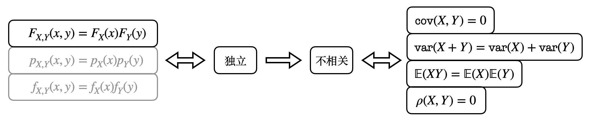
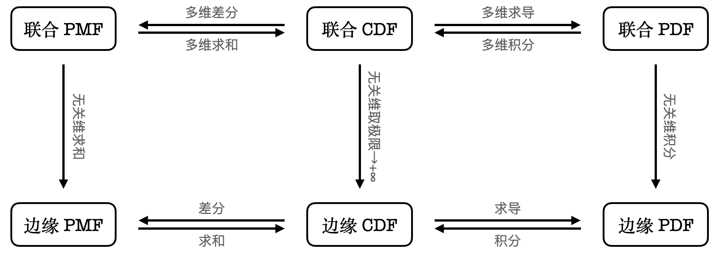

<h1 style="text-align: center"> 概率论与数理统计 </h1>

 xyfJASON 

---

[TOC]

$$
\newcommand{\prob}[]{\mathbb P}
$$

## 随机变量的函数

### 一元函数

#### 一般情形

**PMF/PDF**：设 $X$ 是一离散随机变量，则 $Y=g(X)$ 也是一个离散随机变量，且其分布列为：
$$
p_Y(y)=\sum_{\{x|y=g(x)\}}p_X(x)
$$
设 $X$ 是一连续随机变量，则 $Y=g(X)$ 也是一个连续随机变量，且其分布函数为：
$$
F_Y(y)=\mathbb P(Y\leqslant y)=\mathbb P(g(X)\leqslant y)=\int\limits_{\{x|g(x)\leqslant y\}}f_X(x)\mathrm dx
$$
于是 $Y$ 的概率密度函数为：
$$
f_Y(y)=\frac{\mathrm dF_Y(y)}{\mathrm dy}
$$

**期望**：设 $X$ 是一离散随机变量，则 $Y=g(X)$ 的期望为：
$$
\mathbb EY = \mathbb E[g(X)]=\sum_xg(x)p_X(x)
$$
设 $X$ 是一连续随机变量，则 $Y=g(X)$ 的期望为：
$$
\mathbb EY = \mathbb E[g(X)]=\int_{-\infty}^{+\infty}g(x)f_X(x)\mathrm dx
$$
也就是说，我们不必先求出 $Y$ 的分布，只需知道 $X$ 的分布就能求出 $Y$ 的期望。

#### 线性函数情形

设 $X$ 是一连续随机变量，$a,b\in\R$ 且 $a\neq0$，设 $Y=aX+b$，则：
$$
f_Y(y)=\frac{1}{|a|}f_X\left(\frac{y-b}{a}\right)
$$
证：使用1.1节中描述的方法，先求 $Y$ 的分布函数：
$$
F_Y(y)=\mathbb P(Y\leqslant y)=\mathbb P(aX+b\leqslant y)=\begin{cases}\mathbb P\left(X\leqslant \frac{y-b}{a}\right)=F_X\left(\frac{y-b}{a}\right)&a>0\\\mathbb P\left(X\geqslant \frac{y-b}{a}\right)=1-F_X\left(\frac{y-b}{a}\right)&a<0\end{cases}
$$
然后求导得到 $Y$ 的概率密度函数：
$$
f_Y(y)=\frac{\mathrm dF_Y(y)}{\mathrm dy}=\begin{cases}\frac{1}{a}f_X\left(\frac{y-b}{a}\right)&a>0\\-\frac{1}{a}f_X\left(\frac{y-b}{a}\right)&a<0\end{cases}=\frac{1}{|a|}f_X\left(\frac{y-b}{a}\right)
$$
证毕。

> 例子：正态分布的线性变换仍然是正态分布，且：
> $$
> X\sim N(\mu,\sigma^2)\implies aX+b\sim N(a\mu+b,a^2\sigma^2)
> $$
> 证：运用上述定理，
> $$
> \begin{align}
> f_{aX+b}(y)&=\frac{1}{|a|}f_X\left(\frac{y-b}{a}\right)\\
> &=\frac{1}{\sqrt{2\pi}\sigma|a|}\exp{-\frac{\left(\frac{y-b}{a}-\mu\right)^2}{2\sigma^2}}\\
> &=\frac{1}{\sqrt{2\pi}\sigma|a|}\exp{-\frac{(y-a\mu-b)^2}{2a^2\sigma^2}}
> \end{align}
> $$
> 所以，$aX+b\sim N(a\sigma+b,a^2\sigma^2)$. 证毕。

#### 单调函数情形

设 $X$ 是一连续随机变量，$g$ 是一严格单调的可逆函数，且其反函数 $h$ 可微，则 $Y=g(X)$ 在 $\{y|f_Y(y)>0\}$ 内的概率密度函数是：
$$
f_Y(y)=f_X(h(y))\left|\frac{\mathrm dh}{\mathrm dy}(y)\right|
$$
证：仍然先求 $Y$ 的分布函数：
$$
F_Y(y)=\mathbb P(Y\leqslant y)=\begin{cases}\mathbb P(X\leqslant h(y))=F_X(h(y))&g\;单调递增\\\mathbb P(X\geqslant h(y))=1-F_X(h(y))&g\;单调递减\end{cases}
$$
于是求导得：
$$
f_Y(y)=\begin{cases}f_X(h(y))h'(y)&g\;单调递增\\-f_X(h(y))h'(y)&g\;单调递减\end{cases}=f_X(h(y)\left|\frac{\mathrm dh}{\mathrm dy}(y)\right|
$$
证毕。

### 二元函数

#### 一般情形

**PMF/PDF**：设 $X,Y$ 是离散随机变量，则 $Z=g(X,Y)$ 也是一个离散随机变量，且其分布列为：
$$
p_Z(z)=\sum_{\{(x,y)|z=g(x,y)\}}p_{X,Y}(x,y)
$$
设 $X,Y$ 是连续随机变量，则 $Z=g(X,Y)$ 也是一个连续随机变量，且其分布函数为：
$$
F_Z(z)=\mathbb P(Z\leqslant z)=\mathbb P(g(X,Y)\leqslant z)=\iint\limits_{\{(x,y)|g(x,y)\leqslant z\}}f_{X,Y}(x,y)\mathrm dx\mathrm dy
$$
于是 $Z$ 的概率密度函数为：
$$
f_Z(z)=\frac{\mathrm dF_Z(z)}{\mathrm dz}
$$

**期望**：设 $X$ 和 $Y$ 是联合离散随机变量，则 $Z=g(X,Y)$ 的期望为：
$$
\mathbb EZ=\mathbb E[g(X,Y)]=\sum_{x}\sum_{y}g(x,y)f_{X,Y}(x,y)
$$

设 $X$ 和 $Y$ 是联合连续随机变量，则 $Z=g(X,Y)$ 的期望为：
$$
\mathbb EZ=\mathbb E[g(X,Y)]=\int_{-\infty}^{+\infty}\int_{-\infty}^{+\infty}g(x,y)f_{X,Y}(x,y)\mathrm dx\mathrm dy
$$

同样地，我们不必先求出 $Z$ 的分布，只需知道 $X$ 和 $Y$ 的联合分布就能求出 $Z$ 的期望。

#### 独立随机变量之和

设 $X,Y$ 是独立的离散随机变量，$Z=X+Y$，则：
$$
p_Z(z)=\sum_x p_X(x)p_Y(z-x)
$$
设 $X,Y$ 是独立的连续随机变量，$Z=X+Y$，则：
$$
f_Z(z)=\int_{-\infty}^{+\infty} f_X(x)f_Y(z-x)\mathrm dx
$$
称上述两个式子为卷积（convolution）。

> 例子：相互独立的正态随机变量之和仍服从正态分布。
>
> 设 $X\sim N(\mu_x,\sigma_x^2)$，$Y\sim N(\mu_y,\sigma_y^2)$ 且相互独立，$Z=X+Y$，则 $Z\sim N(\mu_x+\mu_y,\sigma_x^2+\sigma_y^2)$. 
>
> 证：运用上述定理，
> $$
> \begin{align}
> f_Z(z)&=\int_{-\infty}^{+\infty}\frac{1}{2\pi\sigma_x\sigma_y}e^{-\frac{(x-\mu_x)^2}{2\sigma_x^2}-\frac{(z-x-\mu_y)^2}{2\sigma_y^2}}\mathrm dx\\
> &=\int_{-\infty}^{+\infty}\frac{1}{2\pi\sigma_x\sigma_y}e^{-\frac{1}{2}\left[\frac{u^2}{\sigma_x^2}+\frac{(v-u)^2}{\sigma_y^2}\right]}\mathrm du&u=x-\mu_x,\,v=z-\mu_x-\mu_y
> \end{align}
> $$
> 由于
> $$
> \frac{u^2}{\sigma_x^2}+\frac{(v-u)^2}{\sigma_y^2}=\frac{u^2}{\sigma_x^2}+\frac{u^2}{\sigma_y^2}+\frac{v^2}{\sigma_y^2}-\frac{2uv}{\sigma_y^2}=\left(\frac{\sqrt{\sigma_x^2+\sigma_y^2}}{\sigma_x\sigma_y}u-\frac{\sigma_x v}{\sigma_y\sqrt{\sigma_x^2+\sigma_y^2}}\right)^2+\frac{v^2}{\sigma_x^2+\sigma_y^2}
> $$
> 令 $t=\frac{\sqrt{\sigma_x^2+\sigma_y^2}}{\sigma_x\sigma_y}u-\frac{\sigma_x v}{\sigma_y\sqrt{\sigma_x^2+\sigma_y^2}}$，则：
> $$
> f_Z(z)=\frac{1}{2\pi\sigma_x\sigma_y}\frac{\sigma_x\sigma_y}{\sqrt{\sigma_x^2+\sigma_y^2}}e^{\frac{v^2}{\sigma_x^2+\sigma_y^2}}\int_{-\infty}^{+\infty}e^{-\frac{1}{2}t^2}\mathrm dt=\frac{1}{\sqrt{2\pi}\sqrt{\sigma_x^2+\sigma_y^2}}e^{\frac{(z-\mu_x-\mu_y)^2}{\sigma_x^2+\sigma_y^2}}
> $$
> 所以 $Z\sim N(\mu_x+\mu_y,\sigma_x^2+\sigma_y^2)$. 证毕。
>
> 推论：设 $X_i\sim N(\mu_i,\sigma_i^2)$ 且相互独立，则 $\sum\limits_{i=1}^nX_i\sim N\left(\sum\limits_{i=1}^n\mu_i,\sum\limits_{i=1}^n\sigma_i^2\right)$. 

#### 极值分布

设 $X,Y$ 是独立的随机变量，$M=\max(X,Y),N=\min(X,Y)$，则：
$$
\begin{align}
&F_M(z)=\mathbb P(M\leqslant z)=\mathbb P(X\leqslant z\and Y\leqslant z)=\mathbb P(X\leqslant z)\mathbb P(Y\leqslant z)=F_X(z)F_Y(z)\\
&F_N(z)=\mathbb P(N\leqslant z)=1-\mathbb P(N>z)=1-\mathbb P(X>z\and Y>z)=1-\mathbb P(X>z)\mathbb P(Y>z)=1-[1-F_X(z)][1-F_Y(z)]
\end{align}
$$
更一般的，设 $X_1,X_2,\cdots,X_n$ 是 $n$ 个相互独立的随机变量，$M=\max\limits_{1\leqslant i\leqslant n}X_i$，$N=\min\limits_{1\leqslant i\leqslant n}X_i$，则：
$$
\begin{align}
&F_M(z)=\prod_{i=1}^nF_{X_i}(z)\\
&F_N(z)=1-\prod_{i=1}^n[1-F_{X_i}(z)]
\end{align}
$$

#### 瑞利分布

设 $X,Y\sim N(0,\sigma)$ 且相互独立，$R=\sqrt{X^2+Y^2}$，称 $R$ 服从瑞利分布，其分布函数为：
$$
\begin{align}
F_R(r)&=\mathbb P(R\leqslant r)=\mathbb P(X^2+Y^2\leqslant r^2)\\
&=\iint\limits_{\{(x,y)|x^2+y^2\leqslant r^2\}}p_{X,Y}(x,y)\mathrm dx\mathrm dy\\
&=\iint\limits_{x^2+y^2\leqslant r^2}\frac{1}{2\pi\sigma^2}e^{-\frac{x^2+y^2}{2\sigma^2}}\mathrm dx\mathrm dy\\
&=\frac{1}{2\pi\sigma^2}\int_0^{2\pi}\mathrm d\theta\int_0^{r}e^{-\frac{\rho^2}{2\sigma^2}}\rho\mathrm d\rho\\
&=e^{-\frac{\rho^2}{2\sigma^2}}\Bigg|_{r}^0\\
&=1-e^{-\frac{r^2}{2\sigma^2}}
\end{align}
$$
故概率密度函数为：
$$
f_R(r)=\frac{\mathrm dF_R(r)}{\mathrm dr}=\frac{r}{\sigma^2}e^{-\frac{r^2}{2\sigma^2}}\quad (r>0)
$$

### 多元函数

设 $\mathbf{X}=(X_1,X_2,\cdots,X_n)$ 是一个随机向量，$T$ 是 $\R ^n$ 上的一可逆映射，$\mathbf Y=T(\mathbf X)$，则 $\mathbf Y$ 的概率密度函数为：
$$
f_{\mathbf Y}(\mathbf y)=f_{\mathbf X}(T^{-1}(\mathbf y))|J|
$$
其中，$J$ 表示 $T^{-1}:\mathbf y\mapsto \mathbf x$，即 $\mathbf x=T^{-1}(\mathbf y)$ 的雅各比行列式：
$$
J=\begin{vmatrix}
\frac{\part x_1}{\part y_1}&\frac{\part x_1}{\part y_2}&\cdots&\frac{\part x_1}{\part y_n}\\
\frac{\part x_2}{\part y_1}&\frac{\part x_2}{\part y_2}&\cdots&\frac{\part x_2}{\part y_n}\\
\vdots&\vdots&\vdots&\vdots\\
\frac{\part x_n}{\part y_1}&\frac{\part x_n}{\part y_2}&\cdots&\frac{\part x_n}{\part y_n}\end{vmatrix}
$$
证：设 $D\subset \R^n$ 是一个性质好的集合，则：
$$
\begin{align}
\mathbb P(\mathbf Y\in D)&=\mathbb P(T(\mathbf X)\in D)\\
&=\mathbb P(\mathbf X\in T^{-1}(D))&&两边同时施以\;T^{-1}\\
&=\int_{T^{-1}(D)}f_{\mathbf X}(\mathbf x)\mathrm d\mathbf x\\
&=\int_{D}f_{\mathbf X}(T^{-1}(y))|J|\mathrm d\mathbf y&&变量代换\;\mathbf y=T(\mathbf x)
\end{align}
$$
又
$$
\mathbb P(\mathbf Y\in D)=\int_Df_\mathbf Y(\mathbf y)\mathrm d\mathbf y
$$
根据 $D$ 一定的任意性，可知：
$$
f_{\mathbf Y}(\mathbf y)=f_{\mathbf X}(T^{-1}(\mathbf y))|J|
$$
证毕。

## 独立性与相关性

### 概览

注意，我们所说的不相关默认指不线性相关，即 $X$ 与 $Y$ 没有线性关系，但是可能具有其他关系而导致不独立。

### 协方差与相关系数

**定义**：
$$
\begin{align}
&\text{cov}(X,Y)=\mathbb E[(X-\mathbb EX)(Y-\mathbb EY)]\\
&\rho(X,Y)=\frac{\text{cov}(X,Y)}{\sqrt{\text{var}X\text{var}Y}}
\end{align}
$$

当 $\text{cov}(X,Y)=0$ 时（$\rho(X,Y)=0$），称 $X$ 和 $Y$ 不相关。

**性质**：

- $\text{cov}(X,Y)=\mathbb EXY-\mathbb EX\mathbb EY$ 
- $\text{cov}(X,X)=\text{var}(X)$ 
- $\text{cov}(X,aY+b)=a\cdot\text{cov}(X,Y)$ 
- $\text{cov}(X,Y+Z)=\text{cov}(X,Y)+\text{cov}(X,Z)$ 
- $\text{var}(cX)=c^2\text{var}X$ 
- $\text{var}(X+Y)=\text{var}X+2\text{cov}(X,Y)+\text{var}Y$ 
- $\text{var}(aX+bY)=a^2\text{var}X+2ab\text{cov}(X,Y)+b^2\text{var}Y=\begin{bmatrix}a&b\end{bmatrix}\begin{bmatrix}\text{var}X&\text{cov}(X,Y)\\\text{cov}(Y,X)&\text{var}Y\end{bmatrix}\begin{bmatrix}a\\b\end{bmatrix}$ 

- $\text{var}(X)=0\implies \mathbb P(X=\mathbb EX)=1$  

  证：根据切比雪夫不等式，$\mathbb P\left(|X-\mathbb EX|\geqslant \frac{1}{n}\right)\leqslant n^2\text{var}(X)=0$ 对 $\forall n$ 都成立，故 $\mathbb P(X=\mathbb EX)=1$. 证毕。

- $|\rho|\leqslant 1$，且 $\rho=1$ 当且仅当 $\mathbb P(Y=aX+b)=1$. 

  证：对 $\forall t\in \R$，由于 $\text{var}(Y-tX)=t^2\text{var}X-2t\text{cov}(X,Y)+\text{var}Y\geqslant 0$，所以：
  $$
  \Delta=4\text{cov}^2(X,Y)-4\text{var}X\text{var}Y\leqslant 0
  $$
  即有：$|\rho|\leqslant 1$，且 $\rho=1$ 当且仅当存在某个 $b$ 使得 $\text{var}(Y-bX)=0$，于是根据方差的性质有：$\mathbb P(Y-bX=\mathbb E[Y-bX]=a)=1$，其中 $a,b$ 均为常数，证毕。

## 多元随机变量

### 概览

### 二元正态分布相关

#### 定义

若随机变量 $X,Y$ 有如下联合概率密度函数：
$$
p_{X,Y}(x,y)=\frac{1}{2\pi\sigma_1\sigma_2\sqrt{1-\rho^2}}\exp\left[-\frac{1}{2(1-\rho^2)}\left(\frac{(x-\mu_1)^2}{\sigma_1^2}-\frac{2\rho(x-\mu_1)(y-\mu_2)}{\sigma_1\sigma_2}+\frac{(y-\mu_2)^2}{\sigma_2^2}\right)\right]
$$
称 $X,Y$ 服从参数为 $\mu_1,\mu_2,\sigma_1,\sigma_2,\rho$ 的二元正态分布。

> 矩阵形式：设 $\mathbf X=\begin{pmatrix}x\\y\end{pmatrix},\mathbf \mu=\begin{pmatrix}\mu_1\\\mu_2\end{pmatrix},\mathbf \Sigma=\begin{pmatrix}\sigma_1^2&\rho\sigma_1\sigma_2\\\rho\sigma_1\sigma_2&\sigma_2^2\end{pmatrix}$，则：
> $$
> p_{\mathbf X}(\mathbf x)=\frac{1}{2\pi\sqrt{|\Sigma|}}\exp\left(-\frac{1}{2}(\mathbf x-\mathbf\mu)^T\Sigma^{-1}(\mathbf x-\mathbf\mu)\right)
> $$
> 这一形式可以推广到多元正态分布。

#### 密度分解

对定义式进行变形可以得到：
$$
p_{X,Y}(x,y)=\frac{1}{\sqrt{2\pi}\sigma_1}\exp\left(-\frac{(x-\mu_1)^2}{2\sigma_1^2}\right)\cdot\frac{1}{\sqrt{2\pi}\sigma_2\sqrt{1-\rho^2}}\exp\left(-\frac{\left[y-\left(\mu_2+\rho\frac{\sigma_2}{\sigma_1}(x-\mu_1)\right)\right]^2}{2\sigma_2^2(1-\rho^2)}\right)
$$
注意到，前一部分是 $N(\mu_1,\sigma_1)$ 的概率密度函数，后一部分是 $N\left(\mu_2+\rho\frac{\sigma_2}{\sigma_1}(x-\mu_1),\sigma_2^2(1-\rho^2)\right)$ 的概率密度函数。又由于：
$$
p_{X,Y}(x,y)=p_X(x)p_{Y|X}(y|x)
$$
所以事实上后一部分是就是 $p_{Y|X}(y|x)$. 

#### 边缘分布

根据密度分解容易知道，二元正态分布的边缘分布就是正态分布，且：
$$
X\sim N(\mu_1,\sigma_1^2),\quad Y\sim N(\mu_2,\sigma_2^2)
$$

#### 协方差与相关系数

运用密度分解，可以计算：
$$
\begin{align}
\text{cov}(X,Y)&=\mathbb E[(X-\mathbb EX)(Y-\mathbb EY)]\\
&=\iint_{\R^2}(x-\mu_1)(y-\mu_2)f_{X,Y}(x,y)\mathrm dx\mathrm dy\\
&=\int_{-\infty}^{+\infty}(x-\mu_1)f_X(x)\mathrm dx\int_{-\infty}^{+\infty}(y-\mu_2)f_{Y|X}(y|x)\mathrm dy\\
&=\int_{-\infty}^{+\infty}(x-\mu_1)f_X(x)\mathrm dx\left[\int_{-\infty}^{+\infty}yf_{Y|X}(y|x)-\mu_2\right]\\
&=\int_{-\infty}^{+\infty}(x-\mu_1)f_X(x)\mathrm dx\Big[\mathbb E[Y|X=x]-\mu_2\Big]\\
&=\int_{-\infty}^{+\infty}(x-\mu_1)f_X(x)\mathrm dx\Big[\rho\frac{\sigma_2}{\sigma_1}(x-\mu_1)\Big]\\
&=\rho\frac{\sigma_2}{\sigma_1}\int_{-\infty}^{+\infty}(x-\mu_1)^2f_X(x)\mathrm dx\\
&=\rho\frac{\sigma_2}{\sigma_1}\text{var}X\\
&=\rho\sigma_1\sigma_2
\end{align}
$$
由此可得相关系数：
$$
\rho(X,Y)=\frac{\text{cov}(X,Y)}{\sqrt{\text{var}X}\sqrt{\text{var}Y}}=\rho
$$
也即二元正态分布定义中的 $\rho$ 就是其相关系数。

#### 独立性

定理：设 $(X,Y)$ 服从二元正态分布，则 $X,Y$ 独立当且仅当 $\rho=0$. 

证：由于 $X,Y$ 独立蕴含着 $X,Y$ 不相关，而后者等价于相关系数 $\rho=0$，所以独立 $\implies\rho=0$. 

又设 $\rho=0$，则：
$$
p_{X,Y}(x,y)=\frac{1}{\sqrt{2\pi}\sigma_1}\exp\left(-\frac{(x-\mu_1)^2}{2\sigma_1^2}\right)\cdot \frac{1}{\sqrt{2\pi}\sigma_2}\exp\left(-\frac{(y-\mu_2)^2}{2\sigma_2^2}\right)=p_X(x)p_Y(y)
$$
所以 $\rho=0\implies$ 独立。证毕。

由该定理可知，对于二元正态分布而言，独立和不相关是等价的。

## 条件

### 条件概率

#### 条件概率

**定义**：设 $A,B$ 为两个事件且 $\prob(B)>0$，则称 $\frac{\prob(A\cap B)}{\prob(B)}$ 为 $B$ 发生的条件下 $A$ 发生的概率，记作 $\prob(A\mid B)$，即：
$$
\prob (A\mid B)=\frac{\prob(A\cap B)}{\prob(B)},\quad \prob(B)>0
$$
**公理化**：可以证明，条件概率是一个公理化定义下的概率：

1. 非负性：显然；

2. 规范性：
   $$
   \prob(\Omega\mid B)=\frac{\prob(\Omega\cap B)}{\prob(B)}=\frac{\prob(B)}{\prob(B)}=1
   $$

3. 可数可加性：
   $$
   \begin{align}
   \prob\left(\bigcup_{i=1}^nA_i\mid B\right)&=\frac{\prob\left(\left(\bigcup\limits_{i=1}^nA_i\right)\cap B\right)}{\prob(B)}\\
   &=\frac{\prob\left(\bigcup\limits_{i=1}^n(A_i\cap B)\right)}{\prob(B)}\\
   &=\frac{\sum\limits_{i=1}^n\prob(A_i\cap B)}{\prob(B)}\\
   &=\sum_{i=1}^n\prob(A_i\mid B)
   \end{align}
   $$

证毕。

因此，**概率的所有性质都适用于条件概率**。

**乘法公式**：由条件概率定义有：
$$
\prob (A\cap B)=\prob(B)\prob(A\mid B)
$$
推广：
$$
\prob(A_1A_2\cdots A_n)=\prob(A_1)\prob(A_2\mid A_1)\prob(A_3\mid A_1A_2)\cdots\prob(A_n\mid A_1A_2\cdots A_{n-1})
$$

#### 全概率公式

设 $A_1,A_2,\cdots,A_n$ 互不相容，$B\subset A_1\cup A_2\cup\cdots\cup A_n$，则：
$$
\prob(B)=\sum_{i=1}^n\prob(A_i)\prob(B\mid A_i)
$$
证：
$$
\begin{align}
\prob(B)&=\prob\left(B\cap \left(\bigcup_{i=1}^nA_i\right)\right)\\
&=\prob\left(\bigcup_{i=1}^n(A_i\cap B)\right)\\
&=\sum_{i=1}^n\prob(A_i\cap B)\\
&=\sum_{i=1}^n\prob(A_i)\prob(B\mid A_i)
\end{align}
$$
证毕。

#### 贝叶斯公式

设 $A_1,A_2,\cdots,A_n$ 互不相容且 $\prob(A_i)>0$，$B\subset A_1\cup A_2\cup\cdots\cup A_n$，则：
$$
\prob(A_i\mid B)=\frac{\prob(A_i\cap B)}{\prob(B)}=\frac{\prob(A_i)\prob(B\mid A_i)}{\sum\limits_{j=1}^n\prob(A_j)\prob(B\mid A_j)}
$$

关于贝叶斯公式的理解：视事件 $A_i$ 是导致事件 $B$ 发生的原因，我们对于事件 $A_i$ 已有一个先验概率 $\prob(A_i)$，现在事件 $B$ 发生了，这必然给我们带了一定的信息，于是我们可以由此修正 $A_i$ 发生的概率，得到 $\prob(A_i\mid B)$，即后验概率。

#### 条件独立

我们知道，两个事件 $A,B$ 相互独立，是指 $\prob(A\cap B)=\prob(A)\prob(B)$. 由于条件概率是符合概率公理化定义的概率律，我们可以对条件独立有类似的定义。

**定义**：给定事件 $C$，若事件 $A,B$ 满足：
$$
\prob(A\cap B\mid C)=\prob(A\mid C)\prob(B\mid C)
$$
则称 $A,B$ 在给定事件 $C$ 下条件独立。

注意，$A,B$ 条件独立并不能推出 $A,B$ 独立，反过来亦不成立。

### 条件分布

#### 条件分布列

离散随机变量 $Y$ 取定某个值 $y$ 后，离散随机变量 $X$ 的条件分布列为：
$$
p_{X\mid Y}(x\mid y)=\prob(X=x\mid Y=y)=\frac{p_{X,Y}(x,y)}{p_Y(y)}
$$
于是我们有联合分布列、边缘分布列、条件分布列之间的关系：
$$
\begin{align}
&p_{X,Y}(x,y)=p_Y(y)p_{X\mid Y}(x\mid y)\\
&p_X(x)=\sum_yp_{X,Y}(x,y)=\sum_yp_Y(y)p_{X\mid Y}(x\mid y)
\end{align}
$$

#### 条件概率密度函数

连续随机变量 $Y$ 取定某个值 $y$ 后，连续随机变量 $X$ 的条件概率密度函数为：
$$
f_{X\mid Y}(x\mid y)=\frac{f_{X,Y}(x,y)}{f_Y(y)}
$$
同样我们有联合概率密度函数、边缘概率密度函数、条件概率密度函数之间的关系：
$$
\begin{align}
&f_{X,Y}(x,y)=f_Y(y)f_{X\mid Y}(x\mid y)\\
&f_X(x)=\int_{-\infty}^{+\infty}f_{X,Y}(x,y)\mathrm dy=\int_{-\infty}^{+\infty}f_Y(y)f_{X\mid Y}(x\mid y)\mathrm dy
\end{align}
$$

### 条件期望

#### 条件期望

对于离散随机变量，
$$
\mathbb E[X\mid Y=y]=\sum_xxp_{X\mid Y}(x\mid y)
$$
对于连续随机变量，
$$
\mathbb E[X\mid Y=y]=\int_{-\infty}^{+\infty}xf_{X\mid Y}(x\mid y)\mathrm dx
$$
对于随机变量的函数，我们类似有：
$$
\begin{align}
&\mathbb E[g(X)\mid Y=y]=\sum_xg(x)p_{X\mid Y}(x\mid y)&&离散\\
&\mathbb E[g(X)\mid Y=y]=\int_{-\infty}^{+\infty}g(x)f_{X\mid Y}(x\mid y)\mathrm dx&&连续
\end{align}
$$

#### 全期望定理

$$
\begin{align}
&\mathbb EX=\sum_y \mathbb E[X\mid Y=y]p_Y(y)\\
&\mathbb EX=\int_{-\infty}^{+\infty}\mathbb E[X\mid Y=y]f_Y(y)\mathrm dy
\end{align}
$$

证：仅证明离散情形。根据全概率公式有：
$$
p_X(x)=\sum_y p_{X|Y}(x\mid y)p_Y(y)
$$
两边乘上 $x$ 并求和：
$$
\begin{align}
\mathbb EX&=\sum_x xp_X(x)\\
&=\sum_x x\sum_yp_{X|Y}(x\mid y)p_Y(y)\\
&=\sum_yp_Y(y)\sum_xxp_{X|Y}(x\mid y)\\
&=\sum_y \mathbb E[X\mid Y=y]p_Y(y)
\end{align}
$$
证毕。

## 极限理论

### 马尔可夫不等式

设随机变量 $X$ 只取非负值，则对任意 $a>0$，有：
$$
\mathbb P(X\geqslant a)\leqslant \frac{\mathbb EX}{a}
$$
粗略来讲，马尔可夫不等式指出，一个非负随机变量如果均值很小，那么该随机变量取大值的概率也很小。

证：这里假设 $X$ 是连续随机变量，离散类似。
$$
\mathbb EX=\int_0^{+\infty}xf_X(x)\mathrm dx\geqslant \int_a^{+\infty}xf_X(x)\mathrm dx\geqslant a\int_a^{+\infty}f_X(x)\mathrm dx=a\cdot\mathbb P(X\geqslant a)
$$
证毕。

### 切比雪夫不等式

设随机变量 $X$ 的均值为 $\mu$，方差为 $\sigma^2$，则对任意 $c>0$，有：
$$
\mathbb P(|X-\mu|\geqslant c)\leqslant \frac{\sigma^2}{c^2}
$$
粗略来讲，切比雪夫不等式指出，如果一个随机变量的方差非常小，那么该随机变量取远离均值的概率也非常小。

证：利用马尔可夫不等式，
$$
\mathbb P(|X-\mu|\geqslant c)=\mathbb P((X-\mu)^2\geqslant c^2)\leqslant \frac{\mathbb E[(X-\mu)^2]}{c^2}=\frac{\sigma^2}{c^2}
$$
证毕。

### 弱大数定律

设 $X_1,\cdots,X_n$ 独立同分布，其公共分布均值为 $\mu$，则对任意 $\epsilon>0$，有：
$$
\lim_{n\to\infty}\mathbb P(|\bar X-\mu|\geqslant\epsilon)=0
$$
粗略来讲，弱大数定律表明，独立同分布的随机变量序列的样本均值，在大样本的情况下，以很大的概率与随机变量的均值接近，或称作样本均值**依概率收敛**到真值 $\mu$。

证：这里仅对方差有界的情形进行证明，方差无界时弱大数定律依然成立，但是证明较为精巧。

视 $\bar X=\frac{X_1+\cdots+X_n}{n}$ 为我们要研究的随机变量，其均值和方差为：
$$
\begin{align}
&\mathbb E\bar X=\frac{1}{n}\sum_{i=1}^n\mathbb EX_i=\mu\\
&\text{var}(\bar X)=\frac{1}{n^2}\sum_{i=1}^n\text{var}(X_i)=\frac{\sigma^2}{n}
\end{align}
$$
于是根据切比雪夫不等式，有：$\forall \epsilon>0$，
$$
\mathbb P(|\bar X-\mu|\geqslant\epsilon)\leqslant \frac{\sigma^2}{n\epsilon^2}\to0\quad(n\to\infty)
$$
证毕。

一般情形的弱大数定理称为辛钦大数定律，而方差有界的情形称之为切比雪夫大数定律。

更特殊的，对于 $X_1,\cdots,X_n$ 独立同分布于 $B(1,p)$ 的情形而言，我们称之为伯努利大数定律：
$$
\lim_{n\to\infty}\mathbb P(|\bar X-p|\geqslant \epsilon)=0
$$

### 中心极限定理

设 $X_1,\cdots,X_n$ 是独立同分布的随机变量序列，序列的每一项的均值为 $\mu$，方差为 $\sigma^2$，则对 $\forall x\in\R$，有：
$$
\lim_{n\to\infty}\mathbb P\left(\frac{\sum\limits_{i=1}^nX_i-n\mu}{\sqrt n\sigma}\leqslant  x\right)=\Phi(x)
$$
粗略来讲，中心极限定理表明，在大样本的情况下，独立同分布的随机变量序列的样本均值的标准化结果服从标准正态分布。

> 标准化：设一个随机变量 $X$ 有均值和方差，称 $\frac{X-\mathbb EX}{\sqrt{\text{var}(X)}}$ 为 $X$ 的标准化，因为这个结果的均值为 $0$，方差为 $1$。
>
> 样本均值的标准化即为：
> $$
> \frac{\bar X-\mu}{\sqrt{\frac{\sigma^2}{n}}}=\frac{\sum\limits_{i=1}^nX_i-n\mu}{\sqrt{n}\sigma}
> $$

这个一般情形的定理被称作林德伯格-莱维中心极限定理。

对于 $X_1,\cdots,X_n$ 独立同分布于 $B(1,p)$ 的特殊情形而言，我们称之为棣莫弗-拉普拉斯中心极限定理：
$$
\lim_{n\to\infty}\mathbb P\left(\frac{\sum\limits_{i=1}^nX_i-np}{\sqrt{np(1-p)}}\leqslant x\right)=\Phi(x)
$$

## 数理统计

### 正态分布的三个导出分布

#### $\chi^2$ 分布

**定义**：设 $X_1,X_2,\cdots,X_n$ 为 $n$ 个独立的服从 $N(0,1)$ 的随机变量，则称
$$
Z=\sum\limits_{i=1}^nX_i^2
$$
的分布为自由度为 $n$ 的 $\chi^2$ 分布，记作 $Z\sim \chi^2(n)$. 

**期望与方差**：
$$
\begin{align}
&\mathbb EZ=n\\
&\text{var}Z=2n
\end{align}
$$
证：由于
$$
\mathbb EX_i^2=\text{var}X_i+(\mathbb EX_i)^2=1+0=1
$$
故
$$
\mathbb EZ=\mathbb E\left[\sum_{i=1}^nX_i^2\right]=\sum_{i=1}^n\mathbb EX_i^2=n
$$
又由于
$$
\begin{align}
\mathbb EX_i^4&=\int_{-\infty}^{+\infty}x^4\varphi(x)\mathrm dx\\
&=\frac{1}{\sqrt{2\pi}}\int_{-\infty}^{+\infty}x^4e^{-\frac{x^2}{2}}\mathrm dx
=-\frac{1}{\sqrt{2\pi}}\int_{-\infty}^{+\infty}x^3\mathrm d e^{-\frac{x^2}{2}}\\
&=\frac{3}{\sqrt{2\pi}}\int_{-\infty}^{+\infty}x^2e^{-\frac{x^2}{2}}\mathrm dx
=-\frac{3}{\sqrt{2\pi}}\int_{-\infty}^{+\infty}x\mathrm de^{-\frac{x^2}{2}}\\
&=\frac{3}{\sqrt{2\pi}}\int_{-\infty}^{+\infty}e^{-\frac{x^2}{2}}\mathrm dx=3
\end{align}
$$
故
$$
\text{var}X_i^2=\mathbb EX_i^4-(\mathbb EX_i^2)^2=3-1=2
$$
故
$$
\text{var}Z=\text{var}\sum_{i=1}^nX_i^2=\sum_{i=1}^n\text{var}X_i=2n
$$
证毕。

#### $t$ 分布

**定义**：设 $X\sim N(0,1)$，$Y\sim \chi^2(n)$，$X,Y$ 相互独立，则称
$$
t=\frac{X}{\sqrt{\frac{Y}{n}}}
$$
 的分布为自由度为 $n$ 的 $t$ 分布，记作 $t\sim t(n)$. 

#### $F$ 分布

**定义**：设 $X\sim\chi^2(n),Y\sim\chi^2(m)$，$X,Y$ 独立，则称
$$
Z=\frac{X/n}{Y/m}
$$
的分布为自由度为 $n,m$ 的 $F$ 分布，记作 $Z\sim F(n,m)$. 

#### 性质

设 $X_i\overset{\text{iid}}{\sim} N(\mu,\sigma^2)$，则：

**性质 1**：样本均值服从期望相同、方差更小的正态分布：
$$
\bar X=\frac{1}{n}\sum\limits_{i=1}^nX_i\sim N(\mu,\frac{\sigma^2}{n})
$$
易证。 

**性质 2**：样本均值的标准化：
$$
\frac{\bar X-\mu}{\frac{\sigma}{\sqrt{n}}}\sim N(0,1)
$$
易证。

**性质 3**：记 $S^2=\frac{1}{n-1}\sum\limits_{i=1}^n(X_i-\bar X)^2$ 为样本方差，则
$$
\frac{(n-1)S^2}{\sigma^2}\sim \chi^2(n-1)
$$
证明较为复杂，此处略去。

**性质 4**：$\bar X$ 与 $S^2$ 独立，证明略去。

**性质 5**：
$$
\frac{\sqrt n(\bar X-\mu)}{S}\sim t(n-1)
$$
证：首先，由性质 2 知：$\frac{\bar X-\mu}{\frac{\sigma}{\sqrt n}}\sim N(0,1)$；其次，由性质 3 知：$\frac{(n-1)S^2}{\sigma^2}\sim \chi^2(n-1)$；于是，根据 $t$ 分布的定义有：
$$
\cfrac{\cfrac{\bar X-\mu}{\frac{\sigma}{\sqrt n}}}{\sqrt{\cfrac{\frac{(n-1)S^2}{\sigma^2}}{n-1}}}=\frac{\sqrt n(\bar X-\mu)}{S}\sim t(n-1)
$$
证毕。

**性质 6**：设 $X_i\overset{\text{iid}}{\sim} N(\mu_1,\sigma_1^2)$，$i=1,2,\cdots,n$，样本方差为 $S_1^2$；$Y_i\overset{\text{iid}}{\sim} N(\mu_2,\sigma_2^2)$，$i=1,2,\cdots,m$，样本方差为 $S_2^2$，且 $X_i,Y_i$ 相互独立，则：
$$
\frac{S_1^2/\sigma_1^2}{S_2^2/\sigma_2^2}\sim F(n-1,m-1)
$$
证：由性质 3 知：$\frac{(n-1)S_1^2}{\sigma_1^2}\sim\chi^2(n-1)$，$\frac{(m-1)S_2^2}{\sigma_2^2}\sim \chi^2(m-1)$，于是根据 $F$ 分布的定义有：
$$
\frac{\frac{(n-1)S_1^2}{\sigma_1^2}/(n-1)}{\frac{(m-1)S_2^2}{\sigma_2^2}/(m-1)}\sim F(n-1,m-1)
$$
证毕。

### 点估计

#### 矩估计

**基本思想**：对于总体矩 $\mu_k=\mathbb EX^k$，直接用样本矩 $A_k=\frac{1}{n}\sum\limits_{i=1}^n X_i^k$ 近似之，得到：
$$
\frac{1}{n}\sum_{i=1}^n X_i^k\approx\mathbb E X^k
$$
左式包含已知的 $X_i$，右式可用参数表达，于是我们可以将未知的参数用已知的 $X_i$ 表示出来，这就是矩估计。

一般地，有多少个参数，就需要几阶矩，这样才有足够的方程数。

#### 极大似然估计

**基本思想**：设 $X_i\overset{\text{iid}}{\sim} f(x;\vec\theta)$，则 $(X_1,\cdots,X_n)$ 的联合概率密度函数为 $\prod\limits_{i=1}^n f(x_i;\vec\theta)$. 对于一组已知的样本 $(x_1,\cdots,x_n)$，这是一个关于 $\vec\theta$ 的函数，于是一个自然的想法是，我们取这样的一个 $\vec\theta$，它使得 $L(\vec\theta)=\prod\limits_{i=1}^n f(x_i;\vec\theta)$ 取到最大值。这就是极大似然估计。

于是问题转化成了一个多元微分学问题。我们知道，$L(\vec\theta)$ 的最大值在它的驻点或边界上取到，但直接令 $\frac{\part L(\vec\theta)}{\part \theta_i}=0$ 的计算量较大。注意到 $L(\vec\theta)$ 和 $\ln L(\vec\theta)$ 有相同的驻点，于是我们令：
$$
\frac{\part\ln L(\theta)}{\part \theta_i}=0
$$
就可以较为轻松的找到驻点，随后在这些驻点以及边界上寻找最大值即可。

 

#### 无偏性

**定义**：对于我们的参数估计量 $\hat \theta$，若对 $\forall \theta$ 都有 $\mathbb E\hat\theta=\theta$，则称 $\hat\theta$ 是无偏的。

**典型例子**：样本方差 $S^2=\frac{1}{n-1}\sum\limits_{i=1}^n (X_i-\bar X)^2$ 是总体方差 $\sigma^2$ 的无偏估计。

证：首先注意到：$\mathbb E\bar X=\frac{1}{n}\sum\limits_{i=1}^n\mathbb EX_i=\mu$，$\text{var}\bar X=\frac{\sigma^2}{n}$，于是：
$$
\begin{align}
\mathbb ES^2&=\mathbb E\left[\frac{1}{n-1}\sum_{i=1}^n(X_i-\bar X)^2\right]\\
&=\frac{1}{n-1}\mathbb E \left[\sum_{i=1}^nX_i^2-2\bar X\sum_{i=1}^nX_i+n\bar X^2\right]\\
&=\frac{1}{n-1}\left[\sum_{i=1}^n\mathbb E X_i^2-n\mathbb E\bar X^2\right]\\
&=\frac{1}{n-1}\left[n\sigma^2+n\mu^2-n\cdot\frac{\sigma^2}{n}-n\mu^2\right]\\
&=\sigma^2
\end{align}
$$
证毕。